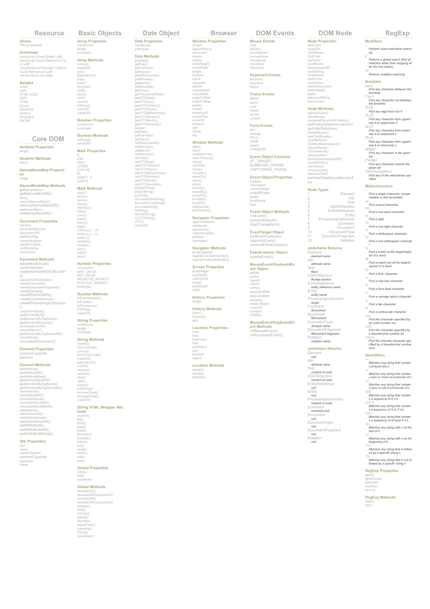

# 1. 자바스크립트의 정의와 역사

## 1-1. 자바스크립트란?

- 자바스크립트는 웹의 요소나 브라우저를 제어할 목적으로 만들어진 동적 문서를 만드는 웹 프로그래밍 언어입니다.
- HTML은 자동차의 뼈대, CSS는 자동차의 외관, Javascript는 자동차의 엔진으로 비교할 수 있습니다.
- 1995년 12월 4일 넷스케이프에서 근무하던 브랜든 아이크가 개발한 언어로서 현재는 표준 Javascript를 ECMAScript라고 부릅니다.

<br><br>

## 1-2. 자바스크립트의 주요 라이브러리

| 라이브러리 이름 | 설명 |
|---------------|-----------------------------------------------------------------------|
| jQuery | DOM 조작 및 제어를 위해 많이 사용하는 라이브러리 |
| Angular | 구글에서 제작한 프론트엔드용 클라이언트 사이드 JavaScript 프레임워크 |
| React | Facebook에서 만든 프론트엔드용 오픈소스 라이브러리 |
| Vue.js | 중국계 미국인 에반 유가 만든 사용자 인터페이스를 만들기 위한 프론트엔드용 프레임워크 |
| Node.js | 자바스크립트 기반의 서버 프로그래밍을 위한 런타임 환경 |
| Express.js | Node.js 환경을 기반으로 만들어진 웹 애플리케이션 프레임워크 |
| Deno | Node.js의 단점을 보완한 서버 프로그래밍을 위한 런타임 환경 |
| Svelte | Rich Harris가 2016년도 출시한 오픈소스 프론트엔드 웹 프레임워크 |
| Electron | GitHub에서 만든 HTML+CSS+Javascript 데스크톱 앱 프레임워크 |
| npm | Node.js 설치시 같이 설치디는 노드 패키지 매니저(Node Package Manager) |

<br><br>

### 1-3. 자바스크립트의 파생 언어

| 언어이름 | 설명 |
|---------------|-----------------------------------------------------------------------|
| TypeScript | 마이크로소프트에서 발표한 JavaScript에 정적 타입 개념을 추가한 신형 언어로 컴파일을 진행하면 Javascript가 만들어집니다. |
| CoffeeScript | JavaScript의 문법을 개선한 신형 언어 |
| AssemblyScript | TypeScript에서 WebAssembly로의 컴파일을 목적으로 또 다시 파생되어 나온 언어 |
| JavaScript.NET | JavaScript를 컴파일러용 언어로 개조한 언어 |
| ReasonML | 전직 페이스북 개발자가 만든 정적타입, 함수형 프로그래밍 기반 언어 |
| Vanilla JS | 외부의 라이브러리나 프레임워크를 이용하지 않는 순수 자바스크립트 |

### 1-4. 자바스크립트의 역사

- 자바스크립트는 1995년 넷스케이프에서 일하고 있던 브랜든 아이크에 의해 만들어졌습니다.
- 최초의 자바스크립트는 Mocha라는 이름으로 발표가 되었다가 이 후 LiveScript라는 이름을 거쳐 최종적으로 Javascript라는 이름을 갖게 되었습니다.
- Java와는 아무 연관이 없지만, 당시 Java의 유명세에 묻어가려는 마케팅적 이유로 이름이 붙여졌습니다.

| 버전 | 출시일 | 동등한 기술적 내용 | 넷스케이프 내비게이터 | 모질라 | 파이어폭스 | 인터넷 익스플로러 | 오페라 | 사파리 | 구글 크롬 |
|-----|----------|------------------------------------|---------|----------|----------|----------|----------|----------|----------|
| 1.0 | 1996년 3월 |  | 2.0 |  | 3.0 |  |  |  |			
| 1.1 | 1996년 8월 |  | 3.0 |  |  |  |  |  |			
| 1.2 | 1997년 6월 |  | 4.0-4.05 |  |  | 3 |  |  |		
| 1.3 | 1998년 10월 | ECMA-262 1st + 2nd edition | 4.06-4.7x |  | 4.0 | 5 |  |  |	
| 1.4 |  |  | 넷스케이프 서버 |  |  | 6 |  |  |
| 1.5 | 2000년 11월 | ECMA-262 3rd edition | 6.0 | 1.0 | 5.5 (JScript 5.5),<br>6 (JScript 5.6),<br>7 (JScript 5.7),<br>8 (JScript 5.8) | 7.0	 | 3.0-5 | 1.0-10.0.666 |
| 1.6 | 2005년 11월 | 1.5 + array extras + array and string generics + E4X |  | 1.5 |  |  |  |  |
| 1.7 | 2006년 10월 | 1.6 + Pythonic generators Archived 2013년 3월 2일 - 웨이백 머신 + iterators + let |  | 2.0 |  |  |  | 28.0.1500.95 |
| 1.8 | 2008년 6월 | 1.7 + generator expressions + expression closures |  | 3.0 |  | 11.50 |  |  |		
| 1.8.1 |  | 1.8 + native JSON support + minor updates |  | 3.5	|  |  |  |  |	
| 1.8.2 | 2009년 6월 22일 | 1.8.1 + minor updates |  | 3.6 |  |  |  |  |					
| 1.8.5 | 2010년 7월 27일 | 1.8.2 + new features for ECMA-262 5th edition compliance |  | 4.0 |  |  |  |  |

### 1-5. EcmaScript로의 전환

- 자바스크립트를 표준화하기 위해 1996년 11월 ECMA-262라는 표준안의 이름이 발표되면서 표준 자바스크립트를 ECMA Script라고 부르게 되었습니다. 약자로 ES라고도 합니다.

| 버전 | 발표시기 | 특징 |
|------|-----------|----------------------------------------------------------|
| ES1 | 1997년 6월 | ECMA-262 기술 규격 |
| ES2 | 1998년 6월 | ActiveX 탑재<br> xml request 기능 제공 |
| ES3 | 1999년 12월 | try/catch<br> Prototype<br> Hoisting<br> Scope<br> Closer|
| ES4 | 폐기(Abandoned) | |
| ES5 | 2009년 12월 | forEach, map, filter<br> reduce, some, every<br> Object에 대한 getter / setter 지원<br> 자바스크립트 strict 모드 지원<br> JSON 지원<br> bind() 메서드 지원 |
| ES6/ES2015 | 2015년 6월 | const and let<br> for…of<br> Spread Operator<br> iterator/generator<br> Promise<br> Default Parameter<br> Module import/export<br> class<br> template tag<br> Arrow function<br> Variable Parameter
| ES7/ES2016 | 2016년 6월 | Array.protorype.includes<br> Exponentiation oprator |
| ES8/ES2017 | 2017년 06월 | String padding<br> Object.values<br> Object.getOwnPropertyDescriptors<br> Trailing commas in function parameter lists and calls<br> Async functions |
| ES9/ES2018 | 2018년 06월 | Object Rest/Spread<br> Promise finally<br> Async iteration<br> 정규표현식 |
| ES10/ES2019 | 2019년 06월 | Object from Entries<br> flat, flatMap<br> Symbol, Description<br> Optional Catch | 
| ES11/ES2020 | 2020년 06월 | String.prototype.matchAll<br> BigInt<br> Promise.allSettled<br> globalThis<br> optional chaining operator<br> nullish coalescing operator
| ES12/ES2021 | 2021년 06월 | String.prototype.replaceAll<br> Promise.any<br> AggregateError<br> WeakReferences <br> Logical Assignment Operators | 
| ES13/ES2022 | 2022년 07월 | top-level await<br> Class field 개선<br> .at() method on the built-in indexables<br> Object.hasOwn<br> RegExp flag <br> Error.prototype.cause |
| ES14/ES2023 | 2023년 06월 | Array.prototype.findLast<br> Array.prototype.findLastIndex<br> Hashbang Grammar |


<br><hr><br>




[Javascript Cheat Sheet 바로가기](https://overapi.com/javascript "javascript cheat sheet")

<br><hr><br>

# 2. 자바스크립트의 사용자 정의 변수/함수/배열/객체

- 변수(Variable) : 데이터를 저장할 저장소의 이름으로 변수라고 하는 것은 언제든지 그 값이 유동적으로 변할 수 있기 때문입니다.
- 함수(Function) : 복잡하거나 반복적으로 구현해야할 코드를 하나의 이름으로 정의하고, 호출하여 사용할 수 있도록 기능을 구현하는 코드 블록을 말합니다.
- 배열(Array) : 하나의 데이터만 저장하는 것이 아니라, 여러 데이터를 하나의 이름으로 연속하여 저장하는 자료 구조를 말합니다.
- 객체(Object) : 필요에 따라 여러 속성(Properties, 이름(name)과 값(value)로 구성)와 기능 구현 코드에 해당하는 메소드(Method)를 구성원으로 하는 집합체를 말합니다.

## 2-1. 변수에 대한 기본 문법

```javascript
var 변수명; //변수 선언
var 변수명 = 초기값;    //변수 선언과 초기값 부여
/* 자바스크립트는 다른 언어와 다르게 같은 이름의 변수를 var 선언자로 재선언하여 사용할 수 있습니다. */
```

<br><br>

## 2-2. 함수에 대한 기본 문법

```html
<script>
//함수의 정의 및 선언 방법1
function 함수명1() { ... }
//함수의 정의 및 선언 방법2
var 함수명2 = function() { ... };
</script>
<!-- 함수의 호출1 : 인라인 이벤트 -->
<button type="button" id="btn1" onclick="함수명1()">버튼1</button>
<button type="button" id="btn2">버튼2</button>
<script>
//함수의 호출2 : 이벤트리스너에 의한 이벤트    
document.getElementById("btn2").addEventListener("click", function() { 함수명2(); });    
</script>
```

<br><br>

## 2-3. 배열에 대한 기본 문법

```javascript
//배열 선언 및 초기화 방법1
var 배열명 = [값1, "값2",..... ];
//배열 선언 및 초기화 방법2
var 배열명 = new Array();
var 배열명 = new Array(숫자);
var 배열명 = new Array(값1, 값2,..값n);
```

<br><br>

## 2-4. 객체에 대한 기본 문법

```javascript
var 객체명 = {
    속성1:값1, 
    속성2:값2,....
    속성n:값n, 
    메소드1:function() {....},
    메소드2:function() {....},
     ...
    메소드n:function() {....} 
};
```

<br><br>

## 2-5. 변수/함수/배열/객체 사용의 예시 코드

```html
<!DOCTYPE html>
<html lang="en">
<head>
    <meta charset="UTF-8">
    <meta name="viewport" content="width=device-width, initial-scale=1.0">
    <title>자바스크립트 01</title>
    <!-- head 태그 사이에 있는 script는 body 요소가 로딩 되기 전에 
        해야 할 일을 기술합니다.  -->
    <script>
    /* 스크립트내의 각주 */

    </script>
</head>
<body>
    <h1>자바스크립트(Javascript)란?</h1>
    <p>자바스크립트는 웹의 요소나 브라우저를 제어할 목적으로 만들어진
        동적 문서를 만드는 웹 프로그래밍 언어입니다.</p>
    <hr>    
    <h2>자바스크립트의 레벨</h2>
    <p>자바스크립트의 정식 명칭은 EcmaScript라고 하며, 
        ES5(2009년 이전)와 ES6(2015년 이후)로 명확한 구분점을 가지고 있으며, 
        ES5 이하는 웹의 요소나 브라우저를 제어할 목적을 갖고 있으며,
        ES6 이상은 ES5 이하의 기능을 포함하며, 객체 지향적 프로그래밍 기법과 
        프론트엔트 프레임워크나 Node를 기반으로 VIEW단의 서버 프로그래밍을 
        할 수 있는 기능이 더 추가되었습니다.</p>
    <!-- body 요소와 그 하부 요소인 h1, p, h2, hr 등이 출력되고 난 후 
    실행해야 하는 내용을 기술하는 부분 --> 
    <hr>
    <h2>자바스크립트의 기본 - 각주, 변수, 함수, 배열, 객체</h2>
    <div id="msg"></div>   
    <hr>
    <button type="button" onclick="fnc1()">인라인 이벤트 버튼</button><br>
    <button type="button" id="btn2">이벤트리스너 이벤트 버튼</button><br>
    <button type="button" id="btn3">메소드 이벤트 버튼</button><br>
    <script>
    //변수의 정의 및 선언
    var data;
    var name_str = "김기태"; //문자열 변수 name_str
    var ageNum = 43;   //정수형 변수 ageNum 
    var heightNum = 173.52; //실수형 변수 heightNum
    var pass = false;   //논리형 변수 pass
    var a=20, b=30;

    var msg = document.getElementById("msg");   //DOM 요소 선택 
    
    //이벤트리스너에 의한 함수 호출
    document.getElementById("btn2").addEventListener("click", 
    function() { fnc2(); });

    //함수의 정의 
    function fnc1() {
        if(!confirm("함수1을 호출하셨습니다.\n확인 또는 취소를 눌러주세요")){
            msg.innerHTML = "<strong>취소를 누르셨습니다.</strong>";
        } else {
            msg.innerHTML = "<em>확인을 누르셨습니다.</em>";
        }
    }
    var fnc2 = function() { alert("함수2을 호출하셨습니다."); }
    
    var arr = ["김기태","김응원","김필규","김민아"];

    var obj = {name:"김민식", age:48, height:182.78, 
    method1:function () {   //메소드
        var wt = prompt("몸무게를 입력해주세요");
        msg.innerText = this.name + "님의 몸무게는 " + wt + "kg 입니다."
    }};

    document.getElementById("btn3").addEventListener("click", 
     function() { obj.method1(); } );
    </script>
</body>
</html>
```

<br><hr><br>

# 3. 자바스크립트의 출력과 메시지 창

## 3-1. 문서에 출력

```javascript
document.write("태그를 포함한 출력내용");
```

<br><br>

## 3-2. 요소에 출력

```javascript
document.getElementById("해당요소아이디").innerHTML = "태그를 포함한 출력내용";
document.getElementById("해당요소아이디").innerText = "출력내용";
```

<br><br>

## 3-3. 콘솔에 출력

```javascript
console.log("출력할 내용");
```

<br><br>

## 3-4. 알림창에 출력

```javascript
alert("출력제어문자를포함한메시지");
```

<br><br>

## 3-5. 확인창에 출력

```javascript
confirm("출력제어문자를포함한메시지");
```

<br><br>

## 3-6. 입력창에 입력과 출력

```javascript
변수명 = prompt("출력제어문자를포함한메시지");
```

## 3-7. 출력의 방향 예시 코드

```html
<!DOCTYPE html>
<html lang="en">
<head>
    <meta charset="UTF-8">
    <meta name="viewport" content="width=device-width, initial-scale=1.0">
    <title>자바스크립트 02</title>
    <style>
    * { margin: 0; padding: 0; }
    body { width:100%; overflow-x:hidden; }
    a { text-decoration: none; }
    .title { text-align: center; padding-top: 2rem; 
        padding-bottom: 0.8rem; }
    .btn-group, .activity, .rule { clear:both; width: 1280px; 
        margin: 20px auto; }    
    .btn-group:after, .activity:after, .rule:after { content:""; 
    display:block; width: 100%; clear: both; }
    .rule { padding-bottom: 24px; border-bottom:2px solid #333; }

    .btn-group button, .btn-group a { display:inline-block; 
        min-width:140px; height: 40px; line-height: 40px; text-align: center; 
    outline: none; border:3px solid #333; color:#333; font-size:18px; 
    margin:8px; border-radius:22px; box-sizing: border-box; cursor:pointer; }
    .btn-group button:hover, .btn-group a:hover { background-color: deepskyblue;
    color:#fff; }

    .activity { min-height:200px; margin-bottom:100px; }
    </style>
</head>
<body>
    <h1 class="title">자바스크립트의 출력 방향과 메시지창</h1>
    <hr>
    <div class="rule">
        <h2 class="title">스크립트의 적용 방식</h2>
        <ul>
            <li>인라인 스크립트 : 해당 태그에 직접 스크립트를 기입하는 방식</li>
            <li>내부 스크립트 : 해당 문서에 script 태그를 기입하여 스크립팅하는 방식</li>
            <li>외부 스크립트 : 별도의 .js 파일을 작성하여 여러 문서에서 script 태그로 삽입하는 방식</li>
        </ul>
    </div>
    <div class="rule">
        <h2 class="title">스크립트의 출력 방향</h2>
        <ul>
            <li>문서에 출력 : document.write()</li>
            <li>요소에 출력 : document.getElementById().innerHTML </li>
            <li>콘솔에 출력 : console.log()</li>
        </ul>
    </div>
    <div class="rule">
        <h2 class="title">메시지창</h2>
        <ul>
            <li>알림창 : alert("메시지")</li>
            <li>확인창 : confirm("메시지") </li>
            <li>입력창 : prompt("메시지")</li>
        </ul>
    </div>
    <div class="btn-group">
        <button id="btn1" type="button" onclick="fnc1()">문서에 출력</button>
        <button id="btn2" type="button" onclick="fnc2()">요소에 출력</button>
        <button id="btn3" type="button" onclick="fnc3()">콘솔에 출력</button>
        <button id="btn4" type="button" onclick="fnc4()">알림창 출력</button>
        <button id="btn5" type="button" onclick="fnc5()">확인창 출력</button>
        <button id="btn6" type="button" onclick="fnc6()">입력창 출력</button>
        <a href="javascript:;" id="btn7" onclick="fnc7()">링크버튼1</a>
        <a href="javascript:none;" id="btn8" onclick="fnc8()">링크버튼2</a>
    </div>
    <div class="activity">
        <div id="res1"></div>
        <div id="res2"></div>
        <div id="res3"></div>
    </div>
    <script>
    var fnc1 = function() { document.write("<h2>문서에 출력</h2>"); };    
    var fnc2 = function() { 
        document.getElementById("res1").innerHTML = "<h2>요소에 출력</h2>" };    
    var fnc3 = function() { console.log("콘솔에 출력"); };
    var fnc4 = function() { alert("알림창\n출력"); };
    var fnc5 = function() { 
        var res2 = document.getElementById("res2");
        if(confirm("확인창\n확인")){
            res2.innerHTML = "<em>확인 OK~!</em>";
        } else {
            res2.innerHTML = "<ins>취소 NOH~!</ins>";
        }    
    };
    var fnc6 = function(){
        var name = prompt("이름 입력 : ");
        var age = parseInt(prompt("나이 입력 : "));
        var iq = parseFloat(prompt("아이큐 입력 : "));
        var res3 = document.getElementById("res3");
        res3.style.color = "red";
        var tag = "<ul>";
        tag = tag + "<li>이름 : "+name+"</li>";     
        tag = tag + "<li>나이 : "+age+"</li>";
        tag = tag + "<li>아이큐 : "+iq+"</li>";
        tag = tag + "</ul>";
        res3.innerHTML = tag; 
    }
    var fnc7 = function() { 
        alert("인라인 이벤트인 링크버튼을 누르셨습니다."); };
    var fnc8 = function() { window.open("javascript01.html"); }
    </script>
</body>
</html>
```

<br><hr><br>

# 4. 자바스크립트의 연산자

- 자바스크립트의 연산자에는 산술 연산자, 대입 연산자, 비교 연산자, 증감 연산자, 논리 연산자, 비트 연산자, 삼항 연산자, 타입 연산자 등이 있습니다.

| 종류 | 연산자 | 연산자 설명 |
|---------------|--------------|---------------------------------------------------------------|
| 산술 연산자 | + | 더하기 |
|  | - | 빼기 |
|  | * | 곱하기 |
|  | / | 나누기 |
|  | % | 나머지 |
|  | ** | 거듭제곱 |
| 대입 연산자 | = | 오른쪽의 값을 왼쪽에 대입 |
|  | += | 왼쪽의 값을 오른쪽의 값과 더하기하여 왼쪽에 대입 |
|  | -= | 왼쪽의 값을 오른쪽의 값으로 빼기하여 왼쪽에 대입 |
|  | *= | 왼쪽의 값을 오른쪽의 값과 곱하기하여 왼쪽에 대입 |
|  | /= | 왼쪽의 값을 오른쪽의 값으로 나누기하여 왼쪽에 대입 |
|  | %= | 왼쪽의 값을 오른쪽의 값으로 나눈 나머지를 왼쪽에 대입 |
| 증감 연산자 | ++ | 1씩 증가, "++변수" 는 전위연산, "변수++" 는 후위연산 |
|  | -- | 1씩 감소, "--변수" 는 전위연산, "변수--" 는 후위연산 |
| 비교 연산자 | == | 같다 |
|  | != | 같지 않다 |
|  | === | 값과 타입이 모두 같다. |
|  | !== | 값 또는 타입이 같지 않다. |
|  | > | 초과(크다/후) |
|  | < | 미만(작다/전) |
|  | >= | 이상(크거나 같다/이후) |
|  | <= | 이하(크거나 같다/이전) |
| 논리 연산자 | && | AND연산, 주어진 조건이 모두 만족하면, 참, 그렇지 않으면, 거짓 |
|  | &#124;&#124; | OR연산, 주어진 조건이 어느 하나라도 만족하면, 참, 그렇지 않으면, 거짓 |
|  | ! | Not 연산, (반대로)참을 거짓으로, 거짓을 참으로 반환 |
| 비트 연산자 | & | 이진 AND연산, 2진수로 바꾸어 각 자리마다 모든 입력이 1이면, 1을 출력, 아니면, 0을 출력 |
|  | &#124; | 이진 OR연산, 2진수로 바꾸어 각 자리마다 어느 하나라도 입력이 1이면, 1을 출력, 아니면, 0을 출력 |
|  | ~ | 이진 Not연산=보수(Complement), 입력이 1이면, 0을 출력, 입력이 0이면, 1을 출력 => 반대로 |
|  | ^ | 이진 XOR연산, 2진수로 바꾸어 각 자리마다 입력이 서로 다르면, 1을 출력, 같으면, 0을 출력 |
| 삼항 연산자 | 조건 ? 참 : 거짓 | 조건이 만족하면, 참을 그렇지 않으면, 거짓을 반환 |
| 타입 연산자 | typeof 값 &#124; 변수 | 해당 값 또는 변수에 대한 타입을 반환 |

<br>

## 연산자 우선 순위

| 우선순위 | 기능 | 연산자 |
|-----|-------------------------------|-------------------------------------------------|
| 1 | 괄호 | () |
| 2 | 증감/논리 연산자 | ++ -- ! |
| 3 | 산술 연산자 | * / % + - |
| 4 | 비교 연산자 | > >= < <= == === != !=== |
| 5 | 논리 연산자 | and(&&) or(&#124;&#124;) not(!)|
| 6 | 대입 연산자 | *= /= %= += -= |


<br><br>

## 4-1. 산술 연산자

```javascript
    var name1 = "김기태";   //문자열 초기화 -> string
    var su1 = 20;       //숫자 초기화 -> int
    var comp1 = true;   //논리값 초기화 -> bool
    var fl1 = 3.14; //실수 초기화 -> float

    var name2 = "유정환";
    var su2 = 12;
    var comp2 = false;
    var fl2 = 36.5;

    console.log("더하기");
    console.log(name1+name2);
    console.log(su1+su2);
    console.log(comp1+comp2);
    console.log(fl1+fl2);
    console.log("빼기");
    console.log(name1-name2);
    console.log(su1-su2);
    console.log(comp1-comp2);
    console.log(fl1-fl2);
    console.log("곱하기");
    console.log(name1*name2);
    console.log(su1*su2);
    console.log(comp1*comp2);
    console.log(fl1*fl2);
    console.log("나누기");
    console.log(name1/name2);
    console.log(su1/su2);
    console.log(comp1/comp2);
    console.log(fl1/fl2);
    console.log("나머지");
    console.log(su1%su2);
```

<br><br>

## 4-2. 대입 연산자

```javascript
    var x=200, y=300, z=100;
    document.write("<h2>대입 연산자</h2>");    x+=3;
    document.write("<br>x+=3 결과 : "+x);    x-=4;
    document.write("<br>x-=4 결과 : "+x);    x*=2;
    document.write("<br>x*=2 결과 : "+x);    x/=3;
    document.write("<br>x/=3 결과 : "+x);    x%=29;
    document.write("<br>x%=29 결과 : "+x);
```

<br><br>

## 4-3. 증감 연산자

```javascript
    var x=200, y=200;
    document.write("<hr><h2>증감 연산자</h2>");
    document.write("<br>x++ 결과 : "+(x++));
    document.write("<br>++y 결과 : "+(++y));
    document.write("<br>x-- 결과 : "+(x--));
    document.write("<br>--y 결과 : "+(--y));
```

<br><br>

## 4-4. 비교 연산자

```javascript
    var x=200, y=300;
    document.write("<hr><h2>비교연산</h2>"); 
    document.write("<br> x>y : "+(x>y));
    document.write("<br> x<y : "+(x<y));
    document.write("<br> x>=y : "+(x>=y));
    document.write("<br> x<=y : "+(x<=y));
    document.write("<br> x==y : "+(x==y));
    document.write("<br> x!=y : "+(x!=y));
    document.write("<br> x===y : "+(x===y));  //타입과 값이 모두 일치
    document.write("<br> x!==y : "+(x!==y));  //타입 또는 값이 다르면
```

<br><br>

## 4-5. 논리 연산자

```javascript
    var x=200, y=300;
    document.write("<br> x>y && y==200 : "+(x>y && y==200));
    document.write("<br> x>y || y==200 : "+(x<y || y==200));
    document.write("<br> !(x<y) : "+(!(x<y)));
```

<br><br>

## 4-6. 비트 연산자

```javascript
    var x=200, y=300;
    document.write("<hr><h2>비트연산</h2>");
    document.write("<br> x & y : "+(x & y));   //and
    document.write("<br> x | y : "+(x | y));  //or
    document.write("<br> x ^ y : "+(x ^ y));  //xor
    document.write("<br> y >> 2 : "+(y >> 2)); //오른쪽 shift => /2
    document.write("<br> y << 2 : "+(y << 2)); //왼쪽 shift => *2
    document.write("<br> ~y : "+(~y)); //complement(보수)
```

<br><br>

## 4-7. 삼항 연산자

```javascript
    var x=200, y=300;
    var a = (x>y) ? x : y;  
    document.write("<hr><h2>삼항 연산자</h2> -> (x>y) ? x : y => "+a+"<br><br>");   
```

<br><br>

## 4-8. 타입 연산자

```js
    var x=200, y=300;
    var a = typeof "김기태";
    document.write(a + "<br>");

    var a = typeof 1004;
    document.write(a + "<br>");

    var a = typeof 6.28;
    document.write(a + "<br>");
    document.write((typeof x) + "<br>");
```

<br><hr><br>

## 자바스크립트의 변수가 가지는 불용값

```comment
null과 undefined
자바스크립트에서 null이란 object 타입이며, 아직 '값'이 정해지지 않은 것을 의미합니다.

또한, undefined란 null과는 달리 '타입'이 정해지지 않은 것을 의미합니다.

따라서 자바스크립트에서 undefined는 초기화되지 않은 변수나 존재하지 않는 값에 접근할 때 반환됩니다.
```


<br><hr><br>

# 5. 자바스크립트의 객체

- 자바스크립트의 기본 타입은 객체(object)입니다. 객체(object)란 실생활에서 우리가 인식할 수 있는 사물로 이해할 수 있습니다.
- 객체는 여러 프로퍼티(property)나 메소드(method)를 같은 이름으로 묶어놓은 일종의 집합체입니다.
- 자바스크립트는 내장 객체(BOM, DOM, 데이터), 사용자 정의 객체로 구분합니다.

## 5-1. 사용자 정의 객체

### 5-1-1. 사용자 정의 객체 기본 문법

```javascript
var 객체명 = {속성1:값1, 속성2:값2,...속성n:값n,...메소드1:function(){....}};
```

<br>

### 5-1-2. 사용자 정의 객체 예시 코드

```javascript
    //재활용이 불가능한 사용자 정의 더미 객체
    var man1 = {name:"김기태", style:"미남", point:100};
    man1.nick = "김미남";   //항목 추가
    man1.style = "신사";    //항목의 값 변경
```

<br><br>

## 5-2. 생성자를 활용한 객체 생성

### 5-2-1. 생성자를 활용한 객체 기본 문법

```javascript
    //생성자 함수 정의
    function 생성자함수명(매개변수1, 매개변수2,... 매개변수n){
        this.필드1 = 매개변수1;
        this.필드2 = 매개변수2;
        .....
        this.필드n = 매개변수n;
        this.메소드 = function () {
            .....
        }
    }
    //객체 생성
    var 객체명 = new 생성자함수(값1, 값2,...값n);
```

<br>

### 5-2-2. 생성자를 활용한 객체 생성 예시 코드

```javascript
    //생성자(Constructor)를 활용한 객체 생성
    function People(no, name, age, style, target){
        this.no = no;
        this.name = name;
        this.age = age;
        this.style = style;
        this.print = function () {
            var res = document.getElementById(target);
            res.innerHTML = "<ul>";
            res.innerHTML = res.innerHTML + "<li>번호 : "+this.no+"</li>";    
            res.innerHTML = res.innerHTML + "<li>이름 : "+this.name+"</li>";    
            res.innerHTML = res.innerHTML + "<li>나이 : "+this.age+"</li>";    
            res.innerHTML = res.innerHTML + "<li>스타일 : "+this.style+"</li>";    
            res.innerHTML = res.innerHTML + "</ul>";
        }
    }

    var st1 = new People(1, "이종우", 22, "잘생김주의", "res1");
    var st2 = new People(2, "이종욱", 23, "못생김주의", "res2");
    var st3 = new People(3, "이종원", 24, "느낌함", "res3");
    var st4 = new People(4, "이종훈", 25, "노래잘함", "res4");

    st1.print();
    st2.print();
    st3.print();
    st4.print();

    //항목(Field) 추가
    st1.family = "전주이씨";
    st2.family = "경주이씨";

    
    //메소드(Method) 추가
    var html= "";
    st1.toString = function() {
        var res5 = document.getElementById("res5");
        html = "<p>";
        html = html + "<strong>본관 : "+this.family+"</strong>";    
        html = html + "<em>이름 : "+this.name+"</em>";
        html = html + "<em>나이 : "+this.age+"</em>";
        html = html + "</p>";  
        res5.innerHTML = html;  
    }
    st1.toString();

    //항목 제거 전 순회
    html = "";
    for(var field in st1){
        html += "<strong>"+field+"</strong> &nbsp; &nbsp; &nbsp;";
    }
    document.getElementById("res6").innerHTML = html;

    //항목(Field) 제거
    delete st1.family;

    //항목 제거 후 순회
    html = "";
    for(var field in st1){
        html += "<em>"+field+"</em> &nbsp; &nbsp; &nbsp;";
    }
    document.getElementById("res7").innerHTML = html;
```
<br><hr><br>

# 6. 사용자 정의 함수

## 6-1. 사용자 정의 함수 기본 문법

```javascript
//함수타입1 정의 : 매개변수X/반환X
function 함수1() { .... }

//함수타입2 정의 : 매개변수X/반환O
function 함수2() { 
    ....
    return 반환값 | 변수;
}

//함수타입3 정의 : 매개변수O/반환X
function 함수3(매개변수1, 매개변수2,...매개변수n) { .... }

//함수타입4 정의 : 매개변수O/반환O
function 함수4(매개변수1, 매개변수2,...매개변수n) { 
    .... 
    return 반환값 | 변수;
}

함수1(); //함수타입1 호출
var 반환을받는변수 = 함수2();   //함수타입2 호출
함수3(전달값);    //함수타입3 호출
var 반환을받는변수 = 함수4(전달값);   //함수타입4 호출
```

<br><br>

## 6-2. 사용자 정의 함수 예시 코드

```javascript
    //방법1 : function 함수명(매개변수명,...) { [return 값또는변수] }    
    //방법2 : var 함수명 = function(매개변수명,...) { [return 값또는변수] }
    function fnc1(){
        document.write("<br>fnc1 : 매개변수X, 리턴X<br>");
    }
    function fnc2(x){
        document.write(x+"<br>fnc2 : 매개변수O, 리턴X<br>");
    }
    function fnc3(){
        return "<br>fnc3 : 매개변수X, 리턴O<br>";
    }
    function fnc4(x){
        return x+"<br>fnc4 : 매개변수O, 리턴O<br>";
    }
    var res4 = fnc4("김기태");
    var res3 = fnc3();
    document.write(res4);
    document.write(res3);
    fnc2("김이태");
    fnc1();
```

<br><hr><br>

# 7. 조건문과 반복문

- 프로그램의 순차적인 흐름을 제어해야 할 때 사용하는 실행문을 제어문이라고 합니다. 이러한 제어문에는 조건문, 반복문, 기타 제어문 등이 포함됩니다.

<br><br>

## 7-1. 조건문

- 조건문이란 프로그램 내에서 주어진 표현식의 결과에 따라 별도의 명령을 수행하도록 제어하는 실행문입니다.
- 조건문 중에서 가장 기본이 되는 실행문은 if 문입니다.
- 자바스크립트에서 사용할 수 있는 조건문의 형태는 다음과 같습니다.
    1. if 문
    2. if / else 문
    3. if / else if / else 문
    4. switch 문

<br>

### 7-1-1. if문

- if 문은 표현식의 결과가 참(true)이면 주어진 실행문을 실행하며, 거짓(false)이면 아무것도 실행하지 않습니다.

#### if문 기본 문법

```javascript
    if (조건식) {
        조건식의 결과가 참일 때 실행하고자 하는 실행문;
    }
```

#### if문 예시 코드

```javascript
    var x = 10, y = 20;
    if (x == y) {  //동등 연산자는 "="이 아니라 "=="이다.
        document.write("x와 y는 같습니다.");
    }
    if (x < y) {
        document.write("x가 y보다 작습니다.");
    }

    if (x > y) // 실행될 실행문이 한 줄뿐이라면 중괄호({})를 생략할 수 있음.
        document.write("x가 y보다 큽니다.");
```

<br>

### 7-1-2. if~ else~ 문

- if 문과 같이 사용할 수 있는 else 문은 if 문의 표현식 결과가 거짓(false)일 때 주어진 실행문을 실행합니다.

#### if~ else~ 문 기본 문법

```javascript
    if (조건식) {
        조건식의 결과가 참일 때 실행하고자 하는 실행문;
    } else {
        조건식의 결과가 거짓일 때 실행하고자 하는 실행문;
    }
```

<br>

### 7-1-3. if~ else if~ else~ 문

- else if 문은 if 문처럼 표현식을 설정할 수 있으므로, 중첩된 if 문을 좀 더 간결하게 표현할 수 있습니다. 하나의 조건문 안에서 if 문과 else 문은 단 한 번만 사용될 수 있습니다. 하지만 else if 문은 여러 번 사용되어 다양한 조건을 설정할 수 있습니다.

#### if~ else if~ else~ 문 기본 문법

```javascript
    if (조건식1) {
        조건식1의 결과가 참일 때 실행하고자 하는 실행문;
    } else if (조건식2) {
        조건식2의 결과가 참일 때 실행하고자 하는 실행문;
    } else {
        조건식1의 결과도 거짓이고, 조건식2의 결과도 거짓일 때 실행하고자 하는 실행문;
    }
```

#### if~ else if~ else~ 문 예시 코드

```javascript
    var x = 10, y = 20;
    if (x == y) {
        document.write("x와 y는 같습니다.");
    } else if (x < y) {
        document.write("x가 y보다 작습니다.");
    } else { // x > y인 경우
        document.write("x가 y보다 큽니다.");
    }
```

<br>

### 7-1-4. switch 문

- switch 문은 if / else 문과 마찬가지로 주어진 조건 값에 따라 프로그램이 다른 명령을 수행하도록 하는 조건문입니다. 이러한 switch 문은 if / else 문보다 가독성 측면에서 더 좋습니다.

#### switch 문 기본 문법

```javascript
    switch (조건 값) {
        case 값1:
            조건 값이 값1일 때 실행하고자 하는 실행문;
            break;
        case 값2:
            조건 값이 값2일 때 실행하고자 하는 실행문;
            break;
        ...
        default:
            조건 값이 어떠한 case 절에도 해당하지 않을 때 실행하고자 하는 실행문;
            break;
    }
```

#### switch 문 예시 코드

```javascript
    var x = 10;
    switch (typeof x) {
        case "number":
            document.write("변수 x의 타입은 숫자입니다.");
            break;
        case "string":
            document.write("변수 x의 타입은 문자열입니다.");
            break;
        case "object":
            document.write("변수 x의 타입은 객체입니다.");
            break;
        default:
            document.write("변수 x의 타입을 잘 모르겠네요...");
            break;
    }
```

```javascript
    var day = new Date().getDay(); // 오늘의 요일을 반환함. (일요일: 0 ~ 토요일: 6)
    switch (day) {
        case 1: // 월요일인 경우
        case 2: // 화요일인 경우
        case 3: // 수요일인 경우
        case 4: // 목요일인 경우
        default: // 0부터 6까지의 값이 아닌 경우
            document.write("아직도 주말은 멀었네요... 힘내자구요!!");
            break;
        case 5: // 금요일인 경우
            document.write("오늘은 불금이네요!!");
            break;
        case 6: // 토요일인 경우
        case 0: // 일요일인 경우
            document.write("즐거운 주말에도 열심히 공부하는 당신~ 최고에요!!");
            break;
    }
```

<br><br>

## 7-2. 반복문

- 반복문이란 프로그램 내에서 똑같은 명령을 일정 횟수만큼 반복하여 수행하도록 제어하는 실행문입니다. 
- 프로그램이 처리하는 대부분의 코드는 반복적인 형태가 많으므로, 가장 많이 사용되는 실행문 중 하나입니다.
- 자바스크립트에서 사용할 수 있는 반복문의 형태는 다음과 같습니다.
    1. while 문
    2. do / while 문
    3. for 문
    4. for / in 문
    5. for / of 문

<br>

### 7-2-1. while 문

- while 문은 특정 조건을 만족할 때까지 계속해서 주어진 실행문을 반복 실행합니다.

#### while 문 기본 문법

```javascript
    while (조건식) {
        조건식의 결과가 참인 동안 반복적으로 실행하고자 하는 실행문;
    }
```

while 문은 우선 표현식이 참(true)인지를 판단하여 참이면 내부의 실행문을 실행합니다. 내부의 실행문을 전부 실행하고 나면, 다시 표현식으로 돌아와 또 한 번 표현식이 참인지를 판단하게 됩니다. 이렇게 표현식의 검사를 통해 반복해서 실행되는 반복문을 루프(loop)라고 합니다.

#### while 문 예시 코드

```javascript
    var i = 1;
    while (i < 10) { // 변수 i가 10보다 작을 때만 while 문을 반복함.
        document.write(i + "<br>");
        i++; // 반복할 때마다 변수 i를 1씩 증가시켜 변수 i가 10보다 커지면 반복문을 종료함.
    }
```

while 문 내부에 표현식의 결과를 변경하는 실행문이 존재하지 않을 경우 프로그램은 루프를 영원히 반복하게 됩니다.
이것을 무한 루프(infinite loop)에 빠졌다고 하며, 무한 루프에 빠진 프로그램은 영원히 종료되지 않습니다.
무한 루프는 특별히 의도한 경우가 아니라면 반드시 피해야 하는 상황입니다.
따라서, while 문을 작성할 때는 표현식의 결과가 어느 순간에는 거짓(false)을 갖도록 표현식를 변경하는 실행문을 반드시 포함해야 합니다.

※ while 문에서 실행될 실행문이 한 줄 뿐이라면 중괄호({})를 생략할 수 있습니다

<br>

### 7-2-2. do / while 문

- while 문은 루프에 진입하기 전에 먼저 표현식부터 검사합니다. 하지만 do / while 문은 먼저 루프를 한 번 실행한 후에 표현식을 검사합니다. 즉, do / while 문은 표현식의 결과와 상관없이 무조건 한 번은 루프를 실행합니다.

#### do / while 문 기본 문법

```javascript
    do {
        표현식의 결과가 참인 동안 반복적으로 실행하고자 하는 실행문;
    } while (표현식);
```

#### do / while 문 예시 코드

```javascript
    var i = 1, j = 1;
    while (i > 3) { // 변수 i의 초깃값은 1이기 때문에 이 while 문은 한 번도 실행되지 않음.
        document.write("i : " + (i++) + "<br>");
    }
    do { // 변수 j의 초깃값은 1이기 때문에 이 do / while 문은 단 한 번만 실행됨.
        document.write("j : " + (j++) + "<br>");
    } while (j > 3);
```

<br>

### 7-2-3. for 문

- for 문은 while 문과는 달리 자체적으로 초기식, 표현식, 증감식을 모두 포함하고 있는 반복문입니다. 따라서 while 문보다는 좀 더 간결하게 반복문을 표현할 수 있습니다.

#### for 문 기본 문법

```javascript
    for (초기식; 표현식; 증감식) {
        표현식의 결과가 참인 동안 반복적으로 실행하고자 하는 실행문;
    }
```

for 문을 구성하는 초기식, 표현식, 증감식은 각각 생략될 수 있습니다. 또한, 쉼표 연산자(,)를 사용하면 여러 개의 초기식이나 증감식을 동시에 사용할 수도 있습니다. for 문을 사용하면 앞선 예제의 while 문을 더욱 더 간결하게 표현할 수 있습니다.
for 문에서 실행될 실행문이 한 줄 뿐이라면 중괄호({})를 생략할 수 있습니다.

#### for 문 예시 코드

```javascript
    for (var i = 1; i < 10; i++) {
        document.write(i + "<br>");
    }
```

<br>

### 7-2-4. for / in 문

- for / in 문은 일반적인 for 문과는 전혀 다른 형태의 반복문입니다.
- for / in 문은 해당 객체의 모든 열거할 수 있는 프로퍼티(enumerable properties)를 순회할 수 있도록 해줍니다.

※ 열거할 수 있는 프로퍼티란 내부적으로 enumerable 플래그가 true로 설정된 프로퍼티를 의미합니다. 이러한 프로퍼티들은 for / in 문으로 접근할 수 있게 됩니다.

- 이 반복문은 루프마다 객체의 열거할 수 있는 프로퍼티의 이름을 지정된 변수에 대입합니다.
- 이렇게 대입받은 변수를 이용하면 루프 안에서 객체의 열거할 수 있는 프로퍼티에 순차적으로 접근할 수 있습니다.


#### for / in 문 기본 문법

```javascript
    for (변수 in 객체) {
        객체의 모든 열거할 수 있는 프로퍼티의 개수만큼 반복적으로 실행하고자 하는 실행문;
    }
```

#### for / in 문 예시코드1

- for / in 문을 사용하여 배열의 요소에 접근하는 예제

```javascript
    var arr = [3, 4, 5];
    for (var i = 0; i < arr.length; i++) { // 배열 arr의 모든 요소의 인덱스(index)를 출력함.
        document.write(i + " ");
    }
    for (var i in arr) { // 위와 같은 동작을 하는 for / in 문
        document.write(i + " ");
    }
```

#### for / in 문 예시코드2

- for / in 문을 사용하여 객체의 프로퍼티에 접근하는 예제

```javascript
    var obj = { name : "이순신", age : 20 };
    for (var i in obj) {
        document.write(i + "<br>");
    }
```

<br>

### 7-2-5. for / of 문

- for / of 문은 반복할 수 있는 객체(iterable objects)를 순회할 수 있도록 해주는 반복문입니다.
- 자바스크립트에서 반복할 수 있는 객체에는 Array, Map, Set, arguments 객체 등이 있습니다.
- 이 반복문은 루프마다 객체의 열거할 수 있는 프로퍼티의 값을 지정된 변수에 대입합니다.

#### for / of 문 기본 문법

```javascript
    for (변수 of 객체) {
        객체의 모든 열거할 수 있는 프로퍼티의 개수만큼 반복적으로 실행하고자 하는 실행문;
    }
```

#### for / of 문을 사용하여 배열의 요소에 접근

```javascript
    var arr = [3, 4, 5];
    for (var i = 0; i < arr.length; i++) { // 배열 arr의 모든 요소의 인덱스(index)를 출력함.
        document.write(arr[i] + " ");
    }
    for (var value of arr) { // 위와 같은 동작을 하는 for / of 문
        document.write(value + " ");
    }
```

#### for / of 문을 사용하여 Set 객체의 프로퍼티에 접근하는 예제

```javascript
    var arr = new Set([1, 1, 2, 2, 3, 3]);
    for (var value of arr) {
        document.write(value + " ");
    }
```

<br><br>

## 7-3. 기타 제어문

- 일반적으로 표현식의 검사를 통해 루프로 진입하면, 다음 표현식을 검사하기 전까지 루프 안에 있는 모든 실행문을 실행합니다. 하지만 continue 문과 break 문은 이러한 일반적인 루프의 흐름을 사용자가 직접 제어할 수 있게 해줍니다.
- label 문을 사용하면 continue 문과 break 문의 동작이 프로그램의 흐름을 특정 영역으로 이동시킬 수 있습니다.

<br>

### 7-3-1. label 문

- label 문은 프로그램 내의 특정 영역을 식별할 수 있도록 해주는 식별자입니다. label 문을 사용하면 continue 문과 break 문의 동작이 프로그램의 흐름을 특정 영역으로 이동시킬 수 있습니다.

#### label 문 기본 문법

```javascript
   label:
        식별하고자 하는 특정 영역
```

#### 

```javascript
    arrIndex:
        for (var i in arr) {
            document.write(i);
        }
```

<br>

### 7-3-2. continue 문

- continue 문은 루프 내에서 사용하여 해당 루프의 나머지 부분을 건너뛰고, 바로 다음 표현식의 판단으로 넘어가게 합니다. 보통 반복문 내에서 특정 조건에 대한 처리를 제외하고자 할 때 자주 사용됩니다. 
- 자바스크립트에서 continue 문은 다음과 같이 두 가지 형태로 사용할 수 있습니다. 
    1. continue;
    2. continue 라벨이름;


#### continue 문 예시 코드1

```javascript
    var exceptNum = 3;
    for (var i = 0; i <= 100; i++) {
        if (i % exceptNum == 0) // exceptNum의 배수는 출력하지 않음.
            continue;
        document.write(i + " ");
    }
```

#### continue 문 예시 코드2

```javascript
    gugudan:
        for (var i = 2; i <= 9; i++) {
            dan:
            for (var j = 1; j <= 9; j++) {
                if ((i*j) % 2 == 0)
                    continue dan;
                document.write(i + " * " + j + " = " + (i*j) + "<br>");
            }
        }
```

<br>

### 7-3-3. break 문

- break 문은 루프 내에서 사용하여 해당 반복문을 완전히 종료시키고, 반복문 바로 다음에 위치한 실행문으로 프로그램의 흐름을 이동시킵니다. 즉, 루프 내에서 표현식의 판단 결과에 상관없이 반복문을 완전히 빠져나가고 싶을 때 사용합니다.

#### break 문 예시코드1

```javascript
    var lectures = ["html", "css", "자바스크립트", "php"];
    var topic = "자바스크립트";
    for (var i = 0; i < lectures.length; i++) {
        if (lectures[i] == topic) {
            document.write(topic + " 과목은 " + (i + 1) + "번째 과목입니다.");
            break; // 원하는 값을 찾은 후에는 더 이상 for 문을 반복하지 않고 빠져나감.
        }
    }
```

#### break 문 예시코드2

```javascript
    gugudan: 
        for (var i = 2; i <= 9; i++) { 
            dan: for (var j = 1; j <= 9; j++) { 
                if (i > 3) break gugudan; 
                document.write(i + " * " + j + " = " + (i*j) + ""); 
            } 
        }
```

<br><hr><br>

# 8. 배열의 사용

- 자바스크립트에서 배열(array)은 이름과 인덱스로 참조되는 정렬된 값의 집합으로 정의됩니다.
- 배열을 구성하는 각각의 값을 배열 요소(element)라고 하며, 배열에서의 위치를 가리키는 숫자를 인덱스(index)라고 합니다.
- 자바스크립트에서 배열의 특징은 다음과 같습니다.
    1. 배열 요소의 타입이 고정되어 있지 않으므로, 같은 배열에 있는 배열 요소끼리의 타입이 서로 다를 수도 있습니다.
    2. 배열 요소의 인덱스가 연속적이지 않아도 되며, 따라서 특정 배열 요소가 비어 있을 수도 있습니다.
    3. 자바스크립트에서 배열은 Array 객체로 다뤄집니다.

<br><br>

## 8-1. 배열의 생성

### 8-1-1. 배열의 생성 기본 문법

- 배열의 생성 방법은 아래와 같이 세 가지 방법이 있습니다.

```javascript
var arr = [배열요소1, 배열요소2,...]; // 배열 리터럴을 이용하는 방법
var arr = Array(배열요소1, 배열요소2,...); // Array 객체의 생성자를 이용하는 방법
var arr = new Array(배열요소1, 배열요소2,...); // new 연산자를 이용한 Array 객체 생성 방법
```

<br>

### 8-1-2. 배열의 생성 예시 코드

```javascript
    var arrLit = [1, true, "JavaScript"];             // 배열 리터럴을 이용하는 방법
    var arrObj = Array(1, true, "JavaScript");        // Array 객체의 생성자를 이용하는 방법
    var arrNewObj = new Array(1, true, "JavaScript"); // new 연산자를 이용한 Array 객체 생성 방법
    document.write(arrLit + "<br>");                  // 1,true,JavaScript
    document.write(arrObj + "<br>");                  // 1,true,JavaScript 
    document.write(arrNewObj);                        // 1,true,JavaScript
```

<br><br>

## 8-2. 배열의 참조

- 자바스크립트에서 배열의 각 요소를 참조하고 싶을 때는 [] 연산자를 사용합니다.
- 자바스크립트에서는 배열 요소의 개수를 배열의 길이라고 합니다. 이러한 배열의 길이는 length 프로퍼티에 자동으로 갱신됩니다.
- 자바스크립트에서 인덱스는 언제나 0부터 시작합니다. 또한, 인덱스에는 음이 아닌 정수를 반환하는 임의의 표현식도 사용할 수 있습니다. 이러한 인덱스에는 232보다 작은 양수만을 사용할 수 있습니다.

### 8-2-1. 배열의 참조 기본 문법

```javascript
 배열이름[인덱스]
```

<br>

### 8-2-2. 배열의 참조 예시 코드

```javascript
    var arr = ["JavaScript"]; // 요소가 하나뿐인 배열을 생성함.
    var element = arr[0];     // 배열의 첫 번째 요소를 읽어서 대입함.
    arr[1] = 10;      // 배열의 두 번째 요소에 숫자 10을 대입함. 배열의 길이는 1에서 2로 늘어남.
    arr[2] = element; // 배열의 세 번째 요소에 변수 element의 값을 대입함. 배열의 길이는 2에서 3으로 늘어남.
    document.write("배열 arr의 요소에는 [" + arr + "]가 있습니다.<br>"); // 배열의 요소를 모두 출력함.
    document.write("배열 arr의 길이는 " + arr.length + "입니다.<br>");   // 배열의 길이를 출력함.
    delete arr[2];    // 배열의 세 번째 요소를 삭제함. 하지만 배열의 길이는 변하지 않음.
    document.write("배열 arr의 요소에는 [" + arr + "]가 있습니다.<br>"); // 배열의 요소를 모두 출력함.
    document.write("배열 arr의 길이는 " + arr.length + "입니다.");       // 배열의 길이를 출력함.
```

<br><br>

## 8-3. 배열 요소의 추가

### 8-3-1. 배열 요소의 추가시 기본 문법

- 자바스크립트에서 배열에 새로운 배열 요소를 추가하는 방법은 다음과 같습니다.

```javascript
arr.push(추가할 요소); // push() 메소드를 이용하는 방법
arr[arr.length] = 추가할 요소; // length 프로퍼티를 이용하는 방법
arr[특정인덱스] = 추가할 요소; // 특정 인덱스를 지정하여 추가하는 방법
```

<br>

### 8-3-2. 배열 요소의 추가시 예시 코드

```javascript
    var arr = [1, true, "Java"];
    arr.push("Script");           // push() 메소드를 이용하는 방법
    document.write(arr + "<br>"); // 1,true,Java,Script
    arr[arr.length] = 100;        // length 프로퍼티를 이용하는 방법
    document.write(arr + "<br>"); // 1,true,Java,Script,100
    arr[10] = "자바스크립트";     // 특정 인덱스를 지정하여 추가하는 방법
    document.write(arr + "<br>"); // 1,true,Java,Script,100,,,,,,자바스크립트
    document.write(arr[7]);       // undefined
```

```comment
위의 예제에서 배열 arr의 길이는 최종적으로 11이 됩니다.

이때 배열 요소가 존재하는 인덱스는 0, 1, 2, 3, 4, 10뿐이며, 나머지 인덱스에는 배열 요소가 존재하지 않습니다.

이렇게 인덱스에 대응하는 배열 요소가 없는 부분을 배열의 홀(hole)이라고 합니다.

자바스크립트에서는 이러한 배열의 홀(hole)을 undefined 값을 가지는 요소처럼 취급합니다.

따라서 위의 예제에서처럼 배열의 홀을 참조하게 되면 undefined 값을 반환하게 됩니다.
```

<br><br>

## 8-4. 배열의 순회(iteration)

- 배열의 모든 요소에 차례대로 접근하고 싶을 때는 for 문과 같은 반복문을 사용하여 접근할 수 있습니다.

### 8-4-1. 배열의 순회 예시 코드

```javascript
    var arr = [1, true, "JavaScript"];
    var result = "<table><tr>";
    for (var idx in arr) {
        result += "<td>" + arr[idx] + "</td>";
    }
    result += "</tr></table>";
    document.write(result);
```

<br><br>

## 8-5. Array 객체

- 자바스크립트에서 배열(array)은 정렬된 값들의 집합으로 정의되며, Array 객체로 다뤄집니다. 또한, 자바스크립트는 사용자가 배열과 관련된 작업을 손쉽게 할 수 있도록 다양한 메소드도 제공하고 있습니다.

<br>

### 8-5-1. Array 객체의 예시 코드

```javascript
    var arr = new Array(10, "문자열", false);
    document.write((typeof arr) + "<br>");    // object
    document.write((typeof arr[0]) + "<br>"); // number
    document.write((typeof arr[1]) + "<br>"); // string
    document.write(typeof arr[2]);            // boolean
```

<br><br>

## 8-6. 자바스크립트에서 배열 여부 확인

- 자바스크립트에서는 배열이라는 타입(type)을 별도로 제공하지 않습니다.
- 자바스크립트 배열은 객체(object) 타입이 되며, typeof 연산자를 사용하면 'object'를 반환합니다.
- 자바스크립트에서는 해당 변수가 배열인지 여부를 확인할 수 있도록 다음과 같은 방법들을 제공하고 있습니다.
    1. Array.isArray() 메소드
    2. instanceof 연산자
    3. constructor 프로퍼티

<br><br>

### 8-6-1. 배열 여부 확인 예시 코드

```javascript
    var arr = [1, true, "JavaScript"]; // 배열 생성
    document.write(typeof arr);        // object
    document.write(Array.isArray(arr));      // true
    document.write(Array.isArray("문자열")); // false
    document.write(arr instanceof Array); // true
    document.write(123 instanceof Array); // false

    function isArray(a) {
        return a.constructor.toString().indexOf("Array") > -1;
    }
    var arr = [1, true, "JavaScript"];          // 배열 생성
    document.write(arr.constructor);            // constructor 프로퍼티의 값 출력
    document.write(arr.constructor.toString()); // function Array() {[native code]}
    document.write(arr.constructor.toString().indexOf("Array")); // 10
    document.write(isArray(arr))                // true
```

<br><hr><br>

# 9. 자바스크립트의 내장 데이터 객체 

- 자바스크립트에서의 내장 객체는 자바스크립트 언어에 미리 정의되어 있는 객체를 말합니다.
- 대표적인 데이터에 관련된 내장 객체에는 Number, Math, String, Date, Array, Timer 객체 등이 있습니다.
- 각 객체에는 그 객체의 용도에 맞는 속성과 메소드 등으로 구성되어 있습니다.

<br><br>

## 9-1. Number 객체

- 자바스크립트에서 숫자 데이터를 처리하기 위한 내장 객체입니다.
- Number 객체의 모든 속성(Property)는 정적 프로퍼티(Static Property)입니다.
- 메소드(Method)는 to로 시작하는 메소드는 변형하여 반환하는 메소드이며, is로 시작하는 메소드는 true/false를 반환하는 판별 메소드이며, parse는 데이터 변환을 하는 메소드 등으로 구성되어 있습니다.

<br>

### 9-1-1. Number 객체의 속성과 메소드

#### Number 관련 속성

| 속성 | 설명 |
|-----------------|----------------------------------------|
| MAX_VALUE | 숫자 형태의 저장 가능한 가장 큰 값 반환 |
| MIN_VALUE | 숫자 형태의 저장 가능한 가장 작은 값 반환 |
| MAX_SAFE_INTEGER | 안전하게 표현이 가능한 최대 정수값을 반환 |
| MIN_SAFE_INTEGER | 안전하게 표현이 가능한 최소 정수값을 반환 |
| POSITIVE_INFINITY | 양의 무한대를 반환 |
| NEGATIVE_INFINITY | 음의 무한대를 반환 |
| NaN | 숫자가 아님을 의미하는 "Not a Number"를 반환 |
| EPSILON | 1과 Number 객체로 표현 가능한 1보다 큰 최소 값과의 차를 반환 |

<br>

#### Number 관련 메소드
| 메소드 | 설명 |
|-----------------|----------------------------------------|
| 객체.toString(숫자 또는 표현식) | 숫자를 해당 형식의 문자열로 반환  |
| 객체.toExpotential(숫자) | 유효자릿수의 소수점 이하 부분을 지정한 숫자 만큼 표시  |
| 객체.toFixed(숫자) | 지정한 숫자 자리수 만큼 소숫점 이하 반올림하여 반환 |
| 객체.toPrecision(숫자) | 지정한 숫자 자리수 만큼 소숫점 이하 버림하여 반환 |
| Number(숫자형문자열 또는 숫자형문자열을 갖고 있는 변수명) | 해당 문자열을 숫자로 반환 |
| parseInt(숫자형문자열 또는 숫자형문자열을 갖고 있는 변수명) | 해당 문자열을 정수로 반환 |
| parseFloat(숫자형문자열 또는 숫자형문자열을 갖고 있는 변수명) | 해당 문자열을 실수로 반환 |
| isNaN(값 또는 계산식) | 해당 값이 NaN이면, true, 아니면 false 반환 |
| isFinite(값 또는 계산식) | 해당 값이 Finite이면, true, 아니면 false 반환 |
| isInteger(값 또는 계산식) | 해당 값이 정수이면, true, 아니면 false 반환 |
| isSafeInteger(값 또는 계산식) | 해당 값이 안전하게 표현할 수 있는 정수인지 true 또는 false 반환 |


<br>

### 9-1-2. Number 관련 예시 코드

```javascript
Number.isFinite(Infinity)  // false
Number.isFinite(NaN)       // false
Number.isFinite('Hello')   // false
 
Number.isFinite(0)         // true
Number.isFinite(2e64)      // true
Number.isFinite(null)      // false. isFinite(null) => true

Number.isInteger(123)   //true
Number.isInteger(-123)  //true
Number.isInteger(5-2)   //true
Number.isInteger(0)     //true
Number.isInteger(0.5)   //false
Number.isInteger('123') //false
Number.isInteger(false) //false
Number.isInteger(Infinity)  //false
Number.isInteger(-Infinity) //false
Number.isInteger(0 / 0) //false

Number.isNaN(NaN)       // true
Number.isNaN(undefined) // false. undefined → NaN. isNaN(undefined) → true.
Number.isNaN({})        // false. {} → NaN.        isNaN({}) → true.
Number.isNaN('blabla')  // false. 'blabla' → NaN.  isNaN('blabla') → true.
 
Number.isNaN(true)      // false
Number.isNaN(null)      // false
Number.isNaN(37)        // false
Number.isNaN('37');     // false
Number.isNaN('37.37');  // false
Number.isNaN('');       // false
Number.isNaN(' ');      // false
Number.isNaN(new Date())             // false
Number.isNaN(new Date().toString())  // false. String → NaN. isNaN(String) → true.

Number.isSafeInteger(123)   //true
Number.isSafeInteger(-123)  //true
Number.isSafeInteger(5-2)   //true
Number.isSafeInteger(0)     //true
Number.isSafeInteger(1000000000000000)  // true
Number.isSafeInteger(10000000000000001) // false
Number.isSafeInteger(0.5)   //false
Number.isSafeInteger('123') //false
Number.isSafeInteger(Infinity)  //false
Number.isSafeInteger(-Infinity) //false
Number.isSafeInteger(0 / 0) //false

var numObj = 77.1234;
 
numObj.toExponential();  // logs 7.71234e+1
numObj.toExponential(4); // logs 7.7123e+1
numObj.toExponential(2); // logs 7.71e+1
77.1234.toExponential(); // logs 7.71234e+1
 
77.toExponential())      // SyntaxError: Invalid or unexpected token
77 .toExponential();     // logs 7.7e+1

77.toString(); // SyntaxError: Invalid or unexpected token
1.23.toString (); // '1.23'
(77).toString(); // '77'
77 .toString(); // '77'

var numObj = 12345.6789;

// 소숫점 이하 반올림
numObj.toFixed();   // '12346'
// 소숫점 이하 1자리수 유효, 나머지 반올림
numObj.toFixed(1);  // '12345.7'
// 소숫점 이하 2자리수 유효, 나머지 반올림
numObj.toFixed(2);  // '12345.68'

var n = 123.112
 
n.toPrecision(3)  // "123"
n.toPrecision(4) // "123.1"
n.toPrecision(5) // "123.11"

var count = 10;
count.toString();   // '10'
(17).toString();    // '17'
17 .toString();     // '17'
(17.2).toString();  // '17.2'
 
var x = 16;
x.toString(2);       // '10000'
x.toString(8);       // '20'
x.toString(16);      // '10'
 
(254).toString(16);  // 'fe'
(-10).toString(2);   // '-1010'
(-0xff).toString(2); // '-11111111

var x = 0xAB; // 16진법으로 표현된 10진수 171
var y = 29; // 10진법으로 표현된 10진수 29
 
x + y; // 두 수 모두 10진법으로 자동으로 변환되어 계산됨. -> 200

var num = 256;
 
num.toString(2); // 2진법으로 변환 : 100000000
num.toString(8); // 8진법으로 변환 : 400
num.toString(10); // 10진법으로 변환 : 256
num.toString(16); // 16진법으로 변환 : 100
 
// 2진수로 변환한 결괏값을 문자열로 반환함.
num.toString(2); // 100000000
// 문자열을 숫자로 나눴기 때문에 자동으로 10진수로 변환되어 산술 연산된 결괏값
(num.toString(2) / 2); // 50000000

var numObj = new Number(10);
typeof numObj; // object
 
var num = numObj.valueOf();
num;           // 10
typeof num;    // number
```

<br><br>

## 9-2. Math 객체

- Math는 수학적인 상수와 함수를 위한 속성+메소드를 가지는 자바스크립트 내장 객체입니다.
- 다른 전역 객체와 달리 Math는 생성자가 없으므로, Math 를 객체명으로 직접 대입하여 사용하여야 합니다.
- Math의 모든 속성(Property)과 메소드(Method)는 정적(Static)입니다

<br>

### 9-2-1. Math 객체의 속성과 메소드

#### Math 관련 속성
| 속성 | 설명 |
|-----------------|----------------------------------------|
| Math.E | 오일러의 수(Euler's constant) 값	: 2.718 |
| Math.LN2 | 2의 자연로그 값 : 0.693 |
| Math.LN10 | 10의 자연로그 값 : 2.303 |
| Math.LOG2E | 오일러 수(e)의 밑 값이 2인 로그 값 : 1.443 |
| Math.LOG10E	| 오일러 수(e)의 밑 값이 10인 로그 값 : 0.434 |
| Math.PI | 원의 원주율 값 : 3.14159 |
| Math.SQRT1_2 | 2의 제곱근의 역수 값 : 0.707 |
| Math.SQRT2 | 2의 제곱근 값 : 1.414 |

<br>

#### Math 관련 메소드

| 메소드 | 설명 |
|-----------------|----------------------------------------|
| Math.min(x, y, ...) | 인수로 전달받은 값 중에서 가장 작은 수를 반환 |
| Math.max(x, y, ...) | 인수로 전달받은 값 중에서 가장 큰 수를 반환 |
| Math.random() | 0보다 크거나 같고 1보다 작은 랜덤 숫자(random number)를 반환 |
| Math.round(x) | x를 소수점 첫 번째 자리에서 반올림하여 그 결과를 반환 |
| Math.floor(x)	| x와 같거나 작은 수 중에서 가장 큰 정수를 반환 |
| Math.ceil(x) | x와 같거나 큰 수 중에서 가장 작은 정수를 반환 |
| Math.abs(x) | x의 절댓값을 반환 |
| Math.cbrt(x) | x의 세제곱근을 반환 |
| Math.sqrt(x) | x의 제곱근을 반환 |
| Math.clz32(x) | x을 32비트 이진수로 변환한 후, 0이 아닌 비트의 개수를 반환 |
| Math.exp(x) | ex(지수:Expotential) 의 값을 반환 |
| Math.expm1(x) | 1 - ex 의 값을 반환 |
| Math.fround(x) | x와 가장 근접한 32비트 부동 소수점 수(single precision float)를 반환 |
| Math.hypot(x, y, ...) | 인수로 전달받은 값들을 각각 제곱한 후 더한 총합의 제곱근을 반환 |
| Math.imul(x, y) | 인수로 전달받은 두 값의 32비트 곱셈의 결과 반환 |
| Math.log(x) | x의 자연로그 값을 반환 |
| Math.log1p(x) | ln(1 + x)의 값을 반환 |
| Math.log10(x) | x의 10을 밑으로 가지는 로그 값을 반환 |
| Math.log2(x) | x의 2를 밑으로 가지는 로그 값을 반환 |
| Math.pow(x, y) | x의 y승을 반환 |
| Math.sign(x) | x의 부호 값을 반환 |
| Math.trunc(x) | x의 모든 소수 부분을 삭제하고 정수 부분만을 반환 |
| Math.sin(x) | x는 각도로서 해당 sin 삼각 함수 결과값 반환 |
| Math.cos(x) | x는 각도로서 해당 cos 삼각 함수 결과값 반환 |
| Math.tan(x) | x는 각도로서 해당 tan 삼각 함수 결과값 반환 |
| Math.asin(x) | x는 각도로서 해당 asin 삼각 함수 결과값 반환 |
| Math.acos(x) | x는 각도로서 해당 acos 삼각 함수 결과값 반환 |
| Math.atan(x) | x는 각도로서 해당 atan 삼각 함수 결과값 반환 |
| Math.asinh(x) | x는 각도로서 해당 asinh 삼각 함수 결과값 반환 |
| Math.acosh(x) | x는 각도로서 해당 acosh 삼각 함수 결과값 반환 |
| Math.atanh(x) | x는 각도로서 해당 atanh 삼각 함수 결과값 반환 |
| Math.atan2(x) | x는 각도로서 해당 atanh2 삼각 함수 결과값 반환 |

<br>

### 9-2-2. Math 객체의 예시 코드

```javascript
Math.abs(-1);       // 1
Math.abs('-1');     // 1
Math.abs('');       // 0
Math.abs([]);       // 0
Math.abs(null);     // 0
Math.abs(undefined);// NaN

Math.round(1.4);  // 1
Math.round(1.6);  // 2
Math.round(-1.4); // -1
Math.round(-1.6); // -2
Math.round(1);    // 1
Math.round();     // NaN

Math.ceil(1.4);  // 2
Math.ceil(1.6);  // 2
Math.ceil(-1.4); // -1
Math.ceil(-1.6); // -1
Math.ceil(1);    // 1
Math.ceil();     // NaN

Math.floor(1.9);  // 1
Math.floor(9.1);  // 9
Math.floor(-1.9); // -2
Math.floor(-9.1); // -10
Math.floor(1);    // 1
Math.floor();     // NaN

Math.sqrt(9);  // 3
Math.sqrt(-9); // NaN
Math.sqrt(2);  // 1.414213562373095
Math.sqrt(1);  // 1
Math.sqrt(0);  // 0
Math.sqrt();   // NaN

const random = Math.floor((Math.random() * 10) + 1);
console.log(random); // 1 ~ 10까지의 정수

Math.pow(2, 8);  // 256
Math.pow(2, -1); // 0.5

Math.max(1, 2, 3); // 3
 
// 배열 요소 중에서 최대값 취득
// max()  인수로 배열을 받을 수 없으니, 배열을 인수로 받는 apply를 사용
const arr = [1, 2, 3];
const max = Math.max.apply(null, arr); // 3
// ES6 문법
Math.max(...arr); // 3
[...rest] = [1,2,4]; // rest = [1,2,4]
Math.max(...rest); //4

Math.min(1, 2, 3); // 1
 
// 배열 요소 중에서 최소값 취득
const arr = [1, 2, 3];
const min = Math.min.apply(null, arr); // 1
// ES6 문법
Math.min(...arr); // 1
```

<br><br>

## 9-3. Date 객체

- Date 객체는 1970년 1월 1일 UTC(협정 세계시) 자정과의 시간 차이를 밀리초로 나타내는 정수 값을 담는 객체로서 날짜/시간을 나타내는 객체입니다.
- Date객체는 자바스크립트가 서버의 날짜와 시간을 가져올 수 있도록 하는 객체로서 무조건 new 키워드를 써서 생성자 함수 방식으로 사용자 객체를 생성하여 사용하셔야 합니다.

<br>

### 9-3-1. Date 객체가 가지는 인자와 메소드

#### Date 객체가 가지는 인자
| 인자 | 설명 |
|-----------------|----------------------------------------|
| year | 1900년 이후의 년 |
| month | 월을 나타내는 0 ~ 11까지의 정수 (주의: 0부터 시작, 0 = 1월) |
| day | 일을 나타내는 1 ~ 31까지의 정수 |
| hour | 시를 나타내는 0 ~ 23까지의 정수 |
| minute | 분을 나타내는 0 ~ 59까지의 정수 |
| second | 초를 나타내는 0 ~ 59까지의 정수 |
| millisecond | 밀리초를 나타내는 0 ~ 999까지의 정수 |

<br>

#### Date 관련 메소드

| 메소드 | 설명(값의 범위) |
|-----------------|----------------------------------------|
| getDate()	| 현지 시각으로 현재 일자에 해당하는 숫자를 반환(1 ~ 31) |
| getDay()	| 현지 시각으로 현재 요일에 해당하는 숫자를 반환(0 ~ 6) |
| getMonth() | 현지 시각으로 현재 월에 해당하는 숫자를 반환(0 ~ 11) |
| getFullYear()	| 현지 시각으로 현재 연도를 4비트의 숫자(YYYY)로 반환(YYYY) |
| getHours() | 현지 시각으로 현재 시각에 해당하는 숫자를 반환(0 ~ 23) |
| getMilliseconds()	| 현지 시각으로 현재 시각의 밀리초에 해당하는 숫자를 반환(0 ~ 999) |
| getMinutes() | 현지 시각으로 현재 시각의 분에 해당하는 숫자를 반환(0 ~ 59) |
| getSeconds() | 현지 시각으로 현재 시각의 초에 해당하는 숫자를 반환(0 ~ 59) |
| getTime()	| 1970년 1월 1일 0시 0분 0초부터 현재까지의 시간을 밀리초 단위로 환산한 값을 숫자로 반환 |
| getTimezoneOffset() | UTC로부터 현재 시각까지의 시간차를 분 단위로 환산한 값을 숫자로 반환 |
| setDate() | 현지 시각으로 특정 일자를 설정(1 ~ 31) |
| setMonth() | 현지 시각으로 특정 월을 설정(0 ~ 11) |
| setFullYear() | 현지 시각으로 특정 연도를 설정 (연도뿐만 아니라 월과 일자도 설정할 수 있음)	YYYY, MM, DD |
| setHours() | 현지 시각으로 특정 시간을 설정(0 ~ 23) |
| setMilliseconds() | 현지 시각으로 특정 밀리초를 설정함(0 ~ 999) |
| setMinutes() | 현지 시각으로 특정 분을 설정(0 ~ 59) |
| setSeconds() | 현지 시각으로 특정 초를 설정(0 ~ 59) |
| setTime() | 1970년 1월 1일 0시 0분 0초부터 밀리초 단위로 표현되는 특정 시간을 설정 |

<br>

### 9-3-2. Date 객체의 예시 코드

```javascript
const date1 = new Date();
console.log(date1);  //현재 시간 출력

let date2 = new Date('May 16, 2019 17:22:10');
console.log(date2); // Thu May 16 2019 17:22:10 GMT+0900 (한국 표준시)
 
date2 = new Date('2019/05/16/17:22:10');
console.log(date2); // Thu May 16 2019 17:22:10 GMT+0900 (한국 표준시)


let date3 = new Date(2019, 4);
console.log(date3); // Wed May 01 2019 00:00:00 GMT+0900 (한국 표준시)
 
// 월을 나타내는 4는 5월을 의미한다.
// 2019/5/16/17:24:30:00
date3 = new Date(2019, 4, 16, 17, 24, 30, 0);
console.log(date3); // Thu May 16 2019 17:24:30 GMT+0900 (한국 표준시)
 
// new Date(dateString) 형식이 가독성이 훨씬 좋다.
date3 = new Date('2019/5/16/17:24:30:10');
console.log(date3); // Thu May 16 2019 17:24:30 GMT+0900 (한국 표준시)

let date4 = Date();
console.log(typeof date4); // string 
console.log(date4); // "Thu May 16 2019 17:33:03 GMT+0900 (한국 표준시)"
 
let date5 = new Date();
console.log(typeof date5); // object
console.log(date5); // Thu May 16 2019 17:33:03 GMT+0900 (한국 표준시) { }
 
// Object라 메소드를 사용할수 있다.
console.log(date5.getDay()); // 6

let d = Date.parse('Jan 2, 1970 00:00:00 UTC'); // UTC
console.log(d); // 86400000
 
d = Date.parse('Jan 2, 1970 09:00:00'); // KST
console.log(d); // 86400000
 
d = Date.parse('1970/01/02/09:00:00'); // KST
console.log(d); // 86400000

d = Date.UTC(1970, 0, 2);
console.log(d); // 86400000
 
d = Date.UTC('1970/1/2');
console.log(d); // NaN

const today = new Date();
 
// 월을 지정
today.setMonth(0); // 1월
 
console.log(today); // Wed Jan 16 2019 17:45:20 GMT+0900 (한국 표준시)
console.log(today.getMonth()); // 0
 
// 월/일을 지정
today.setMonth(11, 1); // 12월 1일
 
console.log(today); // Sun Dec 01 2019 17:45:20 GMT+0900 (한국 표준시)
console.log(today.getMonth()); // 1

const today2 = new Date();
 
// 날짜 지정
today2.setDate(1);
 
console.log(today2); // Wed May 01 2019 17:47:01 GMT+0900 (한국 표준시)
console.log(today2.getDate());  // 1

const today = new Date();
 
// 시간 지정
today3.setHours(7);
 
console.log(today3); // Thu May 16 2019 07:49:06 GMT+0900 (한국 표준시)
console.log(today3.getHours()); // 7
 
// 시간/분/초/밀리초 지정
today3.setHours(0, 0, 0, 0); // 00:00:00:00
 
console.log(today3); // Thu May 16 2019 00:00:00 GMT+0900 (한국 표준시)
console.log(today3.getHours()); // 0

const today4 = new Date();
 
// 분 지정
today4.setMinutes(50);
 
console.log(today4);   // Thu May 16 2019 17:50:30 GMT+0900 (한국 표준시)
console.log(today4.getMinutes()); // 50
 
// 분/초/밀리초 지정
today4.setMinutes(5, 10, 999); // HH:05:10:999
 
console.log(today4);   // Thu May 16 2019 17:05:10 GMT+0900 (한국 표준시)
console.log(today4.getMinutes()); // 5

const today5 = new Date();
 
// 초 지정
today5.setSeconds(30);
 
console.log(today5);   // Thu May 16 2019 17:54:30 GMT+0900 (한국 표준시)
console.log(today5.getSeconds()); // 30
 
// 초/밀리초 지정
today5.setSeconds(10, 0); // HH:MM:10:000
 
console.log(today5);   // Thu May 16 2019 17:54:10 GMT+0900 (한국 표준시)
console.log(today5.getSeconds()); // 10

const today6 = new Date();
 
// 밀리초 지정
today6.setMilliseconds(123);
 
console.log(today6); // Thu May 16 2019 17:55:45 GMT+0900 (한국 표준시)
console.log(today6.getMilliseconds());    // 123

const today7 = new Date(); // Fri Jan 01 1970 09:00:00 GMT+0900 (한국 표준시)
 
// 1970년 1월 1일 00:00:00(UTC)를 기점으로 현재 시간까지 경과된 밀리초 지정
today7.setTime(86400000); // 86400000 === 1day
 
console.log(today7); // Fri Jan 02 1970 09:00:00 GMT+0900 (한국 표준시)
console.log(today7.getTime());  // 86400000

const today8 = new Date();
const x8 = today8.getTimezoneOffset() / 60; // 분단위값을 60으로 나눈다
 
console.log(today8); // Thu May 16 2019 17:58:13 GMT+0900 (한국 표준시)
console.log(x8);     // -9

const d9 = new Date('2019/5/16/18:30');
 
console.log(d9.toString());     // Thu May 16 2019 18:30:00 GMT+0900 (한국 표준시)
console.log(d9.toDateString()); // Thu May 16 2019

const d10 = new Date('2019/5/16/18:30');
 
console.log(d10.toString());     // Thu May 16 2019 18:30:00 GMT+0900 (한국 표준시)
console.log(d10.toTimeString()); // 18:30:00 GMT+0900 (한국 표준시)
```
<br>

```javascript
//현재 날짜와 시간을 초단위로 반복 출력하는 예시
(function printNow() {
  const today = new Date();
 
  const dayNames = ['(일)', '(월)', '(화)', '(수)', '(목)', '(금)', '(토)'];
  // getDay: 해당 요일(0 ~ 6)를 나타내는 정수를 반환한다.
  const day = dayNames[today.getDay()];
 
  const year = today.getFullYear();
  const month = today.getMonth() + 1;
  const date = today.getDate();
  let hour = today.getHours();
  let minute = today.getMinutes();
  let second = today.getSeconds();
 
  const ampm = hour >= 12 ? 'PM' : 'AM';
 
  // 12시간제로 변경
  hour %= 12;
  hour = hour || 12; // 12시,24시라서 나누어 떨어져서 0이면 12로 재설정 (12시간제)
 
  // 10미만인 분과 초를 2자리로 변경
  minute = minute < 10 ? '0' + minute : minute;
  second = second < 10 ? '0' + second : second;
 
  const now = `${year}년 ${month}월 ${date}일 ${day} ${hour}:${minute}:${second} ${ampm}`;
 
  console.log(now);
  setTimeout(printNow, 1000); // 1초마다 재귀처리
}());
```
<br>

```javascript
//날짜 계산 방법 - 현재, 어제, 내일, 한달 전, 한달 후
var today = new Date();	// 현재 날짜 및 시간
console.log("현재 : ", today);
 
var yesterday = new Date(today.setDate(today.getDate() - 1));	// 어제
console.log("어제 : ", yesterday);
 
var tomorrow = new Date(today.setDate(today.getDate() + 1));	// 내일
console.log("내일 : ", tomorrow);

var oneMonthAgo = new Date(today.setMonth(today.getMonth() - 1));	// 한달 전
console.log("한달 전 : ", oneMonthAgo);
 
var oneMonthLater = new Date(today.setMonth(today.getMonth() + 1));	// 한달 후
console.log("한달 후 : ", oneMonthLater);

var oneYearAgo = new Date(today.setYear(today.getFullYear() - 1));	// 1년 전
console.log("한달 전 : ", oneYearAgo);
 
var oneYearLater = new Date(today.setYear(today.getFullYear() + 1));	// 1년 후
console.log("한달 후 : ", oneYearLater);
```

<br><br>

## 9-4. String 객체

- String 객체는 문자열을 다루기 위한 객체로서 별도의 new 키워드를 통한 객체 생성이나 해당 객체를 객체 생성없이 직접 사용하는 정적 객체도 아니므로, 문자열형 데이터라고 한다면, 해당 변수나 객체에 편안하게 활용할 수 있습니다.
- String 객체를 활용하여 정규식 패턴을 통해 해당 데이터의 유효성을 검증할 수도 있습니다.

<br>

### 9-4-1. String 객체 관련 메소드 및 정규식 패턴

#### String 관련 메소드

| 메소드 | 설명 |
|-----------------|----------------------------------------|
| String.fromCharCode() | 쉼표로 구분되는 일련의 유니코드에 해당하는 문자들로 구성된 문자열을 반환 |
| String.fromCodePoint() | 쉼표로 구분되는 일련의 코드 포인트(code point)에 해당하는 문자들로 구성된 문자열을 반환 |
| String.raw() | 템플릿 문자열(template string)의 원형을 반환 |
| 인스턴스.indexOf(찾을값) | String 인스턴스에서 특정 문자나 문자열이 처음으로 등장하는 위치의 인덱스를 반환 |
| 인스턴스.lastIndexOf(찾을값) | String 인스턴스에서 특정 문자나 문자열이 마지막으로 등장하는 위치의 인덱스를 반환 |
| 인스턴스.charAt(인덱스) | String 인스턴스에서 전달받은 인덱스에 위치한 문자를 반환함.
| 인스턴스.charCodeAt(인덱스) | String 인스턴스에서 전달받은 인덱스에 위치한 문자의 UTF-16 코드를 반환 (0 ~ 65535) |
| 인스턴스.charPointAt(인덱스) | String 인스턴스에서 전달받은 인덱스에 위치한 문자의 유니코드 코드 포인트(unicode code point)를 반환 |
| 인스턴스.slice(시작인덱스, 종료인덱스) | String 인스턴스에서 전달받은 시작 인덱스부터 종료 인덱스 바로 앞까지의 문자열을 추출한 새 문자열을 반환 |
| 인스턴스.substring(시작인덱스, 종료인덱스) | String 인스턴스에서 전달받은 시작 인덱스부터 종료 인덱스 바로 앞까지의 문자열을 추출한 새 문자열을 반환 |
| 인스턴스.substr(시작인덱스, 글자수) | String 인스턴스에서 전달받은 시작 인덱스부터 길이만큼의 문자열을 추출한 새로운 문자열을 반환 |
| 인스턴스.split("구분기호") | String 인스턴스에서 구분자(separator)를 기준으로 나눈 후, 나뉜 문자열을 하나의 배열로 반환 |
| 인스턴스.concat(결합한문자열) | String 인스턴스에 전달받은 문자열을 결합한 새로운 문자열을 반환 |
| 인스턴스.toUpperCase() | String 인스턴스의 모든 문자를 대문자로 변환한 새로운 문자열을 반환 |
| 인스턴스.toLowerCase() | String 인스턴스의 모든 문자를 소문자로 변환한 새로운 문자열을 반환 |
| 인스턴스.trim() | String 인스턴스의 양 끝에 존재하는 공백과 모든 줄 바꿈 문자(LF, CR 등)를 제거한 새로운 문자열을 반환 |
| 인스턴스.search(찾을값) | 인수로 전달받은 정규 표현식에 맞는 문자나 문자열이 처음으로 등장하는 위치의 인덱스를 반환 |
| 인스턴스.replace(찾을값, 바꿀값) | 인수로 전달받은 패턴에 맞는 문자열을 대체 문자열로 변환한 새 문자열을 반환 |
| 인스턴스.match(찾을값) | 인수로 전달받은 정규 표현식에 맞는 문자열을 찾아서 하나의 배열로 반환 |
| 인스턴스.includes(찾을값) | 인수로 전달받은 문자나 문자열이 포함되어 있는지를 검사한 후 그 결과를 불리언 값으로 반환 |
| 인스턴스.startsWith(찾을값) | 인수로 전달받은 문자나 문자열로 시작되는지를 검사한 후 그 결과를 불리언 값으로 반환 |
| 인스턴스.endsWith(찾을값) | 인수로 전달받은 문자나 문자열로 끝나는지를 검사한 후 그 결과를 불리언 값으로 반환 |
| 인스턴스.toLocaleUpperCase() | 영문자뿐만 아니라 모든 언어의 문자를 대문자로 변환한 새로운 문자열을 반환 |
| 인스턴스.toLocaleLowerCase() | 영문자뿐만 아니라 모든 언어의 문자를 소문자로 변환한 새로운 문자열을 반환 |
| 인스턴스.localeCompare() | 인수로 전달받은 문자열과 정렬 순서로 비교하여 그 결과를 정수 값으로 반환 |
| 인스턴스.normalize() | 해당 문자열의 유니코드 표준화 양식(Unicode Normalization Form)을 반환 |
| 인스턴스.repeat(숫자) | 해당 문자열을 인수로 전달받은 횟수만큼 반복하여 결합한 새로운 문자열을 반환 |
| 인스턴스.toString("표시패턴 또는 숫자") | String 인스턴스의 값을 문자열로 반환 |
| 인스턴스.valueOf() | String 인스턴스의 값을 문자열로 반환 |

<br>

#### String 객체의 정규식 패턴
| $` | 문자 대체(replace) 시 일치한 문자 이전 값 참조 |
| $' | 문자 대체(replace) 시 일치한 문자 이후 값 참조 |
| $+ | 문자 대체(replace) 시 마지막으로 캡처된 값 참조 |
| $& | 문자 대체(replace) 시 일치한 문자 결과 전체 참조 |
| $_ | 문자 대체(replace) 시 입력(input)된 문자 전체 참조 |
| $1~9 | 문자 대체(replace) 시 캡처(Capture)된 값 참조 |

<br>

### 9-4-2. String 객체의 예시 코드

```javascript
var str1 = 'Hello';
console.log(str1.length); // 글자수 -> 5

var str = 'Hello';
console.log(str.charAt(0)); // H
console.log(str.charAt(1)); // e
console.log(str.charAt(2)); // l
console.log(str.charAt(3)); // l
console.log(str.charAt(4)); // o
 
// 지정한 index가 범위(0 ~ str.length-1)를 벗어난 경우 빈문자열을 반환한다.
console.log(str.charAt(5)); // ''
 
// 문자열 순회. 문자열은 length 프로퍼티를 갖는다.
for (let i = 0; i < str.length; i++) {
  console.log(str.charAt(i));
}
 
// String 객체는 유사 배열 객체이므로 배열과 유사하게 접근할 수 있다.
for (let i = 0; i < str.length; i++) {
  console.log(str[i]); // str['0']
}

str = 'Hello World';
 
console.log(str.indexOf('l'));  // 2
console.log(str.indexOf('or')); // 7
console.log(str.indexOf('or' , 8)); // -1
 
if (str.indexOf('Hello') !== -1) {
  // 문자열 str에 'hello'가 포함되어 있는 경우에 처리할 내용
}
 
// ES6: String.prototype.includes
if (str.includes('Hello')) {
  // 문자열 str에 'hello'가 포함되어 있는 경우에 처리할 내용
}

console.log(str.lastIndexOf('World')); // 6
console.log(str.lastIndexOf('l'));     // 9
console.log(str.lastIndexOf('o', 5));  // 4
console.log(str.lastIndexOf('o', 8));  // 7
console.log(str.lastIndexOf('l', 10)); // 9
 
console.log(str.lastIndexOf('H', 0));  // 0
console.log(str.lastIndexOf('W', 5));  // -1
console.log(str.lastIndexOf('x', 8));  // -1

// 첫번째로 검색된 문자열만 대체하여 새로운 문자열을 반환한다.
str.replace('world', 'Kim'); // Hello Kim
 
// 특수한 교체 패턴을 사용할 수 있다. ($& => 검색된 문자열)
str.replace('world', '<strong>$&</strong>'); // Hello <strong>world</strong>
 
/* 정규표현식
g(Global): 문자열 내의 모든 패턴을 검색한다.
i(Ignore case): 대소문자를 구별하지 않고 검색한다.
*/
str.replace(/hello/gi, 'Kim'); // Kim world

var camelCase = 'helloWorld';
 
// 두번째 인수로 치환 함수를 전달할 수 있다.
// 특정 문자를 검색해 모두 대문자로 치환 하는 코드
// 문자를 찾아 인수로 match에 대입해 함수 실행
camelCase.replace("World", match => match.toUpperCase()); // "helloWORLD"
 
 
// /.[A-Z]/g => 1문자와 대문자의 조합을 문자열 전체에서 검색한다.
camelCase.replace(/.[A-Z]/g, function (match) {
  // match : oW => match[0] : o, match[1] : W
  return match[0] + '_' + match[1].toLowerCase();
}); // hello_world
 
 
// /(.)([A-Z])/g => 1문자와 대문자의 조합
// $1 => (.)
// $2 => ([A-Z])
camelCase.replace(/(.)([A-Z])/g, '$1_$2').toLowerCase(); // hello_world

var snake_case = 'hello_world';
 
// /_./g => _와 1문자의 조합을 문자열 전체에서 검색한다.
snake_case.replace(/_./g, function (match) {
  // match : _w => match[1] : w
  return match[1].toUpperCase();
}); // helloWorld

str.replace(' ','') // 첫번째 공백 제거
str.replace(/\-/g,'') // 특정문자 제거1 (-)
str.replace(/,/g,'') // 특정문자 제거2(,)
str.replace(/^\s+/,'') // 앞의 공백 제거
str.replace(/\s+$/,'') // 뒤의 공백 제거
str.replace(/^\s+|\s+$/g,'') // 앞뒤 공백 제거
str.replace(/\s/g,'') // 문자열 내의 모든 공백 제거
str.replace(/\n/g,'') // n개행 제거
str.replace(/\r/g,'') // 엔터 제거

str = 'How are you doing?';
 
// 공백으로 구분(단어로 구분)하여 배열로 반환한다
console.log(str.split(' ')); // [ 'How', 'are', 'you', 'doing?' ]
 
// 각 문자를 모두 분리한다
console.log(str.split('')); // [ 'H','o','w',' ','a','r','e',' ','y','o','u',' ','d','o','i','n','g','?' ]
 
// 정규 표현식
console.log(str.split(/\s/)); // [ 'How', 'are', 'you', 'doing?' ]
 
// 인수가 없는 경우, 대상 문자열 전체를 단일 요소로 하는 배열을 반환한다.
console.log(str.split()); // [ 'How are you doing?' ]
 
// 공백으로 구분하여 배열로 반환한다. 단 요소수는 3개까지만 허용한다
console.log(str.split(' ', 3)); // [ 'How', 'are', 'you' ]
 
// 'o'으로 구분하여 배열로 반환한다.
console.log(str.split('o')); // [ 'H', 'w are y', 'u d', 'ing?' ]

str = 'Hello World'; // str.length == 11
 
str.substring(1, 4); // ell
 
// 첫번째 인수 > 두번째 인수 : 순서 맞추기 위해 자동 교환된다.
str.substring(4, 1); // ell
 
// 두번째 인수가 생략된 경우 : 해당 문자열의 끝까지 반환한다.
str.substring(4); // o World
str.substring(4,); // o World
 
// 인수 < 0 또는 NaN인 경우 : 0으로 취급된다.
str.substring(-2); // Hello World
 
// 인수 > 문자열의 길이(str.length) : 인수는 문자열의 길이(str.length)으로 취급된다.
str.substring(1, 12); // ello World
str.substring(11); // '' str[10] == 'd'
str.substring(20); // ''
str.substring(0, str.indexOf(' ')); // 'Hello'
str.substring(str.indexOf(' ') + 1, str.length); // 'World'

str = 'hello world';
 
// 인수 < 0 또는 NaN인 경우 : 0으로 취급된다.
str.substring(-5); // 'hello world'
// 뒤에서 5자리를 잘라내어 반환한다.
str.slice(-5); // 'world'
 
// 2번째부터 마지막 문자까지 잘라내어 반환
tr.substring(2); // llo world
str.slice(2); // llo world
 
// 0번째부터 5번째 이전 문자까지 잘라내어 반환
str.substring(0, 5); // hello
str.slice(0, 5); // hello

str = '   foo  ';
 
console.log(str.trim()); // 'foo'
 
// String.prototype.replace
console.log(str.replace(/\s/g, ''));   // 'foo'
console.log(str.replace(/^\s+/g, '')); // 'foo  '
console.log(str.replace(/\s+$/g, '')); // '   foo'
 
// String.prototype.{trimStart,trimEnd} : Proposal stage 3
console.log(str.trimStart()); // 'foo  '
console.log(str.trimEnd());   // '   foo'

'abc'.repeat(0);   // ''
'abc'.repeat(1);   // 'abc'
'abc'.repeat(2);   // 'abcabc'
'abc'.repeat(2.5); // 'abcabc' (2.5 → 2)
'abc'.repeat(-1);  // RangeError: Invalid count value

str = 'hello world';
 
str.includes('hello'); // true
str.includes('hello', 0); // true
str.includes('hello', 2); // false
 
// String​.prototype​.indexOf 메소드로 대체할 수 있다.
str.indexOf('hello'); // 0

'abc'.padStart(10);         // "       abc"
'abc'.padStart(10, "foo");  // "foofoofabc"
'abc'.padStart(6,"123465"); // "123abc"
'abc'.padStart(8, "0");     // "00000abc"
'abc'.padStart(1);          // "abc"

'abc'.padEnd(10);          // "abc       "
'abc'.padEnd(10, "foo");   // "abcfoofoof"
'abc'.padEnd(6, "123456"); // "abc123"
'abc'.padEnd(1);           // "abc"
```
<br><br>

## 9-5. Array 객체

- Array 객체는 웹 문서의 계층 구조와 상관없이 나타낼 수 있는 배열을 다루는 객체입니다.
- 배열 변수를 선언한 것도 Array 객체이며, new 키워드를 활용하는 생성자 함수를 활용하여 선언한 것도 Array 객체입니다.

<br>

### 9-5-1. Array 객체의 관련 메소드

| 메소드 | 설명 |
|-----------------|----------------------------------------|
| Array.isArray() | 전달된 값이 Array 객체인지 아닌지를 검사 |
| Array.from() | 배열과 비슷한 객체와 반복할 수 있는 객체를 배열처럼 변환 |
| Array.of() | 인수의 수나 타입에 상관없이 인수로 전달받은 값을 가지고 새로운 Array 인스턴스를 생성 |
| 인스턴스명.push() | 하나 이상의 요소를 배열의 가장 마지막에 추가하고, 배열의 총 길이를 반환 |
| 인스턴스명.pop() | 배열의 가장 마지막 요소를 제거하고, 그 제거된 요소를 반환 |
| 인스턴스명.shift() | 배열의 가장 첫 요소를 제거하고, 그 제거된 요소를 반환 |
| 인스턴스명.unshift() | 하나 이상의 요소를 배열의 가장 앞에 추가하고, 배열의 총 길이를 반환 |
| 인스턴스명.reverse() | 배열 요소의 순서를 전부 반대로 교체 |
| 인스턴스명.sort() | 해당 배열의 배열 요소들을 알파벳 순서에 따라 정렬 |
| 인스턴스명.splice() | 기존의 배열 요소를 제거하거나 새로운 배열 요소를 추가하여 배열의 내용을 변경 |
| 인스턴스명.copyWithin() | 해당 배열에서 일련의 요소들을 복사하여, 명시된 위치의 요소들을 교체 |
| 인스턴스명.fill() | 시작 인덱스부터 종료 인덱스 바로 앞까지의 모든 배열 요소를 특정 값으로 교체 |
| 인스턴스명.join() | 배열의 모든 요소를 하나의 문자열로 반환 |
| 인스턴스명.slice() | 전달받은 시작 인덱스부터 종료 인덱스 바로 앞까지의 모든 배열 요소를 추출하여 만든 새로운 배열을 반환 |
| 인스턴스명.concat() | 해당 배열의 뒤에 인수로 전달받은 배열을 합쳐서 만든 새로운 배열을 반환 |
| 인스턴스명.toString() | 해당 배열의 모든 요소를 하나의 문자열로 반환 |
| 인스턴스명.toLocaleString() | 해당 배열의 모든 요소를 하나의 문자열로 반환 |
| 인스턴스명.indexOf() | 전달받은 값과 동일한 배열 요소가 처음으로 등장하는 위치의 인덱스를 반환 |
| 인스턴스명.lastIndexOf() | 전달받은 값과 동일한 배열 요소가 마지막으로 등장하는 위치의 인덱스를 반환 |
| 인스턴스명.forEach() | 해당 배열의 모든 요소에 대하여 반복적으로 명시된 콜백 함수를 실행 |
| 인스턴스명.map() | 해당 배열의 모든 요소에 대하여 반복적으로 명시된 콜백 함수를 실행한 후, 그 실행 결과를 새로운 배열로 반환 |
| 인스턴스명.filter() | 해당 배열의 모든 요소에 대하여 반복적으로 명시된 콜백 함수를 실행한 후, 그 결괏값이 true인 요소들만을 새로운 배열에 담아 반환 |
| 인스턴스명.every() | 해당 배열의 모든 요소에 대하여 반복적으로 명시된 콜백 함수를 실행한 후, 그 결괏값이 모두 true일 때에만 true를 반환 |
| 인스턴스명.some() | 해당 배열의 모든 요소에 대하여 반복적으로 명시된 콜백 함수를 실행한 후, 그 결괏값이 하나라도 true이면 true를 반환 |
| 인스턴스명.reduce() | 해당 배열의 모든 요소를 하나의 값으로 줄이기 위해, 두 개의 인수를 전달받는 콜백 함수를 실행 |
| 인스턴스명.reduceRight() | 해당 배열의 모든 요소를 하나의 값으로 줄이기 위해, 두 개의 인수를 전달받는 콜백 함수를 실행 |
| 인스턴스명.entries() | 배열 요소별로 키와 값의 한 쌍으로 이루어진 새로운 배열 반복자 객체(Array Iterator Object)를 배열 형태로 반환 |
| 인스턴스명.keys() | 배열 요소별로 키(key)만 포함하는 새로운 배열 반복자 객체를 배열 형태로 반환 |
| 인스턴스명.values() | 배열 요소별로 값(value)만 포함하는 새로운 배열 반복자 객체를 배열 형태로 반환 |
| 인스턴스명.find() | 검사를 위해 전달받은 함수를 만족하는 배열 요소의 값을 반환함. 만족하는 값이 없으면 undefined를 반환 |
| 인스턴스명.findIndex() | 검사를 위해 전달받은 함수를 만족하는 배열 요소의 인덱스를 반환함. 만족하는 값이 없으면 -1을 반환 |


<br>

### 9-5-2. Array 객체의 예시 코드

```javascript
var arr = [
  'zero', 'one', 'two', 'three', 'four',
  'five', 'six', 'seven', 'eight', 'nine'
];

var arr = new Array(1, 2, 3);
 
var arr2 = new Array(20); // 인수 하나만 넘겨줄때는 그 인수가 배열길이
arr2.length // 20

arr1 = Array.from('Hello');
console.log(arr1); // [ 'H', 'e', 'l', 'l', 'o' ]
 
// 유사 배열 객체를 새로운 배열을 변환하여 반환한다.
arr2 = Array.from({ length: 2, 0: 'a', 1: 'b' });
console.log(arr2); // [ 'a', 'b' ]
 
// Array.from의 두번째 매개변수에게 배열의 모든 요소에 대해 호출할 함수를 전달할 수 있다.
// 이 함수는 첫번째 매개변수에게 전달된 인수로 생성된 배열의 모든 요소를 인수로 전달받아 호출된다.
var arr3 = Array.from({ length: 5 }, function (v, i) { return i; });
console.log(arr3); // [ 0, 1, 2, 3, 4 ]

arr1 = Array.of(1);
console.log(arr1); // // [1]
 
arr2 = Array.of(1, 2, 3);
console.log(arr2); // [1, 2, 3]
 
arr3 = Array.of('string');
console.log(arr3); // 'string'

// 리터럴 사용 방법
var zeroArray = [0, 0, 0, 0, 0, 0];
 
// fill()메소드 사용 방법
var zeroArray2 = Array(6).fill(0);
console.log(nullArray); // [0, 0, 0, 0, 0, 0]

[1, 2, 3].fill(4)                // [4, 4, 4] 모두 4로 채룸
[1, 2, 3].fill(4, 1)             // [1, 4, 4] 1번째 인덱스 부터 쭉 4로 채움
[1, 2, 3].fill(4, 1, 2)          // [1, 4, 3] 1번째에서 2번째 인덱스 전까지 4로 채움

// fill ()을 사용하여 모두 1의 행렬(2차원 배열) 만들기
var arr = new Array(3);
 
for (let i=0; i<arr.length; i++) {
  arr[i] = new Array(4).fill(1); // 크기가 4이고 1로 채워진 배열 생성
}
 
console.log(arr[0][0]); // 1
console.log(arr[1][0]); // 1
console.log(arr[2][0]); // 1

var foods = ['apple', 'banana', 'orange'];
 
// foods 배열에 'orange' 요소가 존재하는지 확인
if (foods.indexOf('orange') === -1) { // == if (!foods.includes('orange')) { } 
  foods.push('orange');
}
 
console.log(foods); // ["apple", "banana", "orange"]

var arr1 = [1, 2];
var arr2 = [3, 4];
 
// 배열 arr2를 원본 배열 arr1의 마지막 요소로 추가한 새로운 배열을 반환
// 인수로 전달한 값이 배열인 경우, 배열을 해체하여 새로운 배열의 요소로 추가한다.
let result = arr1.concat(arr2);
console.log(result); // [1, 2, 3, 4]
 
// 숫자를 원본 배열 arr1의 마지막 요소로 추가한 새로운 배열을 반환
result = arr1.concat(3);
console.log(result); // [1, 2, 3]
 
//  배열 arr2와 숫자를 원본 배열 arr1의 마지막 요소로 추가한 새로운 배열을 반환
result = arr1.concat(arr2, 5);
console.log(result); // [1, 2, 3, 4, 5]
 
// 원본 배열은 변경되지 않는다.
console.log(arr1); // [1, 2]

var arr = [1, 2, 3, 4];
 
// 기본 구분자는 ','이다.
// 원본 배열 arr의 모든 요소를 문자열로 변환한 후, 기본 구분자 ','로 연결한 문자열을 반환
result = arr.join();
console.log(result); // '1,2,3,4';
 
// 원본 배열 arr의 모든 요소를 문자열로 변환한 후, 빈문자열로 연결한 문자열을 반환
result = arr.join('');
console.log(result); // '1234'
 
// 원본 배열 arr의 모든 요소를 문자열로 변환한 후, 구분자 ':'로 연결한 문자열을 반환
result = arr.join(':');
console.log(result); // '1:2:3:4'

arr1 = [1, 2];
// push 메소드는 원본 배열을 직접 변경한다.
arr1.push(3, 4);
console.log(arr1); // [1, 2, 3, 4]
 
var arr2 = [1, 2];
// concat 메소드는 원본 배열을 변경하지 않고 새로운 배열을 반환한다.
result = arr2.concat(3, 4);
console.log(result); // [1, 2, 3, 4]

arr[arr.length] = 3;
console.log(arr); // [1, 2, 3]

// ES6 spread 문법
var newArr = [...arr, 3];
// arr.push(3);
 
console.log(newArr); // [1, 2, 3]

var a = ['a', 'b', 'c'];
var c = a.pop();
 
// 원본 배열이 변경된다.
console.log(a); // a --> ['a', 'b']
console.log(c); // c --> 'c'

var arr = [];
 
arr.push(1); // [1]
arr.push(2); // [1, 2]
arr.push(3); // [1, 2, 3]
 
arr.shift(); // [2, 3]
arr.shift(); // [3]
arr.shift(); // []

var items = ['a', 'b', 'c'];
 
// items[0]부터 items[1] 이전(items[1] 미포함)까지 반환
var res = items.slice(0, 1);
console.log(res);  // [ 'a' ]
 
// items[1]부터 items[2] 이전(items[2] 미포함)까지 반환
res = items.slice(1, 2);
console.log(res);  // [ 'b' ]
 
// items[1]부터 이후의 모든 요소 반환
res = items.slice(1);
console.log(res);  // [ 'b', 'c' ]
 
// 인자가 음수인 경우 배열의 끝에서 요소를 반환
res = items.slice(-1);
console.log(res);  // [ 'c' ]
 
res = items.slice(-2);
console.log(res);  // [ 'b', 'c' ]
 
// 모든 요소를 반환 (= 복사본(shallow copy) 생성)
res = items.slice();
console.log(res);  // [ 'a', 'b', 'c' ]

var todos = [
  { id: 1, content: 'HTML', completed: false },
  { id: 2, content: 'CSS', completed: true },
  { id: 3, content: 'Javascript', completed: false }
];
 
// shallow copy
var _todos = todos.slice();
// const _todos = [...todos];
console.log(_todos === todos); // false
 
// 배열의 요소는 같다. 즉, 얕은 복사
console.log(_todos[0] === todos[0]); // true

var sum = function() {
  // 유사 배열 객체 => Array
  const arr = Array.prototype.slice.call(arguments); // [1, 2, 3]
  const arr0 = [].slice.call(arguments); // [1, 2, 3]
  // Spread 문법
  const arr1 = [...arguments]; // [1, 2, 3]
  // Array.from 메소드는 유사 배열 객체를 복사하여 배열을 생성한다.
  const arr2 = Array.from(arguments); // [1, 2, 3]
}
 
console.log(sum(1, 2, 3));

var items1 = [1, 2, 3, 4];
 
// items[1]부터 2개의 요소를 제거하고 제거된 요소를 배열로 반환
var res1 = items1.splice(1, 2);
 
// 원본 배열이 변경된다.
console.log(items1); // [ 1, 4 ]
// 제거한 요소가 배열로 반환된다.
console.log(res1);   // [ 2, 3 ]
 
// -------------------------------------------
 
const items2 = [1, 2, 3, 4];
 
// items[1]부터 모든 요소를 제거하고 제거된 요소를 배열로 반환
const res2 = items2.splice(1);
 
// 원본 배열이 변경된다.
console.log(items2); // [ 1 ]
// 제거한 요소가 배열로 반환된다.
console.log(res2);   // [ 2, 3, 4 ]

var items = [1, 2, 3, 4];
 
// items[1]부터 2개의 요소를 제거하고 그자리에 새로운 요소를 추가한다. 제거된 요소가 반환된다.
var res = items.splice(1, 2, 20, 30);
 
// 원본 배열이 변경된다.
console.log(items); // [ 1, 20, 30, 4 ]
// 제거한 요소가 배열로 반환된다.
console.log(res);   // [ 2, 3 ]

var items = [1, 2, 3, 4];
 
// items[1]부터 0개의 요소를 제거하고 그자리(items[1])에 새로운 요소를 추가한다. 제거된 요소가 반환된다.
var res = items.splice(1, 0, 100);
 
// 원본 배열이 변경된다.
console.log(items); // [ 1, 100, 2, 3, 4 ]
// 제거한 요소가 배열로 반환된다.
console.log(res);   // [ ]

var items = [1, 4];
var items2 = [2, 3];
 
// 원본배열 item를 아규먼트 인자로 items2를 받아서,
// items[1]부터 0개의 요소를 제거하고 그자리(items[1])에 새로운 배열를 추가한다. 
 
// 이렇게 하면 아규먼트가 2차원형태가 되어버린다. ( 1, [ 2, 3 ], 4 )
items.splice(1, 0, items2);
 
// apply로 items를 주고, [1, 0].concat([2, 3])의 결과 인자 1,0, 2,3을 주게되는 꼴이 된다.
Array.prototype.splice.apply(items, [1, 0].concat([2, 3]));
 
items.splice(1,0, 2,3)
// == [].splice.apply(items, [1, 0].concat([2, 3]));
// == items.splice(1, 0, ...items);
 
console.log(items); // [ 1, 2, 3, 4 ]
```

<br><br>

## 9-6. 타이머 객체

- 별도의 객체나 변수의 선언 및 생성이 없이 사용하는 표준 객체로 그래서 모든 메소드는 메소드라고 하지 않고, 함수라고 합니다.
- 타이머를 생성하는 함수와 제거하는 함수로 구성되어 있습니다.

<br>

### 9-6-1. 타이머 객체의 내장 함수

| 함수 | 설명(값의 범위) |
|-----------------|----------------------------------------|
| setTimeout(function, ms단위시간)	| 주어진 시간이 지나면 한 번만 특정 구현내용을 실행하는 함수 |
| setInterval(function, ms단위시간) : 정해진 시간을 주기로 특정 구현내용을 반복적으로 실행하는 함수 |
| clearTimeout(타이머객체명)	| setTimeout을 제거하는 함수 |
| clearInterval(타이머객체명) | setInterval을 제거하는 함수 |

<br>

### 9-6-2. 타이머 객체의 예시 코드

```javascript
//setTimeout
//기본 사용
var sayHi = function() {
  alert('안녕하세요.');
}
setTimeout(function() { sayHi(); }, 1000);

//매개변수 활용
function sayHi2(who, phrase) {
  alert( who + ' 님, ' + phrase );
}
setTimeout(function() { sayHi2(); }, 1000, "홍길동", "안녕하세요."); // 홍길동 님, 안녕하세요.

//익명의 함수(람다식 활용)
setTimeout(() => alert('안녕하세요.'), 1000);

//타임아웃 취소하기
var timerId = setTimeout(() => alert('안녕하세요.'), 1000);
clearTimeout(timerId);

//setInterval
// 2초 간격으로 메시지를 보여줌
let timerId = setInterval(() => alert('째깍'), 2000);
 
// 5초 후에 정지
setTimeout(() => { 
	clearInterval(timerId); 
	alert('정지'); 
}, 5000);
```

<br><hr><br>

# 10. 자바스크립트의 BOM 객체

- BOM(Browser Object Model) 이란?  웹브라우저의 창이나 프래임을 추상화해서 프로그래밍적으로 제어할 수 있도록 제공하는 수단이며, BOM은 전역 객체인 Window의 프로퍼티와 메소드들을 통해서 제어할 수 있습니다.
- 대부분의 브라우저 구현은 되겠지만, 정의된 표준이 아니라면, 브라우저 제작사 마다 세부사항이나 옵션이 달라 모든 브라우저가 똑같이 작동하는 것은 아닙니다.

<br><br>

## 10-1. Window 객체

- 브라우저 창 객체, BOM의 최상위 객체입니다.
- 브라우저 안의 모든 요소들이 소속된 객체로, 최상위에 있기 때문에 어디서든 접근이 가능하다고 해서 '전역 객체'로 정의되어 있고, 객체의 생성없이 정적 요소로 활용하시면 됩니다.

<br>

### 10-1-1. window 객체의 속성과 메소드

#### window 객체의 속성

| 속성 | 설명 |
|-----------|----------------------------------------------|
| closed | 창이 닫혀 있는지 열려 있는지를 불표현식으로 반환 닫혀 있으면 true반환, 열려 있으면 false반환 |
| innerHeight | 창의 콘텐츠 영역 높이를 반환 - 스크롤바나 제목표시줄 등은 제외 |
| innerWidth | 창의 콘텐츠 영역 폭을 반환 - - 스크롤바나 제목표시줄 등은 제외 |
| length | 현재 창의 아이프레임 개수를 숫자로 반환 |
| outerHeight | 창의 모든 인터페이스요소(스크롤바등)을 포함한 높이를 반환 |
| outerWidth | 창의 모든 인터페이스요소(스크롤바등)을 포함한 높이를 반환 |
| pageXOffset | 현재 문서가 창의 왼쪽에서 얼마나 스크롤되어 있는지를 픽셀수치로 반환 |
| pageYOffset | 현재 문서가 창의 위쪽에서 얼마나 스크롤되어 있는지를 픽셀수치로 반환 |
| parent | 아이프레임으로 되어 있는 페이지의 부모가되는 페이지를 선택하는 속성 |
| screenLeft | 창이 화면 좌측을 기준으로 얼마큼 떨어져 있는지 좌표를 반환 |
| screenTop | 창이 화면 상단을 기준으로 얼마큼 떨어져 있는지 좌표를 반환 |
| screenX | 창이 화면 좌측을 기준으로 얼마큼 떨어져 있는지 좌표를 반환 |
| screenY | 창이 화면 상단을 기준으로 얼마큼 떨어져 있는지 좌표를 반환 |
| self | 현재 창을 반환 |
| top | 현재 창의 최상위 브라우저 창을 반환 |

<br>

#### window 객체의 관련 메소드

| 메서드 | 설명 |
|-----------|----------------------------------------------|
| close() | 창을 닫는 메서드 - 매개변수는 없음 |
| moveBy(x,y) | 창을 상대적으로 이동시키는 메서드 |
| moveTo(x,y) | 창을 절대적으로 이동시키는 메서드 |
| open(url,name,specs,replace) | 새창 혹은 새탭으로 창을 여는 메서드 |
| print() | 현재 창을 인쇄할수 있는 창을 띄워주는 메서드 |
| resizeBy(w,h) | 창 사이즈를 상대적으로 변경시키는 메서드 |
| resizeTo(w,h) | 창 사이즈를 절대적으로 변경시키는 메서드 |
| scrollBy(x,y) | 창의 스크롤바 위치를 상대적으로 이동시키는 메서드 |
| scrollTo(x,y) | 창의 스크롤바 위치를 절대적으로 이동시키는 메서드 |
| stop() | 창이 로드되는 것을 멈추는 메서드 - ie 및 edge는 사용 불가능 |

<br>

#### window 객체의 open 메소드의 매개변수

| 매개변수 | 설명 |
|-----------|----------------------------------------------|
| URL | 창으로 띄울 주소를 담는 매개변수 |
|-----------|----------------------------------------------|
| name | 창이 띄워질 위치(대상)을 지정하는 매개변수 |
|    | _blank : url의 주소가 새창 혹은 새탭으로 띄워짐 - 기본값 |
|    | _parent : 아이프레임의 부모가 되는 페이지로 url주소가 띄워짐 |
|    | _self : 현재 페이지로 url주소가 띄워짐 => 주소가 바뀜 |
|    | _top : 로딩되는 모든 frameset으로 url주소가 띄워짐 |
|    | name : 새창으로 띄워진 곳의 이름을 작성하면 그곳에서 url주소가 띄워짐 |
|-----------|----------------------------------------------|
| specs	| 띄워지는 창에 대한 옵션을 설정, 쉼표로 아이템을 구분해서 작성 |
|    | window.open('주소'.'_blank','옵션=값,옵션=값',true); |
|    | specs 값 | 
|    | (대부분의 값은 yes|no|1|0으로 지정하면 된다.) (위치나 크기는 수치만 적고 픽셀단위로 인정된다) |
| channelmode | 극장 모드로 띄울지를 지정하는 옵션, IE만 가능 |
| directories | 디렉토리 버튼 추가 여부, IE만 가능하고 구버전들에게만 있음 |
| fullscreen | 풀스크린모드로 띄울지를 지정하는 옵션, IE만 가능 |
| height | 창의 높이를 지정하는 옵션, 최소값은 100으로 처리 |
| left | 창의 왼쪽 좌표를 지정하는 옵션, 음수는 지정되지 않음 |
| location | 주소표시줄을 표시할지 지정하는 옵션, 오페라브라우저에만 사용가능 |
| menubar | 메뉴바를 표시할지 지정하는 옵션 |
| resizable | 창사이즈를 변경하지 지정하는 옵션, IE만 가능 |
| scrollbars | 스크롤바를 표시할지 지정하는 옵션, 다만, 로딩되는 페이지의 스타일이나 스크립트가 우선한다. |
| status | 상태표시줄을 표시할지 지정하는 옵션 |
| titlebar | 타이틀바를 표시할지 지정하는 옵션 |
| toolbar | 브라우저 툴바를 표시할지 지정하는 옵션, IE와 Firefox만 가능 |
| top | 창의 상단 좌표를 지정하는 옵션, 음수는 지정되지 않음 |
| width | 창의 가로폭을 지정하는 옵션, 최소사이즈는 100으로 처리 |
|-----------|----------------------------------------------|
| replace | url로 작성한 주소를 새항목으로 만들지, history 목록의 현재 항목으로 대체할지를 지정 |
|   | - true : history목록의 현재 문서로 대체 |
|   | - false : 주소를 새 항목으로 대체 |
|-----------|----------------------------------------------|

<br>

### 10-1-2. window 객체의 예시 코드

```html
<!DOCTYPE html>
<html lang="ko">
    <head>
        <meta charset="UTF-8">
        <title>window객체</title>
        <style>
            body{ height: 3000px; } /* 세로스크롤바 생성 */
        </style>
        <script>
            //창사이즈 확인 속성
            //1. innerWidth : 창의 가로폭(스크롤바제외)
            //2. outerWidth : 창의 가로폭(모두포함)
            //3. innerHeight : 창의 높이(스크롤바제외)
            //4. outerHeight : 창의 높이(모두포함)

            document.write('innerWidth : ' + window.innerWidth + '<br>');
            document.write('outerWidth : ' + window.outerWidth);
            for(var key in window){     //window 객체가 가지는 속성, 하위 객체, 메소드를 출력
                document.write("<br>"+key+" : "+window[key]);
            }
        </script>
    </head>
    <body>
        
    </body>
</html>
```

<br><br>

## 10-2. Screen 객체

- 사용자의 디스플레이 화면에 대한 다양한 정보를 저장하는 객체입니다.

<br>

### 10-2-1. screen 객체의 속성

| 속성 | 설명 |
|-----------|----------------------------------------------|
| width | 화면의 너비를 반환 |
| height | 화면의 높이를 반환 |
| availWidth | 화면에서 작업표시줄을 제외한 너비를 반환 |
| availHeigth | 화면에서 작업표시줄을 제외한 높이를 반환 |
| colorDepth | 화면에서 사용 가능한 색상 수를 반환 |
| pixelDepth | 화면의 색상 해상도를 반환 |

<br>

### 10-2-2. screen 객체의 예시 코드

```html
<!DOCTYPE html>
<html lang="ko">
    <head>
        <meta charset="UTF-8">
        <title>screen 객체</title>
        <style>
            body{ height: 3000px; } /* 세로스크롤바 생성 */
        </style>
        <script>
        for(var key in screen){     //screen 객체가 가지는 속성, 하위 객체, 메소드를 출력
                document.write("<br>"+key+" : "+screen[key]);
        }
        </script>
    </head>
    <body>
        
    </body>
</html>
```
<br><br>

## 10-3. Navigator 객체

- 사용자 에이전트(브라우저)의 상태와 신원 정보를 나타내며, 스크립트로 해당 정보를 질의할 때와 애플리케이션을 특정 활동에 등록할 때 사용합니다.
- 대부분의 속성은 읽기 전용이며, 해당 에이전트(브라우저)의 내용은 예약된 내용을 기반으로 하고 있습니다.

<br>

### 10-3-1. Navigater 객체의 속성과 메소드

| 속성 또는 메소드 | 설명 |
|-----------|----------------------------------------------|
| appCodeName | 브라우저의 코드명을 반환. 모든 최신 브라우저는 호환성을 이유로 [Mozilla]를 반환하는 속성 |
| appName | 브라우저의 이름을 반환. IE11, Firefox, Chrome, Safari는 [Netscape]를 반환. IE10이하의 버전은 [Microsoft Internet Explorer]를 반환. Opera는 [Opera]를 반환 속성 |
| appVersion | 브라우저의 버전 정보를 반환 속성 |
| cookieEnabled | 브라우저에서 쿠키를 사용할지 여부를 지정하는 불표현식(true/false)를 반환 속성 |
| geolocation | 사용자의 위치를 찾는데 사용할 수 있는 Geolocation개체를 반환 속성 |
| language | 브라우저의 언어버전을 반환 속성 |
| onLine | 브라우저가 온라인 또는 오프라인 모드인지 불표현식(true/false)를 반환 속성 |
| platform | 브라우저가 컴파일되는 플랫폼을 반환 속성 |
| product | 브라우저의 엔진 이름을 반환. 모든 브라우저가 [Gecko]라고 반환 속성 |
| userAgent | 브라우저에서 서버로 보낸 사용자 에이전트 헤더의 값을 반환 속성 |
| javaEnabled()	브라우저에서 javascript를 사용할 수 있는지 불표현식(true/false)로 반환하는 메소드 |

<br>

### 10-3-2. navigator 객체의 예시 코드

```html
<!DOCTYPE html>
<html lang="ko">
    <head>
        <meta charset="UTF-8">
        <title>navigator 객체</title>
        <style>
            body{ height: 3000px; } /* 세로스크롤바 생성 */
        </style>
        <script>
        for(var key in navigator){     //navigator 객체가 가지는 속성, 하위 객체, 메소드를 출력
                document.write("<br>"+key+" : "+navigator[key]);
        }
        </script>
    </head>
    <body>
        
    </body>
</html>
```
<br>

```javascript
var info = "<h2>웹 브라우저 정보 확인</h2><br>";
    info += "<p>브라우저 이름 : " + navigator.appName + "</p>";
    info += "<p>브라우저 코드명 : " + navigator.appCodeName + "</p>";
    info += "<p>플랫폼 정보 : " + navigator.platform + "</p>";
    info += "<p>사용자 정보 : " + navigator.userAgent + "</p>";
    info += "<p>브라우저 버전 : " + navigator.appVersion + "</p><br>";
    
document.write(info);
```

```javascript
//PC인지 모바일인지 확인하기
function isMobile() {
    var user = navigator.userAgent;
    var is_mobile = false;   
    if( user.indexOf("iPhone") > -1 
        || user.indexOf("Android") > -1 
        || user.indexOf("iPad") > -1
        || user.indexOf("iPod") > -1
    ) {
        is_mobile = true;   
    }
    return is_mobile;    
}
var is_device = isMobile();

if( is_device ) {
    document.write("<p>모바일로 접속하셨습니다.</p>");
} else {
    document.write("<p>PC로 접속하셨습니다.</p>");  
}
```

<br><br>

## 10-4. Location 객체

- 객체가 연결된 인터넷 주소(URL)를 표현하며, 해당 속성을 변경시 연결된 객체에도 반영되어 변경됩니다.

<br>

### 10-4-1. location 객체의 속성과 메소드

#### Location 객체의 속성

| 속성 | 설명 |
|-----------|----------------------------------------------|
| hash | hash속성은 url의 해시기호(#)를 포함하여 주소를 설정하거나 반환하는 속성 |
| host | host속성은 url의 호스트명과 포트를 설정하거나 반환하는 속성 |
| hostname | hostname속성은 url의 호스트명을 설정하거나 반환하는 속성 |
| href | href속성은 현재 페이지의 전체 url를 설정하거나 반환하는 속성 |
| origin | origin속성은 url의 프로토콜, 호스트명, 포트번호를 반환하는 속성 |
| pathname | pathname속성은 url의 경로이름을 설정하거나 반환하는 속성 |
| port | port속성은 서버가 url에 사용하는 포트번호를 설정하거나 반환하는 속성 |
| protocol | protocol속성은 콜론을 포함하여 현재 url의 프로토콜을 설정하거나 반환하는 속성 |
| search | search속성은 ?(물음표)를 포함하여 url의 쿼리 문자열을 설정하거나 반환하는 속성 |

<br>

#### Location 객체의 관련 메소드

| 메서드 | 설명 |
|-----------|----------------------------------------------|
| assign(url) | 주소표시줄의 주소를 매개변수의 url주소로 변경하는 메서드 현재 문서 기록에서 url이 남아 [뒤로가기]버튼을 사용하여 원래 페이지로 돌아갈수 있습니다.  최근 크롬에서는 안되는 이슈가 있습니다. |
| replace(url) | 주소표시줄의 주소를 매개변수의 url주소로 변경하는 메서드 현재 문서 기록에서 url을 제거하여 [뒤로가기]버튼을 눌러 원래 페이지로 돌아갈수 없습니다. |
| reload() | 주소표시줄을 새로고침하는 메서드 |
| toString() | 해당 문자열을 인터넷 주소로 변환합니다. |

<br>

### 10-4-2. location 객체의 예시 코드

```html
<!DOCTYPE html>
<html lang="ko">
    <head>
        <meta charset="UTF-8">
        <title>location 객체</title>
        <style>
            body{ height: 3000px; } /* 세로스크롤바 생성 */
        </style>
        <script>
        for(var key in location){     //location 객체가 가지는 속성, 하위 객체, 메소드를 출력
                document.write("<br>"+key+" : "+location[key]);
        }
        </script>
    </head>
    <body>
        
    </body>
</html>
```

<br><br>

## 10-5. History 객체

- 브라우저의 세션 기록이나 방문했던 페이지의 정보를 기록하고 있는 객체입니다.

<br>

### 10-5-1. history 객체의 속성과 메소드

| 속성 또는 메소드 | 설명 |
|-----------|----------------------------------------------|
| length | 현재 브라우저 창의 기록 목록에 있는 URL 수를 반환하는 속성 |
| back() | 현재 브라우저 창의 기록 목록 중 이전목록으로 보내는 메서드 |
| forward() | 현재 브라우저 창의 기록 목록 중 다음목록으로 보내는 메서드 |
| go(n) | 현재 브라우저 창의 기록 목록에서 매개변수 숫자를 이용하여 그 목록으로 보내는 메서드. 음수는 이전으로 보내고, 양수를 작성하면 다음으로 처리 |

<br>

### 10-5-2. history 객체의 예시 코드

```html
<!DOCTYPE html>
<html lang="ko">
    <head>
        <meta charset="UTF-8">
        <title>history 객체</title>
        <style>
            body{ height: 3000px; } /* 세로스크롤바 생성 */
        </style>
        <script>
        for(var key in history){     //history 객체가 가지는 속성, 하위 객체, 메소드를 출력
                document.write("<br>"+key+" : "+history[key]);
        }
        </script>
    </head>
    <body>
        
    </body>
</html>
```

<br><br>

## 10-6. Document 객체

- html 문서 내에 있는 모든 태그(Element)를 나타내는 객체이며, 해당 요소의 선택, 요소의 생성, 요소의 이벤트 적용, 요소의 조작, 요소의 스타일 적용 등을 가능하게 하는 객체입니다.
- DOM 제어의 요소로 작동하기 때문에 현재 단원보다는 DOM 객체의 단원에서 학습하시기 바랍니다.

<br><hr><br>

# 11. 자바스크립트의 DOM 객체

- DOM(Document Object Model) 란? 문서 객체 모델로 번역되며, html 문서는 여러 태그(Element)로 구성되는데 이를 모든 태그를 조상 요소, 부모 요소, 자식 요소, 형제 요소 등으로 계층 구조화하여 html을 구현하게 하는 문서 모델을 의미합니다.
- 그러므로 DOM 요소란? 문서 객체의 구성원 요소인 태그를 일컬어 DOM 요소라 하며, 줄여서 요소(Element) 라고 합니다.

<br><br>

## 11-1. DOM 객체의 선택과 관련한 메소드

| 메소드 | 설명 |
|-----------|----------------------------------------------|
| document.getElementsByTagName(태그이름) | 해당 태그 이름의 요소를 모두 선택 |
| document.getElementById(아이디) | 해당 아이디의 요소를 선택 |
| document.getElementsByClassName(클래스이름) | 해당 클래스에 속한 요소를 모두 선택 |
| document.getElementsByName(name속성값) | 해당 name 속성값을 가지는 요소를 모두 선택 |
| document.querySelectorAll(선택자) | 해당 선택자로 선택되는 요소를 모두 선택 |
| 요소.firstElementChild() | 해당 요소의 첫 번째 자식 요소를 선택 |
| 요소.lastElementChild() | 해당 요소의 마지막 자식 요소를 선택 |
| 요소.firstChild() | 해당 요소의 첫 번째 자식 노드를 선택 |
| 요소.lastChild() | 해당 요소의 마지막 자식 노드를 선택 |
| 요소.previousSibling() | 해당 요소의 이전(형) 노드를 선택 |
| 요소.nextSibling() | 해당 요소의 다음(동생) 노드를 선택 |

<br>

### DOM 객체의 getter/setter 동작이 모두 가능한 속성

| 속성 | 설명 |
|-----------|----------------------------------------------|
| 요소.innerHTML | 해당 요소에 HTML을 추가하거나 존재하는 내부 요소를 가져올 때 사용하는 속성 |
| 요소.innerText | 해당 요소에 Text를 추가하거나 존재하는 내부 요소를 모두 텍스트로 가져올 때 사용하는 속성 |

<br><br>

## 11-2. DOM 객체의 집합

| 객체 집합 | 설명 |
|-----------|----------------------------------------------|
| document.anchors | name 속성을 가지는 <a>요소를 모두 반환 |
| document.applets | applet 요소를 모두 반환함. (HTML5에서 제외됨) |
| document.body | &lt;body&gt;요소를 반환 |
| document.cookie | HTML 문서의 쿠키(cookie)를 반환 |
| document.domain | HTML 문서가 위치한 서버의 도메인 네임(domain name)을 반환 |
| document.forms | &lt;form&gt;요소를 모두 반환 |
| document.images | &lt;img&gt;요소를 모두 반환 |
| document.links | href 속성을 가지는 &lt;area&gt;요소와 &lt;a&gt;요소를 모두 반환 |
| document.referrer | 링크(linking)되어 있는 문서의 URI를 반환 |
| document.title | &lt;title&gt;요소를 반환 |
| document.URL | HTML 문서의 완전한 URL 주소를 반환 |
| document.baseURI | HTML 문서의 절대 URI(absolute base URI)를 반환 |
| document.doctype | HTML 문서의 문서 타입(doctype)을 반환 |
| document.documentElement | &lt;html&gt;요소를 반환 |
| document.documentMode | 웹 브라우저가 사용하고 있는 모드를 반환 |
| document.documentURI | HTML 문서의 URI를 반환 |
| document.domConfig | HTML DOM 설정을 반환 (더는 사용하지 않음) | 
| document.embeds | &lt;embed&gt;요소를 모두 반환 |
| document.head | &lt;head&gt;요소를 반환 |
| document.implementation | HTML DOM 구현(implementation)을 반환 |
| document.inputEncoding | HTML 문서의 문자 인코딩(character set) 형식을 반환 |
| document.lastModified | HTML 문서의 마지막 갱신 날짜 및 시간을 반환 |
| document.readyState HTML | 문서의 로딩 상태(loading status)를 반환 |
| document.scripts | &lt;script&gt;요소를 모두 반환 |
| document.strictErrorChecking | 오류의 강제 검사 여부를 반환 |

<br><br>

## 11-3. DOM 요소의 노드

DOM 요소의 노드
| 노드 | 설명 |
|-----------|----------------------------------------------|
| 문서 노드(document node) | HTML 문서 전체를 나타내는 노드 |
| 요소 노드(element node) | 모든 HTML 요소는 요소 노드이며, 속성 노드를 가질 수 있는 유일한 노드 |
| 속성 노드(attribute node) | 모든 HTML 요소의 속성은 속성 노드이며, 요소 노드에 관한 정보를 가지고 있음. 하지만 해당 요소 노드의 자식 노드(child node)에는 포함되지 않음. |
| 텍스트 노드(text node) | HTML 문서의 모든 텍스트는 텍스트 노드 | 
| 주석 노드(comment node) | HTML 문서의 모든 주석은 주석 노드 |

<br><br>

## 11-5. DOM 요소의 속성 접근과 값 변경

```javascript
//document.요소선택메소드().태그속성명 = 값;
var img1 = document.getElementById("img1");
img1.src = "kimkitae.jpg";
img1.alt = "김기태 사진";
img1.title = "김기태";
```

<br><br>

## 11-6. DOM 객체의 조작

| 메소드 용도 | 메소드명과 문법 | 설명 |
|----------------|-----------------------------------------|--------------------------------------------|
| DOM 요소의 생성 | document.createElement(HTML요소) | 지정된 HTML 요소를 생성 |
| DOM 텍스트 노드의 생성 | document.createTextNode(텍스트) | 지정된 텍스트를 텍스트 노드로 생성 |
| 자식 노드로 추가 | 부모요소.append(HTML및텍스트) | 특정한 부모 요소의 자식 노드로 지정한 HTML 및 텍스트 요소를 마지막 자식 노드로 추가 |
| 자식 노드로 추가 | 부모요소.prepend(HTML및텍스트) | 특정한 부모 요소의 자식 노드로 지정한 HTML 및 텍스트 요소를 첫 자식 노드로 추가 |
| 형 노드로 추가 | 요소.before(HTML및텍스트) | 특정한 요소의 노드로 지정한 HTML 및 텍스트 요소를 형 노드로 추가 |
| 동생 노드로 추가 | 요소.after(HTML및텍스트) | 특정한 요소의 노드로 지정한 HTML 및 텍스트 요소를 동생 노드로 추가 |
| 자식 요소의 추가 | 부모요소.appendChild(HTML) | 특정한 부모 요소의 자식 요소로 지정한 HTML를 추가 |
| 요소의 제거 | 요소.remove() | 특정한 요소를 제거 |
| 자식 요소의 제거 | 요소.removeChild() | 특정한 요소의 자식요소를 제거 |
| 요소의 복제 | 요소.cloneNode() | 특정한 요소의 모든 노드를 복제 |
| 자식 요소의 변경 | 요소.replaceChild(변경할내용) | 특정한 요소를 변경할 내용으로 변경 |
| 자식 노드 유무 정보 | 요소.hasChildNodes() | 특정한 요소의 자식 노드 유무를 true 또는 false로 반환 |
| 요소의 속성 추가 및 설정 | 요소.setAttribute(속성, 값) | 요소의 속성을 설정 |
| 요소의 속성 값 가져오기 | 요소.getAttribute(속성) | 요소의 속성값을 반환 |
| 요소의 속성 제거 | 요소.removeAttribute(속성) | 요소의 속성을 제거 |

<br><br>

## 11-7. DOM 객체의 스타일 적용

- 자바스크립트에서 해당 요소의 스타일을 인라인 방식으로 지정하는 방법으로는 

<br>

### 11-7-1. DOM 객체의 스타일 적용 기본 문법

```javascript
요소.style.css속성 = 값;
```

<br>

### 11-7-2. DOM 객체의 스타일 적용 예시 코드

```javascript
document.getElementById("box1").style.color = "red";
document.getElementById("box1").style.fontSize = "32px";
document.getElementById("box1").style.backgroundColor = "blue";
document.getElementById("box1").style.border = "2px solid #333";
document.getElementById("box1").style.borderBottomWidth = "8px";
```

<br><hr><br>

# 12. 미디어 및 기타 객체

## 12-1. video/audio 객체

### 12-1-1. video/audio 관련 속성

| 속성 | 설명 |
|-------------------|--------------------------------------------------------|
| autoplay | 비디오/오디오를 자동으로 재생하도록 하는 속성으로 false 또는 true 값을 가질 수 있음 |
| buffered | 미디어의 어느 시간대가 버퍼에 들어 있는지 확인할 수 있는 속성 |
| controls | 소리 조절(volume), 동영상 탐색(seek), 일시 정지(pause)/재시작(resume) 등이 표시되는 미디어 제어 패널의 표시 여부를 지정하는 속성 |
| crossorigin | CORS를 사용해서 관련 이미지를 패치해야 하는지 여부를 지정하는 속성 |
| width | 미디어의 너비를 지정하는 속성 |
| height | 미디어의 높이를 지정하는 속성 |
| loop | 반복 여부를 지정하는 속성으로 true 또는 false 값을 가질 수 있음 |
| muted | 무음 처리 여부를 지정하는 속성으로 true 또는 false 값을 가질 수 있음 |
| played | 이미 재생된 동영상 영역을 의미하는 속성 |
| preload | 재생 전에 미리 캐싱할 것인지의 여부를 나타내는 속성 <br>none : 캐싱 안함<br> metadata : 재생 전 미리 가져오기<br> auto : 기본값이며, 사용자의 브라우저에 의해 캐싱이 될 지 안 될지를 결정 |
| poster | 대기화면 이미지를 지정하는 속성 |
| src | 비디오/오디오의 경로 |

<br>

### 12-1-2. video/audio 예시 코드

```html
<!DOCTYPE html>
<html lang="en">
<head>
    <meta charset="UTF-8">
    <meta name="viewport" content="width=device-width, initial-scale=1.0">
    <meta http-equiv="X-UA-Compatible" content="ie=edge">
    <title>동영상 제어</title>
    <style>
    .player { width:640px; margin: 0 auto; margin-top:20px; clear:both; position:relative; height: 100vh;  overflow-x:hidden; }  
    .vdo_fr { width: 640px; height: 360px; position:relative; overflow:hidden; clear:both; }  
    button { background-color:transparent; outline:0; border:0; }
    #video { display:block;  position:absolute; }
    #progress { height:10px; width:640px; position:relative; margin-top:20px; border-radius:6px; background:#333; overflow:hidden; }
    #progressBar { width:0px; height:10px;  background:#c30;  }
    #buttonbar { height:37px; padding:3px; background:#333; width: 100%; 
    box-sizing:border-box; }
    .player_btn, #buttonbar input { display:inline-block; cursor:pointer; }
    .player_btn { margin: 6px; width:18px; height:18px; background-repeat:no-repeat;
    background-image:url("controls2.png"); background-size:90px 90px; }
    #restart { background-position:-48px 0px; background-image:url("controls2.png"); }
    #rew { background-position:-24px 0px; background-image:url("controls2.png"); }
    #play { background-position:0px -48px; position:relative; }
    #play:after { content:"▶"; display:block; color:deepskyblue; margin-top:-8px; 
font-size:10px; position:absolute; top:1px; left:0px; }
    #pause { background-position:-72px -48px; display:none; position:relative; }
    #pause:after { content:"||"; display:block; color:deepskyblue; margin-top:-8px; 
font-size:10px; position:absolute; top:3px; left:0px; }
    #stop { background-position:-48px -48px;  }
    #fastFwd { background-position:-72px 0px;  }
    #mute { background-position:0px 0px; background-image:url("controls2.png"); }
    #unmute { background-position:0px -72px; display:none; }
    #vmup { background-position:-48px -72px; }
    #vmdown { background-position:0px -24px; background-image:url("controls2.png"); }
    #sizeup { background-size:72px 72px; background-image:url("controls3.png"); 
    background-position:0px 0px; }
    #sizedown { background-size:72px 72px; background-image:url("controls3.png"); 
    background-position:-24px 0px; }
    #full { background-size:72px 72px; background-image:url("controls3.png"); 
    background-position:-48px 0px; }
    #original { background-size:72px 72px; background-image:url("controls3.png"); 
    background-position:0px -24px; display:none; }
    #currentTime { position:absolute; right:1.5%; top:46%; color:#fff; }
    #volTxt { color:#fff; line-height: 10px;  width: 35px; text-align:center; padding: 0; }
    </style>
    </head>
    <body>  
    <div class="player">
        <div class="vdo_fr">
            <video id="video">
                <source src="flower.mp4" type="video/mp4" />
                <source src="flower.webm" type="video/webm" />
            </video>
        </div>    
        <div id="timebar">
            <span id="currentTime"></span>
        </div>
        <div id="buttonbar">
            <button id="restart" class="player_btn"></button>
            <button id="rew" class="player_btn"></button>
            <button id="play" class="player_btn"></button>
            <button id="pause" class="player_btn"></button>
            <button id="stop" class="player_btn"></button>
            <button id="fastFwd" class="player_btn"></button>
            <button id="mute" class="player_btn"></button>
            <button id="unmute" class="player_btn"></button>
            <input id="vol" type="range" value="500" min="0" max="1000">
            <button id="vmup" class="player_btn"></button>
            <button id="vmdown" class="player_btn"></button>
            <button id="volTxt">100%</button>
            <button id="sizeup" class="player_btn"></button>
            <button id="sizedown" class="player_btn"></button>
            <button id="full" class="player_btn"></button>
            <button id="original" class="player_btn"></button>
        </div> 
        <div id="progress">
            <div id="progressBar"></div>    
        </div>   
    </div>        
    <script src="vdo.js"></script> 
</body>
</html>
```

<br><br>

## 12-2. form 객체

- form 요소는 form 요소 자체와 그 안에 존재하는 부속 요소인 여러 control 요소를 포함한다.

<br>

### 12-2-1. form 객체의 선택 또는 탐색

#### 폼과 요소 탐색하기

```javascript
//폼의 접근
document.forms.폼이름 //form 태그의 name 속성으로 기재된 폼이름으로 접근
document.forms[인덱스]; //현재 문서의 form 태그의 인덱스로 접근
```

<br>

```javascript
//폼 요소의 접근
document.폼이름.컨트롤요소이름 //해당 폼 컨트롤 요소에 기재된 name 속성의 값인 이름으로 접근
document.getElementById("컨트롤요소ID"); //해당 폼 컨트롤 요소에 기재된 id 속성의 값인 아이디로 접근
```

<br>

### 12-2-2. form 객체의 예시 코드

```html
<!DOCTYPE html>
<html lang="en">
<head>
    <meta charset="UTF-8">
    <meta name="viewport" content="width=device-width, initial-scale=1.0">
    <title>회원가입</title>
    <style>
@import url("https://cdnjs.cloudflare.com/ajax/libs/font-awesome/4.7.0/css/font-awesome.css");
@import url("https://fonts.googleapis.com/css2?family=Nanum+Gothic&family=Nanum+Pen+Script&family=Noto+Sans+KR:wght@100..900&family=Noto+Serif+KR");
* {  box-sizing: border-box; }
body {  font-family: "Montserrat", sans-serif;  margin: 0;  padding: 0; }
.wrapper {  width: 100%;  height: 100vh;  display: flex;  justify-content: center;
  align-items: center;  background: #ebecf0;  overflow: hidden; }
.container {  border-radius: 10px;  box-shadow: -5px -5px 10px #fff, 5px 5px 10px #babebc;
  position: absolute;  width: 768px;  min-height: 480px;  overflow: hidden; }
form {  background: #ebecf0;  display: flex;  flex-direction: column;
  padding: 0 50px;  height: 100%;  justify-content: center;  align-items: center; }
form input {  background: #eee;  padding: 16px;  margin: 8px 0;  width: 85%;
  border: 0;  outline: none;  border-radius: 20px;
  box-shadow: inset 7px 2px 10px #babebc, inset -5px -5px 12px #fff; }
button {  border-radius: 20px;  border: none;  outline: none;  font-size: 12px;
  font-weight: bold;  padding: 15px 45px;  margin: 14px;  letter-spacing: 1px;
  text-transform: uppercase;  cursor: pointer;  transition: transform 80ms ease-in; }
.form_btn {  box-shadow: -5px -5px 10px #fff, 5px 5px 8px #babebc; }
.form_btn:active { box-shadow: inset 1px 1px 2px #babebc, inset -1px -1px 2px #fff;}
.overlay_btn {  background-color: #ff4b2b;  color: #fff;
  box-shadow: -5px -5px 10px #ff6b3f, 5px 5px 8px #bf4b2b; }
.sign-in-container {  position: absolute;  left: 0;  width: 50%;
  height: 100%;  transition: all 0.5s; }
.sign-up-container { position: absolute;  left: 0;  width: 50%;  height: 100%;
  opacity: 0;  transition: all 0.5s; }
.overlay-left {  display: flex;  flex-direction: column;  padding: 0 50px;  
  justify-content: center;  align-items: center;  position: absolute;  right: 0;  
  width: 50%;  height: 100%; opacity: 0;  background-color: #ff4b2b;  color: #fff;
  transition: all 0.5s;
}
.overlay-right {  display: flex;  flex-direction: column;  padding: 0 50px;
  justify-content: center;  align-items: center;  position: absolute;
  right: 0;  width: 50%;  height: 100%;  background-color: #ff4b2b;
  color: #fff;  transition: all 0.5s; }
.container.right-panel-active .sign-in-container {  transform: translateX(100%);  opacity: 0; }
.container.right-panel-active .sign-up-container {  transform: translateX(100%);  opacity: 1;
  z-index: 2; }
.container.right-panel-active .overlay-right { transform: translateX(-100%);  opacity: 0;}
.container.right-panel-active .overlay-left {   transform: translateX(-100%);
  opacity: 1;  z-index: 2; }
.social-links {  margin: 20px 0; }
form h1 {  font-weight: bold;  margin: 0;  color: #000; }

p {  font-size: 16px;  font-weight: bold;  letter-spacing: 0.5px;  margin: 20px 0 30px; }
span {  font-size: 12px;  color: #000;  letter-spacing: 0.5px;  margin-bottom: 10px; }
.social-links div {  width: 40px;  height: 40px;  display: inline-flex;
  justify-content: center;  align-items: center;  margin: 0 5px;
  border-radius: 50%;  box-shadow: -5px -5px 10px #fff, 5px 5px 8px #babebc;
  cursor: pointer;
}
.social-links a {  color: #000; }
.social-links div:active {  box-shadow: inset 1px 1px 2px #babebc, inset -1px -1px 2px #fff; }    
    </style>
</head>
<body>
    <div class="wrapper">
        <div class="container">
          <div class="sign-up-container">
            <form>
              <h1>회원 가입</h1>
              <div class="social-links">
                <div>
                  <a href="#"><i class="fa fa-facebook" aria-hidden="true"></i></a>
                </div>
                <div>
                  <a href="#"><i class="fa fa-twitter" aria-hidden="true"></i></a>
                </div>
                <div>
                  <a href="#"><i class="fa fa-linkedin" aria-hidden="true"></i></a>
                </div>
              </div>
              <span>이메일과 비밀번호를 입력하고, 회원가입하시기 바랍니다.</span>
              <input type="text" placeholder="Name">
              <input type="email" placeholder="Email">
              <input type="password" placeholder="Password">
              <button class="form_btn">회원가입</button>
            </form>
          </div>
          <div class="sign-in-container">
            <form>
              <h1>Sign In</h1>
              <div class="social-links">
                <div>
                  <a href="#"><i class="fa fa-facebook" aria-hidden="true"></i></a>
                </div>
                <div>
                  <a href="#"><i class="fa fa-twitter" aria-hidden="true"></i></a>
                </div>
                <div>
                  <a href="#"><i class="fa fa-linkedin" aria-hidden="true"></i></a>
                </div>
              </div>
              <span>or use your account</span>
              <input type="email" placeholder="Email">
              <input type="password" placeholder="Password">
              <button class="form_btn">Sign In</button>
            </form>
          </div>
          <div class="overlay-container">
            <div class="overlay-left">
              <h1>로그인하기</h1>
              <p>로그인하고, 회원 혜택을 즐겨보세요~!</p>
              <button id="signIn" class="overlay_btn">로그인</button>
            </div>
            <div class="overlay-right">
              <h1>회원가입하기</h1>
              <p>회원가입하고, 다같이 여행을 같이 가자~! 가산투어~!</p>
              <button id="signUp" class="overlay_btn">회원가입</button>
            </div>
          </div>
        </div>
      </div>
      <script>
        const signUpBtn = document.getElementById("signUp");
        const signInBtn = document.getElementById("signIn");
        const container = document.querySelector(".container");

        signUpBtn.addEventListener("click", () => {
        container.classList.add("right-panel-active");
        });
        signInBtn.addEventListener("click", () => {
        container.classList.remove("right-panel-active");
        });  
      </script>
</body>
</html>
```

<br><hr><br>

# 13. 이벤트와 예외처리

## 13-1. 이벤트

- 웹 브라우저에서 사용자가 어떠한 행위를 할 경우 발생하는 사건을 이벤트라고 부르며, 이벤트 처리를 통하여 상호작용(Interaction)을 구현할 수 있습니다.
- 이벤트의 방식에는 인라인 이벤트와 이벤트리스너를 활용하는 두 가지 방식이 있습니다.
- 함수에 의하여 이벤트를 전달하여 처리하는 인라인 이벤트와 같은 경우를 이벤트핸들러(Event Handler)라고 합니다.
- 이벤트를 처리할 대상에 이벤트 객체를 생성하는 addEventListener 메소드를 활용하게 된다면, 이를 이벤트리스너(Event Listener)라고 합니다.
- 그러므로 이벤트 처리를 위해서는 이벤트가 발생하게 되는 객체를 이벤트 발생자라고 하고, 이벤트에 의해 처리대상이 되는 것을 타겟(target)이라고 합니다.
- 이벤트에는 이벤트 타입, 이벤트 핸들러 함수, 옵션 등으로 구성됩니다.

<br><br>

### 13-1-1. 이벤트의 종류와 타입

| 이벤트 종류 | 이벤트 타입 | 설명 |
|--------------|------------------------------|---------------------------------------------------------------------|
| 마우스 이벤트 | click | 마우스 왼쪽 버튼으로 특정 대상을 클릭한 경우 발생 |
|  | dblclick | 마우스 왼쪽 버튼으로 두 번 연이어 클릭한 경우 발생 |
|  | mouseover/hover/mouseenter | 특정 대상에 마우스 포인터가 올라올 경우 발생 |
|  | mouseout/mouseleave | 특정 대상에서 마우스 포인터가 떠나는 경우 발생 |
|  | mousedown | 마우스 왼쪽 버튼을 누르고 있으면 발생 |
|  | mouseup | 마우스 왼쪽 버튼을 떼었을 때 발생 |
|  | mousemove | 특정 대상에서 마우스 포인터가 움직이는 경우 발생 |
|  | contextmenu | 마우스 오른쪽 버튼을 눌렀을 경우 발생 |
|  | drag | 마우스로 특정 객체를 끌 경우 발생 |
|  | drop | 마우스로 특정 객체를 집었다가 놓을 경우 발생 |
|  | scroll(wheel=mousewheel) | 마우스 가운데 존재하는 휠을 돌릴 경우 발생 |
| 키보드 이벤트 | keypress | 키보드에서 특정 키를 눌렀다 뗄 경우 발생 |
|  | keydown | 키보드에서 특정 키를 누르고 있을 경우 발생 |
|  | keyup | 키보드 특정 키에서 손가락을 떼었을 경우 발생 |
| 폼 관련 이벤트 | focus | 해당 컨트롤 요소에 커서가 오면 발생 |
|  | blur | 해당 컨트롤 요소에서 커서가 떠나면 발생 |
|  | change | select 요소와 같은 선택 요소에서 특정 값으로 값을 변경하면 발생 |
|  | submit | 폼 데이터가 전송될 때 발생 |
|  | reset | 폼 컨트롤 요소 중 reset 버튼을 누르면 발생 |
|  | select | 선택 요소 중에서 특정 값을 선택할 때 발생 |
| 기타 이벤트 | load | 창이 로딩이 될 때 발생 |
|  | abort | 창이 나타나면 발생 |
|  | unload | 창이 사라지면 발생 |
|  | resize | 창의 크기가 변경될 때 발생 |
|  | scroll | 창의 스크롤바를 움직일 때 발생 |

<br><br>

### 13-1-2. 이벤트의 기본 문법

#### 이벤트리스너의 경우

```javascript
document.getElementById("아이디").addEventListener("이벤트타입", function () {
    //이벤트 처리 내용
    ......
});
```

<br>

#### 인라인 이벤트의 경우

```html
<span onclick="함수명()">이벤트핸들러</span>
<script>
function 함수명() { ... }    
</script>    
```

<br><br>

## 13-2. 예외처리

### 13-2-1. 예외처리 기본 문법

```javascript
try {
    //예외처리가 필요한 코드
} catch (e){
    //예외가 발생된 사유의 메시지
} finally {
    //예외 유무와 관계없이 무조건 실행되어야 할 코드
}
```

<br>

### 13-2-2. 예외처리 예시 코드

```javascript
try {
  console.log('try');
  new Array(-1); // RangeError: Invalid array length
} catch (e) {
  console.log('catch');
} finally {
  console.log('finally');
}
```

<br><hr><br>

# 14. 웹 애플리케이션에 자바스크립트 적용하기

<br><br>

## 14-1. 폼 UI 도구 만들기


```comment
박스의 너비, 높이, 글자크기, 글자 굵기, 글자색, 배경색, 정렬 방식, 출력할 문자열 등을 입력하거나 선택하고, 적용하기를 누르면, 아래 캔버스에 출력이 되고, 이미지 저장 버튼을 누르면, 해당 캔버스의 내용이 'test.png'로 저장될 수 있도록 하시오.
```

```html
<!DOCTYPE html>
<html lang="en">
<head>
    <meta charset="UTF-8">
    <meta name="viewport" content="width=device-width, initial-scale=1.0">
    <title>DOM 객체의 제어</title>
    <style>
    * { margin: 0; padding: 0; }
    body { width:100%; overflow-x:hidden; color:#000; }
    .title { padding-top: 2rem; text-align: center; padding-bottom: 0.5rem; }
    .table { width: 960px; margin: 10px auto; }
    #btn1, #imgFile { display:block; width: 150px; text-align: center; line-height: 36px; 
    margin: 8px auto; clear:both; font-size:16px; font-weight:bold; }
    .wrap { clear:both; width: 100%; height:auto; min-height:100px; margin-top: 30px; 
        display: flex; justify-content: center;   align-items: center;  }
    #result { width:200px; height:400px; background-color:yellow; color:red; 
    font-size:20px; text-align:right; font-weight:bold; 
    border:3px solid #000;  display: flex; justify-content:right;  align-items:center; }
    .btn_wrap { clear:both; width: 960px; margin:0 auto; padding-top: 30px; padding-bottom: 100px; }
    </style>
</head>
<body>
    <h1 class="title">DOM 객체의 제어</h1>
    <hr>
    <form name="ui">
        <table class="table" cellspacing="25">
            <tbody>
                <tr>
                    <th>너비 : </th>
                    <td><input type="text" size="9" name="w" id="w" value="200">px</td>
                    <th>높이 : </th>
                    <td><input type="text" size="9" name="h" id="h" value="400">px</td>
                </tr>
                <tr>
                    <th>글자크기 : </th>
                    <td><input type="text" size="9" name="font_size" id="font_size" value="20">px</td>
                    <th>굵기 : </th>
                    <td>보통 
                        <input type="radio" name="font_weight" id="font_weight1" value="normal"> &nbsp; &nbsp;
                        굵게 
                        <input type="radio" name="font_weight" id="font_weight2" value="bold" checked>
                    </td>
                </tr>
                <tr>
                    <th>글자색 : </th>
                    <td><input type="text" size="9" name="color" id="color" value="red"></td>
                    <th>배경색 : </th>
                    <td><input type="text" size="9" name="bg_color" id="bg_color" value="yellow"></td>
                </tr>
                <tr>
                    <th>가로정렬 : </th>
                    <td colspan="3">왼쪽 
                        <input type="radio" name="h_align" id="h_align1" value="left"> &nbsp; &nbsp;
                        가운데 
                        <input type="radio" name="h_align" id="h_align2" value="center"> &nbsp; &nbsp;
                        오른쪽 
                        <input type="radio" name="h_align" id="h_align3" value="right" checked>
                    </td>
                </tr>
                <tr>
                    <th>세로정렬 : </th>
                    <td colspan="3">위 
                        <input type="radio" name="v_align" id="v_align1" value="flex-start"> &nbsp; &nbsp;
                        가운데 
                        <input type="radio" name="v_align" id="v_align2" value="center" checked> &nbsp; &nbsp;
                        아래 
                        <input type="radio" name="v_align" id="v_align3" value="flex-end">
                    </td>            
                </tr>
                <tr>
                    <th>출력 문자열 : </th>
                    <td colspan="3">
                        <input type="text" size="80" maxlength="40" name="txt" id="txt" value="Hello World">
                    </td>
                </tr>
                <tr>
                    <td colspan="4"><button type="button" id="btn1">적용하기</button></td>
                </tr>
            </tbody>
        </table>
    </form>
    <div class="wrap" id="canvas">
        <div id="result">
            Hello World
        </div>
    </div>
    <script>
    var txt = document.getElementById("txt");
    var result = document.getElementById("result");    
    function fnc1() {
        result.innerHTML = txt.value;
        result.style.width = document.getElementById("w").value + "px";
        result.style.height = document.getElementById("h").value + "px";
        result.style.fontSize = document.getElementById("font_size").value+"px";
        result.style.fontWeight = document.ui.font_weight.value;
        result.style.color = document.getElementById("color").value;
        result.style.backgroundColor = document.getElementById("bg_color").value;
        result.style.justifyContent = document.ui.h_align.value;
        result.style.alignItems = document.ui.v_align.value;
    }   
    document.getElementById("btn1").addEventListener("click", function() { fnc1(); }); 
    </script>
    <script src="https://cdnjs.cloudflare.com/ajax/libs/jquery/3.2.1/jquery.min.js"></script>
    <script src="https://html2canvas.hertzen.com/dist/html2canvas.min.js"></script>
    <div class="btn_wrap">
        <button id="imgFile">이미지로 저장</button>
    </div>
    <script>
    $(document).ready(function(){
        $("#imgFile").on("click", function(){
            html2canvas($('#result')[0]).then(function(canvas){
                var img = document.createElement("a");
                img.download = "test.png";
                img.href=canvas.toDataURL();
                document.body.appendChild(img);
                img.click();
            });
        });
    });    
    </script>
</body>
</html>
```

<br><br>

## 14-2. 탁상용 전자계산기 만들기

```comment
아래 그림과 같이 숫자와 연산자를 누르면, 해당 계산식이 흰 표현식 안에 나타나고, 등호(=)를 누르면, 그 계산 결과가 검은색 상자인 결과란에 출력되며, [AC] 버튼을 누르면, 표현식란과 결과란의 내용이 모두 삭제되고, [OFF] 버튼을 누르면 현재 창이 닫힐 수 있도록 하시오.
```


```html
<!DOCTYPE html>
<html lang="en">
<head>
    <meta charset="UTF-8">
    <meta name="viewport" content="width=device-width, initial-scale=1.0">
    <title>자바스크립트 11</title>
    <style>
    * { margin: 0; padding: 0; }
    input[type="button"] { background-color: #999; border:0; outline:0; 
        background-color: #666; color:#fff; width: 50px; height: 36px; 
        line-height: 36px; outline:0; border:0; 
        border-radius:5px; text-align:center; margin:5px; font-size:18px; 
        font-weight: bold; box-shadow:1px 1px 5px #000, 1px 1px 4px #111, 1px 1px 3px #222, 1px 1px 2px #333; 
        text-shadow:-1px -1px 1px #666; cursor:pointer; }
    input.blue_btn { background-color: #1bbfaf; color:#fff; }
    input.clear_btn { background-color:deepskyblue; }   
    input.long_btn { background-color:rgb(179, 11, 11); color:#fff; width: 180px; }   
    input.green_btn { background-color: lawngreen; 
        background: linear-gradient(to bottom, #b6e026 0%,#abdc28 100%); } 
    #expression { display:block; width: 220px; height: 48px; margin-top:10px; margin-left: 5px;
    font-size:24px; padding-left: 10px; padding-right: 16px; 
    text-align: right; border-width:3px; border-color:#555; border-style: inset; }
    #display { display:block; width: 230px; height: 48px; margin-top:10px; 
        margin-bottom: 10px; margin-left: 5px; background-color:#000; color:#fff; 
        font-size:24px; padding-left: 10px; padding-right: 10px; line-height: 48px;
        text-align: right; }
    #calculator { width: 260px;  margin: 10px auto; border:3px solid #999; 
    border-radius:16px; background-color:#212226; 
    background: linear-gradient(to bottom, #212226 0%,#161619 100%); padding: 10px; 
    box-shadow:1px 1px 1px #222, 2px 2px 1px #333, 3px 3px 1px #444, 4px 4px 1px #555, 5px 5px 1px #666, 6px 6px 1px #777, 7px 7px 1px #888, 8px 8px 1px #999, 9px 9px 1px #888, 10px 10px 1px #777, 11px 11px 1px #666, 12px 12px 1px #555;}
    @font-face {
        font-family: 'digital';
        src: url('https://cdn.jsdelivr.net/gh/projectnoonnu/noonfonts_20-07@1.0/LAB디지털.woff') format('woff');
        font-weight: normal;
        font-style:normal;
    }
    #expression, #display { font-family: 'digital'; font-style: italic; }
    .tit { text-align: center;  padding: 30px; }
    </style>
</head>
<body>
    <h1 class="tit">전자계산기</h1>
    <hr>
    <form id="calculator">
        <input type="text" id="expression">
        <div id="display"></div>
        <hr>
        <div class="btn_area">
            <input type="button" value="7" onclick="compute('7')" />
            <input type="button" value="8" onclick="compute('8')" />
            <input type="button" value="9" onclick="compute('9')" />
            <input type="button" value="AC" id="ac" class="clear_btn" />
            <input type="button" value="4" onclick="compute('4')" />
            <input type="button" value="5" onclick="compute('5')" />
            <input type="button" value="6" onclick="compute('6')" />
            <input type="button" value="/" onclick="compute('/')" class="blue_btn" />
            <input type="button" value="1" onclick="compute('1')" />
            <input type="button" value="2" onclick="compute('2')" />
            <input type="button" value="3" onclick="compute('3')" />
            <input type="button" value="*" onclick="compute('*')" class="blue_btn" />
            <input type="button" value="." onclick="compute('.')" />
            <input type="button" value="0" onclick="compute('0')" />
            <input type="button" value="+" onclick="compute('+')" class="blue_btn" />
            <input type="button" value="-" onclick="compute('-')" class="blue_btn" />
        </div>
        <input type="button" value="=" onclick="result()" id="equal" class="long_btn" />
        <input type="button" value="OFF" onclick="off()" id="onoff" class="green_btn"/>
    </form>
    <script>
        var ac = document.getElementById("ac");
        var expression = document.getElementById("expression");
        var display = document.getElementById("display");
        function compute(ch){ //문자열 결합
            expression.value = expression.value + ch;
        }    
        var ac = document.getElementById("ac");
        ac.addEventListener("click", function(){
            expression.value=""; 
            display.innerHTML=""; 
        });
        function clear() { //원래내용 다시 초기화
            expression.value=""; 
            display.innerHTML=""; 
        }
        var result = function(){ //문자열을 계산식으로 변환
            var data = eval(expression.value);
            display.innerHTML = data;
        }
        var onoff = document.getElementById("onoff");
        var off = function(){ self.close(); } //현재 창이 닫힘
        </script>
</body>
</html>
```

<br><br>

## 14-3. 회원가입 및 로그인 창 만들기


```comment
위 로그인 창에서 [회원가입] 버튼을 누르면 아래 화면과 같이 회원가입 창으로 변경되고, 아래 회원가입 창에서 [로그인] 버튼을 누르면 다시 위 로그인 창으로 변경되도록 구현하되, 입력 데이터에 대한 유효성 검증이 가능하도록 하시오.
```


```html
<!DOCTYPE html>
<html lang="en">
<head>
    <meta charset="UTF-8">
    <meta name="viewport" content="width=device-width, initial-scale=1.0">
    <title>회원가입</title>
    <style>
@import url("https://cdnjs.cloudflare.com/ajax/libs/font-awesome/4.7.0/css/font-awesome.css");
@import url("https://fonts.googleapis.com/css2?family=Nanum+Gothic&family=Nanum+Pen+Script&family=Noto+Sans+KR:wght@100..900&family=Noto+Serif+KR");
* {  box-sizing: border-box; }
body {  font-family: "Montserrat", sans-serif;  margin: 0;  padding: 0; }
.wrapper {  width: 100%;  height: 100vh;  display: flex;  justify-content: center;
  align-items: center;  background: #ebecf0;  overflow: hidden; }
.container {  border-radius: 10px;  box-shadow: -5px -5px 10px #fff, 5px 5px 10px #babebc;
  position: absolute;  width: 768px;  min-height: 480px;  overflow: hidden; }
form {  background: #ebecf0;  display: flex;  flex-direction: column;
  padding: 0 50px;  height: 100%;  justify-content: center;  align-items: center; }
form input {  background: #eee;  padding: 16px;  margin: 8px 0;  width: 85%;
  border: 0;  outline: none;  border-radius: 20px;
  box-shadow: inset 7px 2px 10px #babebc, inset -5px -5px 12px #fff; }
button {  border-radius: 20px;  border: none;  outline: none;  font-size: 12px;
  font-weight: bold;  padding: 15px 45px;  margin: 14px;  letter-spacing: 1px;
  text-transform: uppercase;  cursor: pointer;  transition: transform 80ms ease-in; }
.form_btn {  box-shadow: -5px -5px 10px #fff, 5px 5px 8px #babebc; }
.form_btn:active { box-shadow: inset 1px 1px 2px #babebc, inset -1px -1px 2px #fff;}
.overlay_btn {  background-color: #ff4b2b;  color: #fff;
  box-shadow: -5px -5px 10px #ff6b3f, 5px 5px 8px #bf4b2b; }
.sign-in-container {  position: absolute;  left: 0;  width: 50%;
  height: 100%;  transition: all 0.5s; }
.sign-up-container { position: absolute;  left: 0;  width: 50%;  height: 100%;
  opacity: 0;  transition: all 0.5s; }
.overlay-left {  display: flex;  flex-direction: column;  padding: 0 50px;  
  justify-content: center;  align-items: center;  position: absolute;  right: 0;  
  width: 50%;  height: 100%; opacity: 0;  background-color: #ff4b2b;  color: #fff;
  transition: all 0.5s;
}
.overlay-right {  display: flex;  flex-direction: column;  padding: 0 50px;
  justify-content: center;  align-items: center;  position: absolute;
  right: 0;  width: 50%;  height: 100%;  background-color: #ff4b2b;
  color: #fff;  transition: all 0.5s; }
.container.right-panel-active .sign-in-container {  transform: translateX(100%);  opacity: 0; }
.container.right-panel-active .sign-up-container {  transform: translateX(100%);  opacity: 1;
  z-index: 2; }
.container.right-panel-active .overlay-right { transform: translateX(-100%);  opacity: 0;}
.container.right-panel-active .overlay-left {   transform: translateX(-100%);
  opacity: 1;  z-index: 2; }
.social-links {  margin: 20px 0; }
form h1 {  font-weight: bold;  margin: 0;  color: #000; }

p {  font-size: 16px;  font-weight: bold;  letter-spacing: 0.5px;  margin: 20px 0 30px; }
span {  font-size: 12px;  color: #000;  letter-spacing: 0.5px;  margin-bottom: 10px; }
.social-links div {  width: 40px;  height: 40px;  display: inline-flex;
  justify-content: center;  align-items: center;  margin: 0 5px;
  border-radius: 50%;  box-shadow: -5px -5px 10px #fff, 5px 5px 8px #babebc;
  cursor: pointer;
}
.social-links a {  color: #000; }
.social-links div:active {  box-shadow: inset 1px 1px 2px #babebc, inset -1px -1px 2px #fff; }    
    </style>
</head>
<body>
    <div class="wrapper">
        <div class="container">
          <div class="sign-up-container">
            <form>
              <h1>회원 가입</h1>
              <div class="social-links">
                <div>
                  <a href="#"><i class="fa fa-facebook" aria-hidden="true"></i></a>
                </div>
                <div>
                  <a href="#"><i class="fa fa-twitter" aria-hidden="true"></i></a>
                </div>
                <div>
                  <a href="#"><i class="fa fa-linkedin" aria-hidden="true"></i></a>
                </div>
              </div>
              <span>이메일과 비밀번호를 입력하고, 회원가입하시기 바랍니다.</span>
              <input type="text" placeholder="Name">
              <input type="email" placeholder="Email">
              <input type="password" placeholder="Password">
              <button class="form_btn">회원가입</button>
            </form>
          </div>
          <div class="sign-in-container">
            <form>
              <h1>Sign In</h1>
              <div class="social-links">
                <div>
                  <a href="#"><i class="fa fa-facebook" aria-hidden="true"></i></a>
                </div>
                <div>
                  <a href="#"><i class="fa fa-twitter" aria-hidden="true"></i></a>
                </div>
                <div>
                  <a href="#"><i class="fa fa-linkedin" aria-hidden="true"></i></a>
                </div>
              </div>
              <span>or use your account</span>
              <input type="email" placeholder="Email">
              <input type="password" placeholder="Password">
              <button class="form_btn">Sign In</button>
            </form>
          </div>
          <div class="overlay-container">
            <div class="overlay-left">
              <h1>로그인하기</h1>
              <p>로그인하고, 회원 혜택을 즐겨보세요~!</p>
              <button id="signIn" class="overlay_btn">로그인</button>
            </div>
            <div class="overlay-right">
              <h1>회원가입하기</h1>
              <p>회원가입하고, 다같이 여행을 같이 가자~! 가산투어~!</p>
              <button id="signUp" class="overlay_btn">회원가입</button>
            </div>
          </div>
        </div>
      </div>
      <script>
        const signUpBtn = document.getElementById("signUp");
        const signInBtn = document.getElementById("signIn");
        const container = document.querySelector(".container");

        signUpBtn.addEventListener("click", () => {
        container.classList.add("right-panel-active");
        });
        signInBtn.addEventListener("click", () => {
        container.classList.remove("right-panel-active");
        });  
      </script>
</body>
</html>
```

<br><br>

## 14-4. 디지털 시계 만들기


```comment
위 그림과 같이 실제 작동되는 듯한 디지털 벽 시계를 작성하되, 하단부에는 날짜와 시간이 표시되도록 구현하시오.
```

```html
<!DOCTYPE html>
<html lang="en">
<head>
    <meta charset="UTF-8">
    <meta name="viewport" content="width=device-width, initial-scale=1.0">
    <title>달력과 디지털 시계</title>
    <style>
    * { margin: 0; padding: 0; }
    body { width:100%; overflow-x:hidden; }
    .wrap { width:100%; }
    .page { clear:both; width: 100vw; height:100vh; box-sizing: border-box; }
    #page1 { background-color: #f1f1f1;}
    #page3 { background-color: lightcyan; }
    .page_title { text-align: center; padding-top: 2rem; padding-top: 0.5rem; }
    .frame { position:fixed; bottom:0; left:0; width:100%; height:120px; line-height: 120px; 
    background-color:rgba(255,127,1,0.65); color:#fff;  font-size:68px; 
    text-shadow:1px 1px 0px #111, 2px 2px 0px #222, 3px 3px 0px #333; }    
    #cal { float:left; padding-left: 100px; }
    #clk { float:right; padding-right: 100px; }
    @font-face {
        font-family: 'digital';
        src: url('https://cdn.jsdelivr.net/gh/projectnoonnu/noonfonts_20-07@1.0/LAB디지털.woff') format('woff');
        font-weight: normal;
        font-style:normal;
    }
    .wood_frame { width: 632px; margin: 20px auto; background-image:url(wood.jpg); 
    background-size: cover; padding: 50px; border-radius:40px; 
    box-shadow:1px 1px 2px #777, 3px 3px 2px #888, 5px 5px 2px #999, 7px 7px 2px #aaa, 9px 9px 2px #bbb; }
    #wood_clock { font-family: 'digital'; font-style: italic; width: 600px;
    text-align:left; text-indent:140px; background-color:#ececec;
    font-size :90px; line-height: 180px; border-radius:15px;
    border:16px groove #dcdcdc; }
    </style>
</head>
<body>
    <div class="wrap" style="min-height:300vh;">
        <section class="page" id="page1">
            <h2 class="page_title">페이지1</h2>
            <div class="wood_frame">
                <div id="wood_clock">
                    16:06:27
                </div>
            </div>    
        </section>
        <section class="page" id="page2">
            <h2 class="page_title">페이지2</h2>
        </section>
        <section class="page" id="page3">
            <h2 class="page_title">페이지3</h2>
        </section>
    </div>
    <div class="frame">
        <div id="cal">2024-04-25</div>
        <div id="clk">16:06:27</div>
    </div>
    <script>
    var cal = document.getElementById("cal");
    var clk = document.getElementById("clk");
    var wood = document.getElementById("wood_clock");
    var today;

    calendar();
    clock();    
    var intv = setInterval(function() { 
        calendar();
        clock();
    }, 1000);
    function calendar() {
        today = new Date();
        var year = today.getFullYear();
        var month = today.getMonth() + 1;
        if(month<10) {
            month = "0"+month;
        }
        var day = today.getDate();
        if(day<10){
            day = "0"+ day;
        }
        var w = ["일","월","화","수","목","금","토"];
        var wk = today.getDay();
        cal.innerHTML = year + "-" + month + "-" + day + "("+w[wk]+")";
    }
    
    function clock() {
        today = new Date();
        var hour = today.getHours();
        if(hour<10) hour = "0" + hour;
        var minute = today.getMinutes();
        if(minute<10) minute = "0" + minute;
        var second = today.getSeconds();
        if(second<10) second = "0" + second;
        clk.innerHTML = hour + ":" + minute + ":" + second;
        wood.innerHTML = hour + ":" + minute + ":" + second;
    }    
    </script>
</body>
</html>
```

<br><br>

## 14-5. 아날로그 시계 만들기


```comment
위 그림과 같이 시계추, 초침, 분침, 시침이 실제 동작되도록 아날로그 벽시계를 작성하시오.
```

```javascript
<!DOCTYPE html>
<html lang="en">
<head>
    <meta charset="UTF-8">
    <meta name="viewport" content="width=device-width, initial-scale=1.0">
    <title>아날로그 시계</title>
    <style>
    * { margin: 0; padding: 0; }

    #clock { width: 274px; height:500px; margin:50px auto; position:relative; }
    .clock_fr { position:relative; }    
    #clock_bg, #clock_base, #second, #minute, #hour, #clock_weight { position:absolute; left:0; top:0; }
    #clock_base, #second, #minute, #hour { top:65px; }
    #clock_weight { top:328px; left:103px; transition:1s; transform-origin:center -4px;}
    </style>
</head>
<body>
    <div id="clock">
        
        <div class="clock_fr">
            
            
            
            
        </div>
        
    </div>   
    <script>
    var second = document.getElementById("second");  //초침 선택
    var minute = document.getElementById("minute");  //분침 선택
    var hour = document.getElementById("hour");
    function clock(){
        var time = new Date(); //날짜/시간 객체 생성
        var hh = time.getHours(); //시 추출
        var mm = time.getMinutes(); //분 추출
        var ss = time.getSeconds(); //초 추출
        if(hh>12) { hh=hh-12; } //시에 대하여 12시간제로 변경
        hh= hh/12*360; //시 각도 계산
        mm= mm/60*360; //분 각도 계산
        ss= ss/60*360; //초 각도 계산
        second.style.transform = "rotate("+ss+"deg)"; //시침에 대한 각도 적용
        minute.style.transform = "rotate("+mm+"deg)"; //분침에 대한 각도 적용
        hour.style.transform = "rotate("+hh+"deg)"; //초침에 대한 각도 적용
    }
    clock();
    setInterval(function(){ clock(); }, 1000); //1초 마다 갱신
    var cw = document.getElementById("clock_weight"); //시계추 선택
    var sw=1;
    setInterval(function(){  //시계추 왕복
        if(sw==1){
            cw.style.transform = "rotate(45deg)";
            sw=sw*-1;
        } else {    
            cw.style.transform = "rotate(-45deg)"; 
            sw=sw*-1;
        }    
    }, 1000);      
    </script>
</body>
</html>
```

<br><br>

## 14-6. DOM 컨트롤로 테이블에 데이터 추가

```html
<!DOCTYPE html>
<html lang="en">
<head>
    <meta charset="UTF-8">
    <meta name="viewport" content="width=device-width, initial-scale=1.0">
    <title>자바스크립트 데이터 추가</title>
    <style>
    .wrap { clear:both; width:650px; margin:20px auto; }    
    #res_btn { display:block; width:100px; text-align: center; line-height:28px;  margin:5px auto;  }
    .fr tr, .fr td, .fr th { line-height: 28px; }
    #res td, #res th { border-bottom:2px solid #333; }
    #res th { border-top: 2px solid #333;  }
    #res th:first-child { width:180px; }
    #res th:last-child, #res td:last-child { width:180px; text-align: center;  }
    </style>
</head>
<body>
    <div class="wrap">
        <form action="" name="frm1">
            <table width="650" class="fr">
                <tbody>
                    <tr>
                        <th>이름</th>
                        <td><input type="text" size="20" name="irum" id="irum" value="아무개"></td>
                        <th>국어</th>
                        <td><input type="text" size="20" name="kor" id="kor" value="0"></td>
                    </tr>
                    <tr>
                        <th>영어</th>
                        <td><input type="text" size="20" name="eng" id="eng" value="0"></td>
                        <th>수학</th>
                        <td><input type="text" size="20" name="mat" id="mat" value="0"></td>
                    </tr>
                </tbody>
            </table>
            <button type="button" id="res_btn">추가</button>
        </form>
        <hr>
        <table id="res" width="650">
            <thead>
                <tr>
                    <th>이름</th>
                    <th>국어</th>
                    <th>영어</th>
                    <th>수학</th>
                    <th>총점</th>
                    <th>평균</th>
                </tr>
            </thead>
            <tbody id="ins_data">

            </tbody>
        </table>
        <script>
        var btn = document.getElementById("res_btn");
        var kor = document.getElementById("kor");
        var eng = document.getElementById("eng");
        var mat = document.getElementById("mat");
        var ins_data = document.getElementById("ins_data");
        var res = "";
        var tot = 0;
        var avg = 0.0;
        var name;
        btn.addEventListener("click", function(){
            res = ins_data.innerHTML;
            name = document.getElementById("irum").value;
            tot = parseInt(kor.value) + parseInt(eng.value) + parseInt(mat.value);
            avg = tot / 3.0;
            res += "<tr><td>"+name+"</td><td>"+kor.value+"</td><td>"+eng.value+"</td><td>"+mat.value+"</td><td>"+tot+"</td><td>"+avg+"</td></tr>";
            ins_data.innerHTML = res;
        });
        </script>
    </div>
</body>
</html>
```

<br><br>

## 14-7. 예약 애플리케이션을 위한 달력 만들기

```html
<!DOCTYPE html>
<html lang="en">
<head>
    <meta charset="UTF-8">
    <meta http-equiv="X-UA-Compatible" content="IE=edge">
    <meta name="viewport" content="width=device-width, initial-scale=1.0">
    <title>자바스크립트 17 - 예약 애플리케이션을 위한 달력 만들기</title>
    <link href="https://fonts.googleapis.com/css2?family=Nanum+Gothic" rel="stylesheet">
    <!-- font-family: 'Nanum Gothic', sans-serif; -->
    <link href="https://fonts.googleapis.com/css2?family=Noto+Sans+KR" rel="stylesheet">
    <!-- font-family: 'Noto Sans KR', sans-serif;  -->
    <script src="https://code.jquery.com/jquery-latest.js"></script>
    <style>
    * { margin: 0; padding: 0; }
    body, html { width: 100%; }
    .sec_cal {
        width: 360px;
        margin: 0 auto;
        font-family: "Noto Sans KR";
    }

    .sec_cal .cal_nav {
        display: flex;
        justify-content: center;
        align-items: center;
        font-weight: 700;
        font-size: 48px;
        line-height: 78px;
    }

    .sec_cal .cal_nav .year-month {
        width: 300px;
        text-align: center;
        line-height: 1;
    }

    .sec_cal .cal_nav .nav {
        display: flex;
        border: 1px solid #333333;
        border-radius: 5px;
    }

    .sec_cal .cal_nav .go-prev,
    .sec_cal .cal_nav .go-next {
        display: block;
        width: 50px;
        height: 78px;
        font-size: 0;
        display: flex;
        justify-content: center;
        align-items: center;
    }

    .sec_cal .cal_nav .go-prev::before,
    .sec_cal .cal_nav .go-next::before {
        content: "";
        display: block;
        width: 20px;
        height: 20px;
        border: 3px solid #000;
        border-width: 3px 3px 0 0;
        transition: border 0.1s;
    }

    .sec_cal .cal_nav .go-prev:hover::before,
    .sec_cal .cal_nav .go-next:hover::before {
        border-color: #ed2a61;
    }

    .sec_cal .cal_nav .go-prev::before {
        transform: rotate(-135deg);
    }

    .sec_cal .cal_nav .go-next::before {
        transform: rotate(45deg);
    }

    .sec_cal .cal_wrap {
        padding-top: 40px;
        position: relative;
        margin: 0 auto;
    }

    .sec_cal .cal_wrap .days {
        display: flex;
        margin-bottom: 20px;
        padding-bottom: 20px;
        border-bottom: 1px solid #ddd;
    }

    .sec_cal .cal_wrap::after {
        top: 368px;
    }

    .sec_cal .cal_wrap .day {
        display:flex;
        align-items: center;
        justify-content: center;
        width: calc(100% / 7);
        text-align: left;
        color: #999;
        font-size: 12px;
        text-align: center;
        border-radius:5px
    }

    .current.today {background: rgb(242 242 242);}

    .sec_cal .cal_wrap .dates {
        display: flex;
        flex-flow: wrap;
        height: 290px;
    }

    .sec_cal .cal_wrap .day:nth-child(7n -1) {
        color: #3c6ffa;
    }

    .sec_cal .cal_wrap .day:nth-child(7n) {
        color: #ed2a61;
    }

    .sec_cal .cal_wrap .day.disable {
        color: #ddd;
    }
    </style>
</head>
<body>
    <form action="" name="cal_form">
        <div class="sec_cal">
            <div class="cal_nav">
                <a href="javascript:;" class="nav-btn go-prev">prev</a>
                <div class="year-month"></div>
                <a href="javascript:;" class="nav-btn go-next">next</a>
            </div>
            <div class="cal_wrap">
                <div class="days">
                <div class="day">MON</div>
                <div class="day">TUE</div>
                <div class="day">WED</div>
                <div class="day">THU</div>
                <div class="day">FRI</div>
                <div class="day">SAT</div>
                <div class="day">SUN</div>
                </div>
                <div class="dates"></div>
            </div>
        </div>
        <input type="hidden" name="reservDate" id="reservDate" value="" />
        <h2 id="selDate"></h2>
    </form>
      <script>
        $(document).ready(function() {
            calendarInit();
            $(".day.current").click(function(){
                $("#reservDate").val($(this).attr("date-val"));
                var sel_date = new Date($(this).attr("date-val"));
                $("#selDate").html(sel_date);
                alert($(this).attr("date-val")+"를 예약하였습니다.");
            });
        });
        /*
            달력 렌더링 할 때 필요한 정보 목록 

            현재 월(초기값 : 현재 시간)
            금월 마지막일 날짜와 요일
            전월 마지막일 날짜와 요일
        */

        function calendarInit() {

            // 날짜 정보 가져오기
            var date = new Date(); // 현재 날짜(로컬 기준) 가져오기
            var utc = date.getTime() + (date.getTimezoneOffset() * 60 * 1000); // uct 표준시 도출
            var kstGap = 9 * 60 * 60 * 1000; // 한국 kst 기준시간 더하기
            var today = new Date(utc + kstGap); // 한국 시간으로 date 객체 만들기(오늘)
        
            var thisMonth = new Date(today.getFullYear(), today.getMonth(), today.getDate());
            // 달력에서 표기하는 날짜 객체
        
            
            var currentYear = thisMonth.getFullYear(); // 달력에서 표기하는 연
            var currentMonth = thisMonth.getMonth(); // 달력에서 표기하는 월
            var currentDate = thisMonth.getDate(); // 달력에서 표기하는 일

            // kst 기준 현재시간
            // console.log(thisMonth);

            // 캘린더 렌더링
            renderCalender(thisMonth);

            function renderCalender(thisMonth) {

                // 렌더링을 위한 데이터 정리
                currentYear = thisMonth.getFullYear();
                currentMonth = thisMonth.getMonth();
                currentDate = thisMonth.getDate();

                // 이전 달의 마지막 날 날짜와 요일 구하기
                var startDay = new Date(currentYear, currentMonth, 0);
                var prevDate = startDay.getDate();
                var prevDay = startDay.getDay();

                // 이번 달의 마지막날 날짜와 요일 구하기
                var endDay = new Date(currentYear, currentMonth + 1, 0);
                var nextDate = endDay.getDate();
                var nextDay = endDay.getDay();

                // console.log(prevDate, prevDay, nextDate, nextDay);

                // 현재 월 표기
                $('.year-month').text(currentYear + '.' + (currentMonth + 1));

                // 렌더링 html 요소 생성
                calendar = document.querySelector('.dates')
                calendar.innerHTML = '';
                
                // 지난달
                for (var i = prevDate - prevDay + 1; i <= prevDate; i++) {
                    calendar.innerHTML = calendar.innerHTML + '<div class="day prev disable">' + i + '</div>'
                }
                // 이번달
                for (var i = 1; i <= nextDate; i++) {
                    var day_num = i;
                    if(day_num < 10) day_num = "0"+i; 
                    var month_num = currentMonth;
                    if(month_num < 10) month_num = "0"+currentMonth; 
                    calendar.innerHTML = calendar.innerHTML + '<div class="day current" date-val="'+(currentYear+'-'+month_num+'-'+day_num)+'">' + i + '</div>'
                }
                // 다음달
                for (var i = 1; i <= (7 - nextDay == 7 ? 0 : 7 - nextDay); i++) {
                    calendar.innerHTML = calendar.innerHTML + '<div class="day next disable">' + i + '</div>'
                }

                // 오늘 날짜 표기
                if (today.getMonth() == currentMonth) {
                    todayDate = today.getDate();
                    var currentMonthDate = document.querySelectorAll('.dates .current');
                    currentMonthDate[todayDate -1].classList.add('today');
                }
            }

            // 이전달로 이동
            $('.go-prev').on('click', function() {
                thisMonth = new Date(currentYear, currentMonth - 1, 1);
                renderCalender(thisMonth);
            });

            // 다음달로 이동
            $('.go-next').on('click', function() {
                thisMonth = new Date(currentYear, currentMonth + 1, 1);
                renderCalender(thisMonth); 
            });
        }
      </script>
</body>
</html>
```

<br><br>

## 14-8. 날씨 API Openweather

```html
<!DOCTYPE html>
<html lang="ko">
<head>
    <meta charset="UTF-8">
    <meta name="viewport" content="width=device-width, initial-scale=1.0">
    <meta http-equiv="X-UA-Compatible" content="ie=edge">
    <title>자바스크립트 18 - 날씨 API - openweather</title>
    <script>
        function parseWeather() {
            loadJSON(function (response) {
                var jsonData = JSON.parse(response);
                document.getElementById("todaysWeather").innerHTML = jsonData["list"][0]["weather"][0]["main"];
            });
        }
        function loadJSON(callback) //url의 json 데이터 불러오는 함수
        {   //json 데이터 정렬하기 http://json.parser.online.fr
            var url = "http://api.openweathermap.org/data/2.5/forecast/daily?q=Seoul,KR&cnt=7&APPID=047ea91a02e19c4e493ceb04d81879f6";
            var request = new XMLHttpRequest();
            request.overrideMimeType("application/json");
            request.open('GET', url, true);
            request.onreadystatechange = function () {
                if (request.readyState == 4 && request.status == "200") {
                    callback(request.responseText);
                }
            };
            request.send(null);
        }
        window.onload = function () {
            parseWeather();
        }
    </script>
    <script src="https://code.jquery.com/jquery-latest.js"></script>
    <script>
    $(document).ready(function(){
        setTimeout(function (){
            var wed = document.getElementById("todaysWeather").innerText;
	var img = document.querySelector("#weatherPic img");
            console.log(wed.trim().toLocaleLowerCase());
            if (wed.toLocaleLowerCase() == 'clear') {
                document.getElementById("weatherTxt").innerText = "날씨 : 맑음";
                img.src = "icon_01.gif";
            } else if(wed.toLocaleLowerCase() == 'rain') {
                document.getElementById("weatherTxt").innerText = "날씨 : 비";
                img.src = "icon_19.gif";
            } else if(wed.toLocaleLowerCase() == 'few clouds') {
                document.getElementById("weatherTxt").innerText = "날씨 : 구름조금";
                img.src = "icon_03.gif";
            } else if(wed.toLocaleLowerCase() == 'snow') {
                document.getElementById("weatherTxt").innerText = "날씨 : 눈";
                img.src = "icon_23.gif";
            } else {
                document.getElementById("weatherTxt").innerText = "날씨 : 흐림";
                img.src = "icon_16.gif";
            }
        }, 400);
    });
/* 날씨 변수
few clouds
broken clouds
overcast clouds
scattered clouds
rain
snow
clear
sky is clear
heavy intensity rain
light rain
moderate rain
thunderstorm
mist ....
*/
    </script>
</head>
<body>
    <div id="todaysWeather" style="display:none;"></div>
    <div id="weatherTxt"></div>
    <div id="weatherPic">
        
    </div>
</body>
</html>
```

<br>

### 14-8-2.  날씨 누리 API FRAME으로 불러오기

```html
<!DOCTYPE html>
<html>
<head>
    <meta charset="UTF-8">
    <meta name="viewport" content="width=device-width, initial-scale=1.0">
    <meta http-equiv="X-UA-Compatible" content="ie=edge">
    <title>자바스크립트 18 - 날씨누리 API IFRAME으로 불러오기</title>
    <style>
        #images { overflow: hidden; }
    </style>
    <script>
    </script>
</head>
<body>
    <h1>날씨누리 API IFRAME으로 불러오기</h1>
    <div id="images">
    <iframe src="http://web.kma.go.kr/weather/main-now-weather.jsp?gubun=1&myPointCode=1159068000" name="iframe_weather_panel1" id="iframe_weather_panel1" width="524" height="625" title="현재날씨/기온"></iframe>    
<!--    <iframe src="main-now-weather.jsp?gubun=2&myPointCode=1159068000" name="iframe_weather_panel1" id="iframe_weather_panel1" width="524"
        height="625" title="현재날씨 강수량"></iframe>  -->
<!--    <iframe src="main-now-weather.jsp?gubun=3&myPointCode=1159068000" name="iframe_weather_panel1" id="iframe_weather_panel1" width="524"
                height="625" title="현재날씨 풍향풍속"></iframe>  -->
</div>
</body>
</html>
```

<br>

### 14-8-3. 날씨 어플리케이션(사이트)에서 특정 영역만 표시하기

```html
<!DOCTYPE html>
<html lang="en">
<head>
    <meta charset="UTF-8">
    <meta name="viewport" content="width=device-width, initial-scale=1.0">
    <meta http-equiv="X-UA-Compatible" content="ie=edge">
    <title>자바스크립트 18 - 날씨 어플리케이션(사이트)에서 특정 영역만 표시하기</title>
    <script src="https://code.jquery.com/jquery-latest.js"></script>
    <style>
    #weather { width:505px; height:540px; position:relative; margin:3em auto; 
    overflow:hidden; border:1px solid #333; }    
    </style>
</head>
<body>
<br>
<div id="weather">
    <div style="position:absolute; top:-245px; left:0px" id="weather_frame">
        <iframe src="https://web.kma.go.kr/weather/main.jsp" width="512" height="785" scrolling="no" frameborder="0"></iframe>
    </div>
</div>        
</body>
</html>
```

<br><br>

## 14-9. GPS 활용하기

```html
<!DOCTYPE html>
<html lang="en">
<head>
    <meta charset="UTF-8">
    <meta name="viewport" content="width=device-width, initial-scale=1.0">
    <meta http-equiv="X-UA-Compatible" content="ie=edge">
    <title>자바스크립트 19 - GPS 활용하기</title>
</head>
<body>
    <div id="data">GPS 연습</div>
    <div id="coords">
        위도 : <span id="lat"></span><br>
        경도 : <span id="lon"></span><br>
    </div>
    <script>
    function getLocation() {
        if(navigator.geolocation){
            navigator.geolocation.getCurrentPosition(function(position){
                document.getElementById("lat").innerText = position.coords.latitude;
                document.getElementById("lon").innerText = position.coords.longitude;
            }, function(error){
                console.error(error);
            }, {
                enableHighAccuracy:false,  //true:최상의 결과를 반환하지만, 응답시간이 느려지거나 전력소비가 증가
                maximumAge:0, //이미 저장된 캐시의 수명시간을 지정, 0일 경우 기억된 캐시를 사용하지 않고 실제 현재 위치를 다시 검색
                timeout:Infinity //현재 GPS 값에 대한 지속시간
            });
        } else {
            alert("GPS를 지원하지 않습니다.");
        }
    }
    getLocation();
    </script>
</body>
</html>
```

<br><br>

## 14-10. 구글 지도 API 실습

```html
<!DOCTYPE html>
<html lang="ko">
<head>
    <meta charset="UTF-8">
    <meta name="viewport" content="width=device-width, initial-scale=1.0">
    <meta http-equiv="X-UA-Compatible" content="ie=edge">
	<title>자바스크립트 20 - 구글지도 실습</title>
	<style>
    #map_canvas { margin-bottom:40px; }
    #contact p { text-align:left;	padding-left:30px; line-height:30px; margin-top:25px;
        padding-right:25px; }
    </style>

<!--여기부터 --> <script src="https://maps.googleapis.com/maps/api/js?sensor=false"></script> 
 <script> 
//36.3491563,127.3776857
function initialize() {
  var myLatlng = new google.maps.LatLng(37.5679212,126.9830358);
  var mapOptions = {
    zoom: 17,
    center: myLatlng
  }
  var map = new google.maps.Map(document.getElementById('map_canvas'), mapOptions);

  var marker = new google.maps.Marker({
      position: myLatlng,
      map: map,
      title: '현재위치'
  });
}

google.maps.event.addDomListener(window, 'load', initialize);
 </script>
<!-- 여기까지 -->
</head>
<body onload="initialize()"><!-- body 태그에 onload이벤트 등록 -->
<div id="content">
	<div class="content_wrap">
		<section class="row" id="contact">
			<h2 class="sub_title1">CONTACT</h2>
			<article class="full_col h600" style="margin-bottom:50px;">
			<!-- API 지도 삽입 -->
				<div id="map_canvas" style="width:1011px; height:600px"></div>
			</article>
		</section>
	</div>
</body>
</html>
```

### 구글 지도 API 등의 서비스를 정상적으로 이용하려고 할 경우 개발자 등록을 마치고, 개발자 API 키를 해당 코드에 추가하시기 바랍니다.

※ [구글 개발자 등록 바로가기](https://developers.google.com/maps/gmp-get-started?hl=ko)

※ [Google Maps API 문서](https://developers.google.com/maps/documentation)


## 14-11. 다음 지도 API 실습

```html
<!DOCTYPE html>
<html lang="ko">
<head>
    <meta charset="UTF-8">
    <meta name="viewport" content="width=device-width, initial-scale=1.0">
    <meta http-equiv="X-UA-Compatible" content="ie=edge">
	<title>자바스크립트 21 - Daum 지도 Web API 가이드</title>
	<link href="http://apis.map.daum.net/favicon.ico" rel="shortcut icon">
	<meta property="og:type" content="website">
	<meta property="og:title" content="Daum 지도 API">
	<link rel="stylesheet" type="text/css" href="http://s1.daumcdn.net/svc/attach/U03/cssjs/mapapidoc/1421136453605/service.min.css">
	<style>
	body { background:white; }
	</style>
	<script type="text/javascript" src="http://dmaps.daum.net/map_js_init/v3.js"></script>
	<script type="text/javascript" src="http://s1.daumcdn.net/svc/original/U03/cssjs/jquery/jquery-1.11.0.js"></script>
	<script type="text/javascript" src="http://s1.daumcdn.net/svc/original/U0301/cssjs/JSON-js/fc535e9cc8/json2.min.js"></script>
</head>
<!--[if gte IE 10]><!-->
<body class="web guide" data-page_section="web" data-page_type="guide" data-title="Daum 지도 Web API 가이드">
<!--<![endif]-->
<!--[if lte IE 7]>
<body class="very_low web guide" data-page_section="web" data-page_type="guide" data-title="Daum 지도 Web API 가이드">
<![endif]-->
<!--[if lte IE 9]>
<body class="low web guide" data-page_section="web" data-page_type="guide" data-title="Daum 지도 Web API 가이드">
<![endif]-->
<div id="map" style="margin-left:120px;	margin-top:50px; width:800px;height:600px; background:white; ">
</div>
<script>
var mapContainer = document.getElementById('map'), // 지도를 표시할 div 
    mapOption = { 
        center: new daum.maps.LatLng(37.5679212,126.9830358), // 지도의 중심좌표
        level: 3 // 지도의 확대 레벨
    };

var map = new daum.maps.Map(mapContainer, mapOption);

// 마커가 표시될 위치입니다 
var markerPosition  = new daum.maps.LatLng(37.5679212,126.9830358); 

// 마커를 생성합니다
var marker = new daum.maps.Marker({
    position: markerPosition
});

// 마커가 지도 위에 표시되도록 설정합니다
marker.setMap(map);

var iwContent = '<div style="padding:5px;">현재위치 <br><a href="" style="color:blue" target="_blank"></a></div>', // 인포윈도우에 표출될 내용으로 HTML 문자열이나 document element가 가능합니다
    iwPosition = new daum.maps.LatLng(37.5679212,126.9830358); //인포윈도우 표시 위치입니다

// 인포윈도우를 생성합니다
var infowindow = new daum.maps.InfoWindow({
    position : iwPosition, 
    content : iwContent 
});
  
// 마커 위에 인포윈도우를 표시합니다. 두번째 파라미터인 marker를 넣어주지 않으면 지도 위에 표시됩니다
infowindow.open(map, marker);
</script>
<script type="text/javascript" src="http://m1.daumcdn.net/tiara/js/td.min.js"></script>
<script type="text/javascript">
var _tiq = 'undefined' !== typeof _tiq ? _tiq : [];
    window._tiq = _tiq;
    _tiq.push(['__trackPageview']);
</script>
<script type="text/javascript" src="http://s1.daumcdn.net/svc/attach/U03/cssjs/mapapidoc/1421136453605/service.min.js">
</script>
</body>
</html>
```

※ [다음 카카오 지도 API 가이드](https://apis.map.kakao.com/web/guide/)


<br><br>

## 14-12. 네이버 지도 API 실습

```html
<!DOCTYPE html>
<html lang="en">
<head>
    <meta charset="UTF-8">
    <meta name="viewport" content="width=device-width, initial-scale=1.0">
    <title>자바스크립트 21 - 네이버 지도 실습</title>
</head>
<body>
    <div class="container" id="toc-content">
        <div class="row">
            <div class="col-md-12">
            
                <div id="main" itemscope="" itemtype="https://schema.org/TechArticle">
                    <div style="display:none;">
                        <div itemprop="image" itemscope,="" itemtype="http://schema.org/ImageObject">
                            <meta itemprop="thumbnailUrl" content="./img/logo_200x200.png">
                            
                        </div>
                        <div>
                            <a href="tutorial-0-Getting-Started.html" itemprop="mainEntityOfPage">Tutorials</a>
                            <a href="tutorial-digest.example.html" itemprop="mainEntityOfPage">Examples</a>
                            <span itemprop="keywords">naver</span>
                            <span itemprop="keywords">map</span>
                            <span itemprop="keywords">js</span>
                            <span itemprop="keywords">api</span>
                            <span itemprop="keywords">v3</span>
                            <span itemprop="keywords">네이버 지도 API</span>
                            <span itemprop="keywords">지도 기본 예제</span>
                        </div>
                    </div>
                    <script src="./js/jquery-1.9.1.js"></script>
        <script type="text/javascript" src="./js/base.js"></script>
        <script type="text/javascript" src="https://oapi.map.naver.com/openapi/v3/maps.js?ncpClientId=83bfuniegk&amp;submodules=panorama,geocoder,drawing,visualization"></script><script type="text/javascript" src="https://oapi.map.naver.com/openapi/v3/maps-panorama.js"></script><script type="text/javascript" src="https://oapi.map.naver.com/openapi/v3/maps-geocoder.js"></script><script type="text/javascript" src="https://oapi.map.naver.com/openapi/v3/maps-drawing.js"></script><script type="text/javascript" src="https://oapi.map.naver.com/openapi/v3/maps-visualization.js"></script>
        <link rel="stylesheet" type="text/css" href="base.css">
        <section class="tutorial-section">
        <header></header>
        <article>
            <h1>지도 기본 예제</h1>
        <!--  -->
        <div id="wrap" class="section">
            <h2>간단한 지도 표시하기</h2>
            <p>지도를 생성하는 가장 기본적인 예제입니다. 지도 옵션을 설정하지 않으면 다음과 같이 서울 시청을 중심으로 하는 지도가 생성됩니다.</p>
            <div id="map" style="width: 100%; height: 600px; position: relative; overflow: hidden; background: rgb(248, 249, 250);" tabindex="0"><div style="position: absolute; display: block; margin: 0px; padding: 0px; border: 0px none; top: 0px; left: 0px; overflow: visible; width: 100%; height: 100%; -webkit-tap-highlight-color: rgba(0, 0, 0, 0); z-index: 0; cursor: url(&quot;https://ssl.pstatic.net/static/maps/mantle/1x/openhand.cur&quot;), default;"><div style="position: absolute; display: block; margin: 0px; padding: 0px; border: 0px none; top: 0px; left: 0px; overflow: visible; width: 100%; height: 100%; -webkit-tap-highlight-color: rgba(0, 0, 0, 0); z-index: 0;"><div style="overflow: visible; width: 100%; height: 0px; position: absolute; display: block; margin: 0px; padding: 0px; border: 0px none; top: 170px; left: -124px; z-index: 1; zoom: 1;"><div style="overflow: visible; width: 100%; height: 0px; position: absolute; margin: 0px; padding: 0px; border: 0px none; top: 0px; left: 0px; z-index: 0; user-select: none; zoom: 1; display: none;"><div style="position: absolute; top: 0px; left: 0px; z-index: 0; margin: 0px; padding: 0px; border: 0px solid transparent; display: block; width: 0px; height: 0px; overflow: visible; box-sizing: content-box !important;"><div draggable="false" unselectable="on" style="position: absolute; top: 381px; left: 437px; z-index: 0; margin: 0px; padding: 0px; border: 0px solid transparent; user-select: none; -webkit-user-drag: none; box-sizing: content-box !important; opacity: 1; width: 256px; height: 256px;" data-ntranid="NTran-28"></div><div draggable="false" unselectable="on" style="position: absolute; top: 125px; left: 437px; z-index: 0; margin: 0px; padding: 0px; border: 0px solid transparent; user-select: none; -webkit-user-drag: none; box-sizing: content-box !important; opacity: 1; width: 256px; height: 256px;" data-ntranid="NTran-25"></div><div draggable="false" unselectable="on" style="position: absolute; top: -131px; left: 437px; z-index: 0; margin: 0px; padding: 0px; border: 0px solid transparent; user-select: none; -webkit-user-drag: none; box-sizing: content-box !important; opacity: 1; width: 256px; height: 256px;" data-ntranid="NTran-26"></div><div draggable="false" unselectable="on" style="position: absolute; top: -131px; left: 693px; z-index: 0; margin: 0px; padding: 0px; border: 0px solid transparent; user-select: none; -webkit-user-drag: none; box-sizing: content-box !important; opacity: 1; width: 256px; height: 256px;" data-ntranid="NTran-32"></div><div draggable="false" unselectable="on" style="position: absolute; top: 125px; left: 693px; z-index: 0; margin: 0px; padding: 0px; border: 0px solid transparent; user-select: none; -webkit-user-drag: none; box-sizing: content-box !important; opacity: 1; width: 256px; height: 256px;" data-ntranid="NTran-41"></div><div draggable="false" unselectable="on" style="position: absolute; top: 381px; left: 181px; z-index: 0; margin: 0px; padding: 0px; border: 0px solid transparent; user-select: none; -webkit-user-drag: none; box-sizing: content-box !important; opacity: 1; width: 256px; height: 256px;" data-ntranid="NTran-36"></div><div draggable="false" unselectable="on" style="position: absolute; top: 381px; left: 693px; z-index: 0; margin: 0px; padding: 0px; border: 0px solid transparent; user-select: none; -webkit-user-drag: none; box-sizing: content-box !important; opacity: 1; width: 256px; height: 256px;" data-ntranid="NTran-45"></div><div draggable="false" unselectable="on" style="position: absolute; top: 125px; left: 181px; z-index: 0; margin: 0px; padding: 0px; border: 0px solid transparent; user-select: none; -webkit-user-drag: none; box-sizing: content-box !important; opacity: 1; width: 256px; height: 256px;" data-ntranid="NTran-49"></div><div draggable="false" unselectable="on" style="position: absolute; top: -131px; left: 181px; z-index: 0; margin: 0px; padding: 0px; border: 0px solid transparent; user-select: none; -webkit-user-drag: none; box-sizing: content-box !important; opacity: 1; width: 256px; height: 256px;" data-ntranid="NTran-40"></div><div draggable="false" unselectable="on" style="position: absolute; top: -131px; left: 949px; z-index: 0; margin: 0px; padding: 0px; border: 0px solid transparent; user-select: none; -webkit-user-drag: none; box-sizing: content-box !important; opacity: 1; width: 256px; height: 256px;" data-ntranid="NTran-30"></div><div draggable="false" unselectable="on" style="position: absolute; top: 125px; left: 949px; z-index: 0; margin: 0px; padding: 0px; border: 0px solid transparent; user-select: none; -webkit-user-drag: none; box-sizing: content-box !important; opacity: 1; width: 256px; height: 256px;" data-ntranid="NTran-44"></div><div draggable="false" unselectable="on" style="position: absolute; top: 381px; left: -75px; z-index: 0; margin: 0px; padding: 0px; border: 0px solid transparent; user-select: none; -webkit-user-drag: none; box-sizing: content-box !important; opacity: 1; width: 256px; height: 256px;" data-ntranid="NTran-31"></div><div draggable="false" unselectable="on" style="position: absolute; top: 381px; left: 949px; z-index: 0; margin: 0px; padding: 0px; border: 0px solid transparent; user-select: none; -webkit-user-drag: none; box-sizing: content-box !important; opacity: 1; width: 256px; height: 256px;" data-ntranid="NTran-48"></div><div draggable="false" unselectable="on" style="position: absolute; top: 125px; left: -75px; z-index: 0; margin: 0px; padding: 0px; border: 0px solid transparent; user-select: none; -webkit-user-drag: none; box-sizing: content-box !important; opacity: 1; width: 256px; height: 256px;" data-ntranid="NTran-39"></div><div draggable="false" unselectable="on" style="position: absolute; top: -131px; left: -75px; z-index: 0; margin: 0px; padding: 0px; border: 0px solid transparent; user-select: none; -webkit-user-drag: none; box-sizing: content-box !important; opacity: 1; width: 256px; height: 256px;" data-ntranid="NTran-42"></div><div draggable="false" unselectable="on" style="position: absolute; top: -131px; left: 1205px; z-index: 0; margin: 0px; padding: 0px; border: 0px solid transparent; user-select: none; -webkit-user-drag: none; box-sizing: content-box !important; opacity: 1; width: 256px; height: 256px;" data-ntranid="NTran-33"></div><div draggable="false" unselectable="on" style="position: absolute; top: 125px; left: 1205px; z-index: 0; margin: 0px; padding: 0px; border: 0px solid transparent; user-select: none; -webkit-user-drag: none; box-sizing: content-box !important; opacity: 1; width: 256px; height: 256px;" data-ntranid="NTran-35"></div><div draggable="false" unselectable="on" style="position: absolute; top: 381px; left: 1205px; z-index: 0; margin: 0px; padding: 0px; border: 0px solid transparent; user-select: none; -webkit-user-drag: none; box-sizing: content-box !important; opacity: 1; width: 256px; height: 256px;" data-ntranid="NTran-38"></div><div draggable="false" unselectable="on" style="position: absolute; top: -387px; left: -75px; z-index: 0; margin: 0px; padding: 0px; border: 0px solid transparent; user-select: none; -webkit-user-drag: none; box-sizing: content-box !important; opacity: 1; width: 256px; height: 256px;" data-ntranid="NTran-56"></div><div draggable="false" unselectable="on" style="position: absolute; top: -387px; left: 181px; z-index: 0; margin: 0px; padding: 0px; border: 0px solid transparent; user-select: none; -webkit-user-drag: none; box-sizing: content-box !important; opacity: 1; width: 256px; height: 256px;" data-ntranid="NTran-59"></div><div draggable="false" unselectable="on" style="position: absolute; top: -387px; left: 437px; z-index: 0; margin: 0px; padding: 0px; border: 0px solid transparent; user-select: none; -webkit-user-drag: none; box-sizing: content-box !important; opacity: 1; width: 256px; height: 256px;" data-ntranid="NTran-57"></div><div draggable="false" unselectable="on" style="position: absolute; top: -387px; left: 693px; z-index: 0; margin: 0px; padding: 0px; border: 0px solid transparent; user-select: none; -webkit-user-drag: none; box-sizing: content-box !important; opacity: 1; width: 256px; height: 256px;" data-ntranid="NTran-58"></div><div draggable="false" unselectable="on" style="position: absolute; top: -387px; left: 949px; z-index: 0; margin: 0px; padding: 0px; border: 0px solid transparent; user-select: none; -webkit-user-drag: none; box-sizing: content-box !important; opacity: 1; width: 256px; height: 256px;" data-ntranid="NTran-53"></div><div draggable="false" unselectable="on" style="position: absolute; top: -387px; left: 1205px; z-index: 0; margin: 0px; padding: 0px; border: 0px solid transparent; user-select: none; -webkit-user-drag: none; box-sizing: content-box !important; opacity: 1; width: 256px; height: 256px;" data-ntranid="NTran-54"></div></div></div><div style="overflow: visible; width: 100%; height: 0px; position: absolute; margin: 0px; padding: 0px; border: 0px none; top: 0px; left: 0px; z-index: 1; user-select: none; zoom: 1;"><div style="position: absolute; top: 0px; left: 0px; z-index: 0; margin: 0px; padding: 0px; border: 0px solid transparent; display: block; width: 0px; height: 0px; overflow: visible; box-sizing: content-box !important;"><div draggable="false" unselectable="on" style="position: absolute; top: 322px; left: 419px; z-index: 0; margin: 0px; padding: 0px; border: 0px solid transparent; user-select: none; -webkit-user-drag: none; box-sizing: content-box !important; opacity: 1; width: 256px; height: 256px;" data-ntranid="NTran-62"></div><div draggable="false" unselectable="on" style="position: absolute; top: 66px; left: 419px; z-index: 0; margin: 0px; padding: 0px; border: 0px solid transparent; user-select: none; -webkit-user-drag: none; box-sizing: content-box !important; opacity: 1; width: 256px; height: 256px;" data-ntranid="NTran-61"></div><div draggable="false" unselectable="on" style="position: absolute; top: -190px; left: 419px; z-index: 0; margin: 0px; padding: 0px; border: 0px solid transparent; user-select: none; -webkit-user-drag: none; box-sizing: content-box !important; opacity: 1; width: 256px; height: 256px;" data-ntranid="NTran-63"></div><div draggable="false" unselectable="on" style="position: absolute; top: -190px; left: 675px; z-index: 0; margin: 0px; padding: 0px; border: 0px solid transparent; user-select: none; -webkit-user-drag: none; box-sizing: content-box !important; opacity: 1; width: 256px; height: 256px;" data-ntranid="NTran-65"></div><div draggable="false" unselectable="on" style="position: absolute; top: 66px; left: 675px; z-index: 0; margin: 0px; padding: 0px; border: 0px solid transparent; user-select: none; -webkit-user-drag: none; box-sizing: content-box !important; opacity: 1; width: 256px; height: 256px;" data-ntranid="NTran-64"></div><div draggable="false" unselectable="on" style="position: absolute; top: 322px; left: 163px; z-index: 0; margin: 0px; padding: 0px; border: 0px solid transparent; user-select: none; -webkit-user-drag: none; box-sizing: content-box !important; opacity: 1; width: 256px; height: 256px;" data-ntranid="NTran-84"></div><div draggable="false" unselectable="on" style="position: absolute; top: 322px; left: 675px; z-index: 0; margin: 0px; padding: 0px; border: 0px solid transparent; user-select: none; -webkit-user-drag: none; box-sizing: content-box !important; opacity: 1; width: 256px; height: 256px;" data-ntranid="NTran-71"></div><div draggable="false" unselectable="on" style="position: absolute; top: 66px; left: 163px; z-index: 0; margin: 0px; padding: 0px; border: 0px solid transparent; user-select: none; -webkit-user-drag: none; box-sizing: content-box !important; opacity: 1; width: 256px; height: 256px;" data-ntranid="NTran-86"></div><div draggable="false" unselectable="on" style="position: absolute; top: -190px; left: 163px; z-index: 0; margin: 0px; padding: 0px; border: 0px solid transparent; user-select: none; -webkit-user-drag: none; box-sizing: content-box !important; opacity: 1; width: 256px; height: 256px;" data-ntranid="NTran-77"></div><div draggable="false" unselectable="on" style="position: absolute; top: -190px; left: 931px; z-index: 0; margin: 0px; padding: 0px; border: 0px solid transparent; user-select: none; -webkit-user-drag: none; box-sizing: content-box !important; opacity: 1; width: 256px; height: 256px;" data-ntranid="NTran-72"></div><div draggable="false" unselectable="on" style="position: absolute; top: 66px; left: 931px; z-index: 0; margin: 0px; padding: 0px; border: 0px solid transparent; user-select: none; -webkit-user-drag: none; box-sizing: content-box !important; opacity: 1; width: 256px; height: 256px;" data-ntranid="NTran-68"></div><div draggable="false" unselectable="on" style="position: absolute; top: 322px; left: -93px; z-index: 0; margin: 0px; padding: 0px; border: 0px solid transparent; user-select: none; -webkit-user-drag: none; box-sizing: content-box !important; opacity: 1; width: 256px; height: 256px;" data-ntranid="NTran-74"></div><div draggable="false" unselectable="on" style="position: absolute; top: 322px; left: 931px; z-index: 0; margin: 0px; padding: 0px; border: 0px solid transparent; user-select: none; -webkit-user-drag: none; box-sizing: content-box !important; opacity: 1; width: 256px; height: 256px;" data-ntranid="NTran-82"></div><div draggable="false" unselectable="on" style="position: absolute; top: 66px; left: -93px; z-index: 0; margin: 0px; padding: 0px; border: 0px solid transparent; user-select: none; -webkit-user-drag: none; box-sizing: content-box !important; opacity: 1; width: 256px; height: 256px;" data-ntranid="NTran-75"></div><div draggable="false" unselectable="on" style="position: absolute; top: -190px; left: -93px; z-index: 0; margin: 0px; padding: 0px; border: 0px solid transparent; user-select: none; -webkit-user-drag: none; box-sizing: content-box !important; opacity: 1; width: 256px; height: 256px;" data-ntranid="NTran-83"></div><div draggable="false" unselectable="on" style="position: absolute; top: -190px; left: 1187px; z-index: 0; margin: 0px; padding: 0px; border: 0px solid transparent; user-select: none; -webkit-user-drag: none; box-sizing: content-box !important; opacity: 1; width: 256px; height: 256px;" data-ntranid="NTran-87"></div><div draggable="false" unselectable="on" style="position: absolute; top: 66px; left: 1187px; z-index: 0; margin: 0px; padding: 0px; border: 0px solid transparent; user-select: none; -webkit-user-drag: none; box-sizing: content-box !important; opacity: 1; width: 256px; height: 256px;" data-ntranid="NTran-78"></div><div draggable="false" unselectable="on" style="position: absolute; top: 322px; left: 1187px; z-index: 0; margin: 0px; padding: 0px; border: 0px solid transparent; user-select: none; -webkit-user-drag: none; box-sizing: content-box !important; opacity: 1; width: 256px; height: 256px;" data-ntranid="NTran-81"></div><div draggable="false" unselectable="on" style="position: absolute; top: -446px; left: -93px; z-index: 0; margin: 0px; padding: 0px; border: 0px solid transparent; user-select: none; -webkit-user-drag: none; box-sizing: content-box !important; opacity: 1; width: 256px; height: 256px;" data-ntranid="NTran-89"></div><div draggable="false" unselectable="on" style="position: absolute; top: -446px; left: 163px; z-index: 0; margin: 0px; padding: 0px; border: 0px solid transparent; user-select: none; -webkit-user-drag: none; box-sizing: content-box !important; opacity: 1; width: 256px; height: 256px;" data-ntranid="NTran-88"></div><div draggable="false" unselectable="on" style="position: absolute; top: -446px; left: 419px; z-index: 0; margin: 0px; padding: 0px; border: 0px solid transparent; user-select: none; -webkit-user-drag: none; box-sizing: content-box !important; opacity: 1; width: 256px; height: 256px;" data-ntranid="NTran-93"></div><div draggable="false" unselectable="on" style="position: absolute; top: -446px; left: 675px; z-index: 0; margin: 0px; padding: 0px; border: 0px solid transparent; user-select: none; -webkit-user-drag: none; box-sizing: content-box !important; opacity: 1; width: 256px; height: 256px;" data-ntranid="NTran-90"></div><div draggable="false" unselectable="on" style="position: absolute; top: -446px; left: 931px; z-index: 0; margin: 0px; padding: 0px; border: 0px solid transparent; user-select: none; -webkit-user-drag: none; box-sizing: content-box !important; opacity: 1; width: 256px; height: 256px;" data-ntranid="NTran-92"></div><div draggable="false" unselectable="on" style="position: absolute; top: -446px; left: 1187px; z-index: 0; margin: 0px; padding: 0px; border: 0px solid transparent; user-select: none; -webkit-user-drag: none; box-sizing: content-box !important; opacity: 1; width: 256px; height: 256px;" data-ntranid="NTran-91"></div></div></div><div style="overflow: visible; width: 100%; height: 0px; position: absolute; display: block; margin: 0px; padding: 0px; border: 0px none; top: 0px; left: 0px; z-index: 100;"><div style="overflow: visible; width: 100%; height: 0px; position: absolute; margin: 0px; padding: 0px; border: 0px none; top: 0px; left: 0px; z-index: 101;"></div><div style="overflow: visible; width: 100%; height: 0px; position: absolute; margin: 0px; padding: 0px; border: 0px none; top: 0px; left: 0px; z-index: 103;"></div><div style="overflow: visible; width: 100%; height: 0px; position: absolute; margin: 0px; padding: 0px; border: 0px none; top: 0px; left: 0px; z-index: 106;"></div></div></div><div style="position: absolute; display: none; margin: 0px; padding: 0px; border: 0px none; top: 0px; left: 0px; overflow: visible; width: 100%; height: 100%; -webkit-tap-highlight-color: rgba(0, 0, 0, 0); background-color: rgb(255, 255, 255); z-index: 10000; opacity: 0.5;"></div></div></div><div style="position: absolute; z-index: 100; margin: 0px; padding: 0px; pointer-events: none; bottom: 0px; right: 0px;"><div style="border: 0px none; margin: -3px 0px 0px; padding: 0px; pointer-events: none; float: right; height: 20px;"><div style="position: relative; width: 53px; height: 14px; margin: 0px 12px 6px 2px; overflow: hidden; pointer-events: auto;"><span style="display: block; margin: 0px; padding: 0px 4px; text-align: center; font-size: 10px; line-height: 11px; font-family: Helvetica, AppleSDGothicNeo-Light, nanumgothic, NanumGothic, 나눔고딕, Dotum, 돋움, sans-serif; font-weight: 700; color: rgb(34, 34, 37); text-shadow: rgba(255, 255, 255, 0.8) -1px 0px, rgba(255, 255, 255, 0.8) 0px 1px, rgba(255, 255, 255, 0.8) 1px 0px, rgba(255, 255, 255, 0.8) 0px -1px;">50m</span></div></div><div style="border: 0px none; margin: 0px; padding: 0px; pointer-events: none; float: right;"><a href="https://ssl.pstatic.net/static/maps/mantle/notice/legal.html" target="_blank" style="display: block; width: 45px; height: 10px; overflow: hidden; margin: 0px 5px 7px 12px; pointer-events: auto;"></a></div></div><div style="position: absolute; z-index: 100; margin: 0px; padding: 0px; pointer-events: none; bottom: 0px; left: 0px;"><div style="border: 0px none; margin: 0px; padding: 0px; pointer-events: none; float: left; height: 19px;"><div class="map_copyright" style="margin: 0px; padding: 0px 0px 2px 10px; height: 19px; line-height: 19px; color: rgb(68, 68, 68); font-family: Helvetica, AppleSDGothicNeo-Light, nanumgothic, NanumGothic, 나눔고딕, Dotum, 돋움, sans-serif; font-size: 11px; clear: both; white-space: nowrap; pointer-events: none;"><div style="float: left;"><span style="white-space: pre; color: rgb(68, 68, 68);">© NAVER Corp.</span></div><a href="#" style="font-family: Helvetica, AppleSDGothicNeo-Light, nanumgothic, NanumGothic, 나눔고딕, Dotum, 돋움, sans-serif; font-size: 11px; line-height: 19px; margin: 0px 0px 0px 5px; padding: 0px; color: rgb(68, 68, 68); float: left; pointer-events: auto; text-decoration: underline; display: none;">더보기</a><div style="float: left;"><a target="_blank" href="http://www.openstreetmap.org/copyright" style="pointer-events: auto; white-space: pre; display: none; color: rgb(68, 68, 68);"> /OpenStreetMap</a></div></div></div></div><div style="border: 1px solid rgb(41, 41, 48); background: rgb(255, 255, 255); padding: 15px; color: rgb(51, 51, 51); position: absolute; font-size: 11px; line-height: 1.5; clear: both; display: none; max-width: 350px !important; max-height: 300px !important;"><h5 style="font-size: 12px; margin-top: 0px; margin-bottom: 10px;">지도 데이터</h5><a href="#" style="position: absolute; top: 8px; right: 8px; width: 14px; height: 14px; font-size: 14px; line-height: 14px; display: block; overflow: hidden; color: rgb(68, 68, 68); text-decoration: none; font-weight: bold; text-align: center;">x</a><div><span style="white-space: pre; color: rgb(68, 68, 68); float: left;">© NAVER Corp.</span><a target="_blank" href="http://www.openstreetmap.org/copyright" style="pointer-events: auto; white-space: pre; color: rgb(68, 68, 68); float: left; display: none;"> /OpenStreetMap</a></div></div></div>
            <code id="snippet" class="snippet"><pre class=" hljs cs">
        <span class="hljs-comment">//지도를 삽입할 HTML 요소 또는 HTML 요소의 id를 지정합니다.</span>
        <span class="hljs-keyword">var</span> mapDiv = document.getElementById(<span class="hljs-string">'map'</span>); <span class="hljs-comment">// 'map'으로 선언해도 동일</span>
        
        <span class="hljs-comment">//옵션 없이 지도 객체를 생성하면 서울 시청을 중심으로 하는 16 레벨의 지도가 생성됩니다.</span>
        <span class="hljs-keyword">var</span> map = <span class="hljs-keyword">new</span> naver.maps.Map(mapDiv);
        </pre></code>
        </div>
        <script id="code">
        //지도를 삽입할 HTML 요소 또는 HTML 요소의 id를 지정합니다.
        var mapDiv = document.getElementById('map'); // 'map'으로 선언해도 동일
        
        //옵션 없이 지도 객체를 생성하면 서울 시청을 중심으로 하는 16 레벨의 지도가 생성됩니다.
        var map = new naver.maps.Map(mapDiv);
        </script>
        </article>

        </section>

                </div>
            </div>

            <div class="clearfix"></div>
        </div>
        </div>
</body>
</html>
```

※ [네이버 지도 API 가이드](https://developers.naver.com/docs/common/openapiguide/appregister.md)


<br><br>

## 14-13. 다음 카카오 주소 API 실습

```html
<!DOCTYPE html>
<html>
<head>
    <meta charset="UTF-8">
    <meta name="viewport" content="width=device-width, initial-scale=1.0">
    <meta http-equiv="X-UA-Compatible" content="ie=edge">
    <title>자바스크립트 22 - 다음 주소 API 실습</title>
</head>
<body>
    <div class="col-sm-10">
        <label for="zipp_btn" class="form-label">■ 주소 *</label><br/>
        <input type="text" class="form-control mb-2" id="zipp_code_id" name="zipp_code" maxlength="10" placeholder="우편번호" style="width: 50%; display: inline;">
        <input type="button" id="zipp_btn" class="btn btn-primary" onclick="execDaumPostcode()" value="우편번호 찾기"><br>
        <input type="text" class="form-control mb-2" name="user_add1" id="UserAdd1" maxlength="40" placeholder="기본 주소를 입력하세요" required>
        <div class="invalid-feedback">주소를 입력해주시기 바랍니다!</div>
        <input type="text" class="form-control" name="user_add2" id="UserAdd2" maxlength="40" placeholder="상세 주소를 입력하세요">
    </div>
    <script src="https://t1.daumcdn.net/mapjsapi/bundle/postcode/prod/postcode.v2.js"></script>
    <!-- CDN 방식 사용 -->
    <script>
	    function execDaumPostcode() {
	        new daum.Postcode({
	            oncomplete: function(data) {
	                // 팝업을 통한 검색 결과 항목 클릭 시 실행
	                var addr = ''; // 주소_결과값이 없을 경우 공백 
	                var extraAddr = ''; // 참고항목
	
	                //사용자가 선택한 주소 타입에 따라 해당 주소 값을 가져온다.
	                if (data.userSelectedType === 'R') { // 도로명 주소를 선택
	                    addr = data.roadAddress;
	                } else { // 지번 주소를 선택
	                    addr = data.jibunAddress;
	                }
	
	                if(data.userSelectedType === 'R'){
	                    if(data.bname !== '' && /[동|로|가]$/g.test(data.bname)){
	                        extraAddr += data.bname;
	                    }
	                    if(data.buildingName !== '' && data.apartment === 'Y'){
	                        extraAddr += (extraAddr !== '' ? ', ' + data.buildingName : data.buildingName);
	                    }
	                    if(extraAddr !== ''){
	                        extraAddr = ' (' + extraAddr + ')';
	                    }
	                } else {
	                    document.getElementById("UserAdd1").value = '';
	                }
	
	                // 선택된 우편번호와 주소 정보를 input 박스에 넣는다.
	                document.getElementById('zipp_code_id').value = data.zonecode;
	                document.getElementById("UserAdd1").value = addr;
	                document.getElementById("UserAdd1").value += extraAddr;
	                document.getElementById("UserAdd2").focus(); // 우편번호 + 주소 입력이 완료되었음으로 상세주소로 포커스 이동
	            }
	        }).open();
	    }
	</script>
</body>
</html>
```

<br><br>

## 14-14. 영화 베스트 가져오기

```html
<!DOCTYPE html>
<html lang="en">
<head>
    <meta charset="UTF-8">
    <meta http-equiv="X-UA-Compatible" content="IE=edge">
    <meta name="viewport" content="width=device-width, initial-scale=1.0">
    <title>자바스크립트 23 - 영화 베스트</title>
    <script src="https://code.jquery.com/jquery-3.6.3.min.js"></script>
</head>
<body>
    <input id="date">
    <button id="btn">데이터 가져오기</button>
    
    <script>
        $('#btn').click(()=>{
            let date = $('#date').val()
            // 백틱 이용
            let url = `http://kobis.or.kr/kobisopenapi/webservice/rest/boxoffice/searchWeeklyBoxOfficeList.json?key=f5eef3421c602c6cb7ea224104795888&targetDt=${date}`
            
            $.ajax({
                url : url,
                type : 'get',
                success : (res)=>{
                    console.log(res)
                    let list = res.boxOfficeResult.weeklyBoxOfficeList
                    
                    // 테이블 생성 후 1행 랭킹, 제목, 개봉일자 
                    let movieTable = document.createElement('table')
                    let tr1 = document.createElement('tr')
                    let ranking = document.createElement('td')
                    let name = document.createElement('td')
                    let date = document.createElement('td')
                    
                    ranking.innerText = '랭킹'
                    name.innerText = '제목'
                    date.innerText = '개봉일자'

                    tr1.appendChild(ranking)
                    tr1.appendChild(name)
                    tr1.appendChild(date)
                    movieTable.appendChild(tr1)

                    document.getElementsByTagName('body')[0].appendChild(movieTable)

                    // for문을 이용하여 랭킹,제목,개봉일자를 가져와 appendChild로 붙이기
                    for (let i = 0; i<list.length; i++ ){
                       let tr2 = document.createElement('tr')
                       let rank = document.createElement('td')
                       let movieNm = document.createElement('td')
                       let openDt = document.createElement('td')

                       rank.innerText = list[i].rank
                       movieNm.innerText = list[i].movieNm
                       openDt.innerText = list[i].openDt

                       tr2.appendChild(rank)
                       tr2.appendChild(movieNm)
                       tr2.appendChild(openDt)

                       movieTable.appendChild(tr2)

                    }
                },
                error : ()=>{
                    console.log('통신 실패')
                }
            })

        })
    </script>
</body>
</html>
```

<br><br>

## 14-15. 결제 API 실습

```html
<!DOCTYPE html>
<html lang="en">
  <head>
    <meta charset="UTF-8">
    <meta name="viewport" content="width=device-width, initial-scale=1.0">
    <meta http-equiv="X-UA-Compatible" content="ie=edge">
    <title>결제하기</title>
    <script
      type="text/javascript"
      src="https://code.jquery.com/jquery-1.12.4.min.js"
    ></script>
    <script
      type="text/javascript"
      src="https://cdn.iamport.kr/js/iamport.payment-1.2.0.js"
    ></script>
    <script
      type="text/javascript"
      src="https://unpkg.com/axios/dist/axios.min.js"
    ></script>

    <script
      src="https://code.jquery.com/jquery-3.3.1.min.js"
      integrity="sha256-FgpCb/KJQlLNfOu91ta32o/NMZxltwRo8QtmkMRdAu8="
      crossorigin="anonymous"
    ></script>
    <script>
      function mypayment() {
        let myAmount = Number(document.getElementById("amount").value);
        let pname = document.getElementById("pname").value;
        let email = document.getElementById("email").value;
        let bname = document.getElementById("bname").value;
        let btel = document.getElementById("btel").value;
        let baddr = document.getElementById("baddr").value;
        let bpostcode = document.getElementById("bpostcode").value;

        const IMP = window.IMP; // 생략 가능
        IMP.init("가맹점식별코드"); // Example: imp00000000
        IMP.request_pay(
          {
            // param
            pg: "kakaopay",
            pay_method: "card",
            name: pname,
            amount: myAmount,
            buyer_email: email,
            buyer_name: bname,
            buyer_tel: btel,
            buyer_addr: baddr,
            buyer_postcode: bpostcode,
            m_redirect_url: "", // 모바일 결제후 리다이렉트될 주소!!
          },
          async (rsp) => {
            // callback
            if (rsp.success) {
              // 결제 성공시
              await axios.post(
                "결제 성공시 컨트롤러 요청 주소",
                {
                  query: `
                      mutation {
                        buyTicket(impUid: "${rsp.imp_uid}", amount: ${rsp.paid_amount},pay_method:"${rsp.pay_method}") {
                          id
                          count
                          money
                          method
                        }
                      }
                    `,
                },
                {
                  headers: {
                    authorization:
                      "Bearer 액세스토큰",
                  },
                }
              );
            } else {
              // 결제 실패시
            }
          }
        );
      }
    </script>
  </head>
  <body>
    <fieldset>
        <legend>결제 정보</legend>
        상품명 : <input type="text" name="pname" id="pname"><br>
        결제자 이메일 : <input type="email" name="email" id="email"><br> 
        결제자 이름 :  <input type="text" name="bname" id="bname"><br>
        결제자 연락처 : <input type="tel" name="btel" id="btel"><br>
        결제자 주소 : <input type="text" name="baddr" id="baddr"><br>
        결제자 우편번호 : <input type="text" name="bpostcode" id="bpostcode"><br>
        결제할 금액: <input type="text" name="amount" id="amount" /><br>
    </fieldset>
    <button onclick="mypayment()">결제하기</button>
  </body>
</html>
```

<br><br>

## 14-16. 로컬 스토리지 실습

```html
<!DOCTYPE html> 
<html> 
<head>
    <meta charset="UTF-8">
    <meta name="viewport" content="width=device-width, initial-scale=1.0">
    <meta http-equiv="X-UA-Compatible" content="ie=edge">
  <title>자바스크립트 25 - 로컬 스토리지에 StorageEvent</title>
</head>
<body>
<h3>로컬 스토리지에 StorageEvent</h3>
<hr>
품목명 : <input id="item" type="text" size="10">
개수 : <input id="count" type="text" size="10">
<button id="save" onclick="store()">저장</button>
<button id="retrieve" onclick="retrieve()">검색</button><p>
  로컬 스토리지의 변경 내용(storage 이벤트) : <br>
  <textarea id="textarea" cols="60" rows="6"></textarea>

<script>
  window.addEventListener("storage", storageEventListener, false)   // (버블 단계)이벤트 등록

    function storageEventListener(e) {
        var eventDetail = "key:\t\t\t" + e.key + " \n" +
              "oldValue:\t\t" + e.oldValue + " \n" +
              "newValue:\t\t" + e.newValue + " \n" +
              "storageArea:\t" + e.storageArea + " \n" +
              "url:\t\t\t" + e.url;
        document.getElementById("textarea").innerHTML = eventDetail;
    }
</script>

<script>
  var item = document.getElementById("item");
  var count = document.getElementById("count");

  function store() {
    if(!window.sessionStorage) {
          alert("세션 스토리지를 지원하지 않습니다.");
          return;
    }
      sessionStorage.setItem(item.value, count.value);  // item.value는 '키'  count.value는 '값'
  }

  function retrieve() {
    if(!window.sessionStorage) {
      alert("세션 스토리지를 지원하지 않습니다.");
      return;
    }
    var val =sessionStorage.getItem(item.value);
    if(val == null) alert(item.value  +  "는 구입 리스트에 없습니다.");
    else count.value = val;
  }
</script>

</body> 
</html>
```

<br><br>

## 14-17. 웹 소켓 채팅 실습

```html
<!DOCTYPE html>
<html lang="en">
<head>
    <meta charset="UTF-8">
    <meta name="viewport" content="width=device-width, initial-scale=1.0">
    <title>자바스크립트 26 - 웹소켓 채팅</title>
</head>
<body>
    <!-- 메시지 폼 -->
    <form name="publish">
    <input type="text" name="message">
    <input type="submit" value="전송">
  </form>
  
  <!-- 수신받을 메시지가 노출될 div -->
  <div id="messages"></div>
  <script>
  let socket = new WebSocket("wss://javascript.info/article/websocket/chat/ws");

// 폼에 있는 메시지를 전송합니다.
document.forms.publish.onsubmit = function() {
  let outgoingMessage = this.message.value;

  socket.send(outgoingMessage);
  return false;
};

// 메시지를 수신하고, 수신한 메시지를 div#messages에 보여줍니다.
socket.onmessage = function(event) {
  let message = event.data;

  let messageElem = document.createElement('div');
  messageElem.textContent = message;
  document.getElementById('messages').prepend(messageElem);
}

const ws = new require('ws');
const wss = new ws.Server({noServer: true});

const clients = new Set();

http.createServer((req, res) => {
  // here we only handle websocket connections
  // in real project we'd have some other code here to handle non-websocket requests
  wss.handleUpgrade(req, req.socket, Buffer.alloc(0), onSocketConnect);
});

function onSocketConnect(ws) {
  clients.add(ws);

  ws.on('message', function(message) {
    message = message.slice(0, 50); // max message length will be 50

    for(let client of clients) {
      client.send(message);
    }
  });

  ws.on('close', function() {
    clients.delete(ws);
  });
}
  </script>
</body>
</html>
```